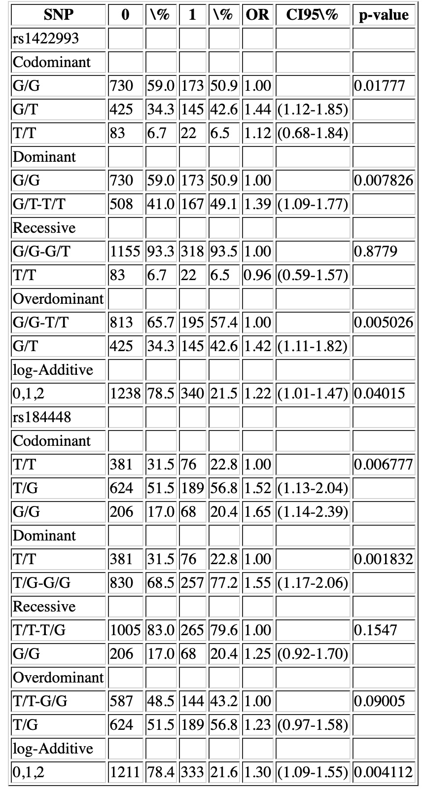

```{r setup, include=FALSE} 
knitr::opts_chunk$set(warning = FALSE, message = FALSE)
```

# Scenario
A dataset containing epidemiological information and 51 SNPs from a case-control study on asthma. We are interested in finding those SNPs associated with the asthma status.

# Load data

```{r}
# Import packages
library(SNPassoc)

# Load data
asthma <- read.table("Data/asthma.txt", header = TRUE)

# Check data's first 20 headers (the rest are SNPs as well)
colnames(asthma)[1:20]

# Check some samples
t(asthma[1:3, 1:7])

# Check some SNPs
asthma[1:5, 7:9]

# Indicate which columns of the dataset contain the SNP data
asthma.s <- setupSNP(data = asthma,
                     colSNPs = 7:ncol(asthma),
                     sep = "")

# Check SNP data now
asthma.s[1:5, 7:9]

# Check the genotype and allele frequencies for a SNP
summary(asthma.s$rs1422993)

# Plot missing genotypes across all SNPs
plotMissing(asthma.s, print.labels.SNPs = TRUE)
```

# H-W equilibrium
Genotype calling error can be detected by a H-W equilibrium test. Note that H-W must be checked only in controls. One is interested in keeping those SNPs that do not reject the null hypothesis (p > 0.05).
```{r}
# H-W test
hwe <- tableHWE(asthma.s, casecontrol)

# Check some results
hwe[1:4,]

# Keeping SNPs that pass the H-W test
snps.ok <- rownames(hwe)[hwe[, 2] >= 0.05]
pos <- which(colnames(asthma) %in% snps.ok, useNames = FALSE)
asthma.s <- setupSNP(data = asthma,
                     colSNPs = pos,
                     sep = "")
```

# SNP association analysis
Now, let's check the association between disease status (**casecontrol**) and a single SNP.

*Note: * AIC (Akaike information criteria): it can be used to decide which is the best model of inheritance (the lower the better the model is).

```{r}
# Test for group ~ SNP
association(formula = casecontrol ~ rs1422993, data = asthma.s)

# Incorporate covariates in the model
association(formula = casecontrol ~ rs1422993 + country + smoke, data = asthma.s)

# Stratify for gender
association(formula = casecontrol ~ rs1422993 + survival::strata(gender),
            data = asthma.s)

# Train the model only on a subset of individuals
association(
  formula = casecontrol ~ rs1422993,
  data = asthma.s,
  subset = country == "Spain"
)
```

Check the association between disease status (**casecontrol**) and all SNPs.
```{r fig1, fig.height = 7, fig.width = 7}
# Massive univariate testing (MUT)
ans <- WGassociation(formula = casecontrol, data = asthma.s)
ans[1:3, ]

# Plot p-values from the MUT
plot(ans)
```

We can also fit max-statistics model.
```{r}

# Calculate p-value for a certain SNP under the max-statistics model
maxstat(asthma.s$casecontrol, asthma.s$rs1422993)

# Max-statistics for all SNPs
ans.max <- maxstat(asthma.s, casecontrol)

# Check output
ans.max[1:5, 1:2]
```

Finally, let's create a table output for the results.
```{r}
# Create a table output for two specific SNPs
library(xtable)
invisible(capture.output(out <-
                           getNiceTable(ans[c("rs1422993", "rs184448")])))
nlines <- attr(out, "nlines")
hlines <- c(-1,-1, 0, cumsum(nlines + 1), nrow(out), nrow(out))
print(
  xtable(out, caption = "", label = 'tab-2SNPs'),
  tabular.enviroment = "longtable",
  type = "html",
  file = "Output/tableSNPs.html",
  floating = FALSE,
  include.rownames = FALSE,
  hline.after = hlines,
  sanitize.text.function = identity
)
```

The output table looks like this:



# Gene × environment and gene × gene interactions

```{r}
# G x E by smoking as the factor
association(formula = casecontrol ~ dominant(rs1422993) * factor(smoke),
            data = asthma.s)

# G x G by rs184448 as the factor
association(
  formula = casecontrol ~ rs1422993 * factor(rs184448),
  data = asthma.s,
  model.interaction = "dominant"
)
```
