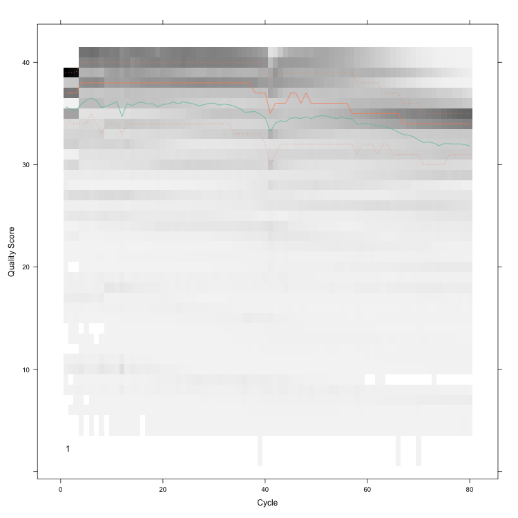

```{r setup, include=FALSE} 
knitr::opts_chunk$set(warning = FALSE, message = FALSE)
rm(list = ls())
```

Most expression studies try to identify the subset of genes that are differentially expressed between two or more conditions (differential gene expression (DGE)) analysis.

**Note:** RNA-seq is the platform of choice for expression studies due to its next generation high-throughput sequencing capabilities.

# Experimental design

* Depth of sequencing: it refers to the number of reads that are sequenced. At a higher cost, a higher depth can be obtained which improves statistical power. Note that adding more depth after 10M reads does not greatly increase power.
* Biological replicates: have at least eight samples per treatment arm.
* Do not to confuse pseudo-replicates (different samples from the same individual) and technical replicates with true biological replicates.

# Import data
## Affymetrix data
In this example, we will use Affymetrix GeneChip bovine microarrays. It consists of five control slides and five treatment slides.
```{r}
# Import data
library(affy)
filenames = c(paste("ctrl", 1:5, ".CEL", sep = ""),
              paste("treat", 1:5, ".CEL", sep = ""))
Names = c(paste("C", 1:5, sep = ""), paste("T", 1:5, sep = ""))
slides = ReadAffy(filenames = paste("Data/", filenames, sep = ""),
                  sampleNames = Names)
print(slides)
```

## RNA-seq data
```{r}
# Import data
library(ShortRead)
seq1 = readFastq("Data/RNAseq1.fastq")
seq2 = readFastq("Data/RNAseq2.fastq")
seq <- do.call('append', c(seq1, seq2))

# Check sequence reads
sread(seq)[1:2]

# Check quality scores
quality(seq)[1:2]
```

# Quality control (QC)
## Spatial effects in Affymetrix data
```{r}
# Image of log intensities for the first slide
library(affyPLM)
PLM = fitPLM(slides)
par(mfrow = c(2, 2))
image(slides[, 1], main = "Log intensities")
image(
  PLM,
  type = "weights",
  which = 1,
  xlab = XLabel,
  main = "Weights"
)
image(
  PLM,
  type = "resids",
  which = 1,
  xlab = XLabel,
  main = "Residuals"
)
image(
  PLM,
  type = "sign.resids",
  which = 1,
  xlab = XLabel,
  main = "Sign of residuals"
)
```

This slide is of bad quality due to its spatial effect. An example of a good slide is the following:
```{r}
# Image of log intensities for the fifth slide
library(affyPLM)
PLM = fitPLM(slides)
par(mfrow = c(2, 2))
image(slides[, 5], main = "log intensities")
image(
  PLM,
  type = "weights",
  which = 5,
  xlab = XLabel,
  main = "Weights"
)
image(
  PLM,
  type = "resids",
  which = 5,
  xlab = XLabel,
  main = "Residuals"
)
image(
  PLM,
  type = "sign.resids",
  which = 5,
  xlab = XLabel,
  main = "Sign of residuals"
)
```

We can also use relative log expression as another QC measure:
```{r}
treatcol = c(3, 3, 3, 3, 3, 2, 2, 2, 2, 2)
Mbox(PLM,
     col = treatcol,
     main = "Relative log expression",
     yaxt = 'n',
     show.names = TRUE)
```

We would hope the medians are close to zero and the spread across arrays is similar. Slides C1, T1, and T2 look somewhat worrisome.

We could also make boxplots or histograms of the raw log intensities:
```{r}
par(mfrow = c(2, 1))
boxplot(slides,
        col = treatcol,
        main = "Raw log intensities",
        yaxt = 'n',
        show.names = TRUE)
hist(
  slides,
  col = treatcol,
  lty = 1,
  xlab = "log2 intensities",
  yaxt = 'n',
  main = "Raw log intensities"
)
```

It is also useful to plot the correlations between slides:
```{r}
library(ABarray)
Cor = pm(slides)
Cor = cor(Cor)
matrixPlot(Cor,
           nrgcols = 21,
           k = 21,
           title = "Perfect match probes (PM)")
```

Overall, it seems that slides C1 and T1 could be excluded due to low quality.

## QC of RNA-Seq
For RNA-seq data, **fastQC** is a popular non-R program for QC. A similar job can be done in R with **ShortRead** package.
```{r}
# QC
seqQC = qa("Data/RNAseq.fastq")

# Save report
report(seqQC, dest = "Output/QCreport")
```

The "quality score per cycle" graph looks like this:
```{r echo=FALSE}
knitr::include_graphics("Figures/6-1.jpg")
```

```{bash echo=FALSE}
rm -rf Output/QCreport
```

Notice how quality starts to drop after around 80 bp. In this case we might want to trim the last 10–20. bases.

# Preprocessing
## Affymetrix data
Steps required include:

* Background correction to remove intensity measures that are not due to the target.
* Normalization which is necessary for across array comparisons.
* A summarization step which is more specific to Affymetrix GeneChips since these are unique in the use a set of short oligos to target a transcript. Various summarization algorithms have been proposed. The main ones are: MAS 5.0, RMA, GCRMA, PLIER, VSN, and MBEI. RMA is the most widely used.

RMA, GCRMA, PLIER, and VSN already return intensities in log 2 scale. MAS does not.
```{r}
# MAS
library(affy)
MAS = mas5(slides, sc = 200)
MAS = exprs(MAS)
MAS = log2(MAS)

# MASCalls
MASCalls = mas5calls(slides)
MASCalls = exprs(MASCalls)

# RMA
RMA = rma(slides)
RMA = exprs(RMA)

# GCRMA
GCRMA = gcrma(slides)
GCRMA = exprs(GCRMA)

# PLIER
library(plier)
PLIER = justPlier(slides, normalize = TRUE)
PLIER = exprs(PLIER)

# VSN
library(vsn)
VSN = vsnrma(slides)
VSN = exprs(VSN)

# MBEI
MBEI = expresso(
  slides,
  normalize.method = "invariantset",
  bg.correct = FALSE,
  pmcorrect.method = "pmonly",
  summary.method = "liwong"
)
MBEI = exprs(MBEI)
MBEI = log2(MBEI)
```

The MASCalls function returns a matrix with flag calls for the expression of each probe in each sample. The flags are P—present, M—marginal, and A—absent. It's best to temove all probes that are flagged as M or A in all arrays.

```{r}
print(MASCalls[1:5, 1:3])
```

Now let's recheck the data for RMA:
```{r}
par(mfrow = c(2, 1))
boxplot(RMA,
        col = treatcol,
        main = "Normalized log intensities",
        yaxt = 'n',
        show.names = TRUE)
plot(
  density(RMA[, 1]),
  col = treatcol[1],
  main = "Normalized log intensities ",
  yaxt = 'n',
  xlim = c(min(RMA), max(RMA)),
  xlab = "log2 intensity"
)
for (j in 2:length(treatcol)) {
  lines(density(RMA[, j]), col = treatcol[j])
}
```

Another interesting graph is PCA of the data. We would expect that the samples from the same group would be more similar to each other and cluster together while the distances between groups would be greater. If you notice that the samples group into, e.g., dates of running the hybridization or slide batches (could fit these effects as a color code), then you have a concern. Slides that are very far apart from others (irrespective of group) also should be looked at more closely.
```{r}
# PCA
PCA = princomp(RMA)
PCA = loadings(PCA)[, 1:2]
plot(
  PCA,
  col = treatcol,
  main = "Principal Components",
  pch = treatcol,
  xlab = "PCA1",
  ylab = "PCA2",
  xaxt = 'n',
  yaxt = 'n',
  labels = FALSE
)
legend(
  "topright",
  c("Treatment", "Control"),
  pch = c(2, 3),
  col = c(2, 3),
  cex = 0.8
)
```

As we see, three slides are quite different from the others. We can find these slides using:
```{r}
which(PCA[, 1] < 0.31)
```

## RNA-seq data
Steps required include:

* Filter the data by removing adapters.
* Trim low quality cycles.
* Remove low quality reads.

A good program for Illumina data is **trimmomatic**:
```{bash}
Java -jar /Users/av/Trimmomatic/dist/jar/trimmomatic-0.40-rc1.jar SE -phred33 Data/RNAseq.fastq Output/trimmedRNA.fastq ILLUMINACLIP:/Users/av/Trimmomatic/adapters/TruSeq3-PE.fa:2:30:10 LEADING:3 TRAILING:3 SLIDINGWINDOW:4:15 MINLEN:50 HEADCROP:10 CROP:80
```

Notice that:

* **SE** means single end reads, for paired-end data use **PE**.
* **phred** is the quality scoring scheme.
* **ILLUMINACLIP** points to the file with the adapters.
* **LEADING** and **TRAILING** remove bases at the beginning and end of the reads below a score of 3.
* **SLIDINGWINDOW** slides across the sequence and removes those inside a window of length 4 that have an average quality below 15.
* **MINLEN** removes sequences that are shorter than 50 after filtering.
* **HEADCROP** removes the first 10 sequences at the start of the run.
* **CROP** deletes everything after the first 80 bases (recall the quality was not so good after 80 cycles).

Now, let's run QC again:
For RNA-seq data, **fastQC** is a popular non-R program for QC. A similar job can be done in R with **ShortRead** package.
```{r}
# QC
seqQC = qa("Output/trimmedRNA.fastq")

# Save report
report(seqQC, dest = "Output/QCreport_2")
```

The "quality score per cycle" graph looks like this now:
```{r echo=FALSE}

```

Things look better now.

```{bash echo=FALSE}
rm -rf Output/QCreport_2
rm Output/trimmedRNA.fastq
```

Now we have to align the data against a reference genome. **bowtie2** is a good software for this. For this purpose, first download the reference genome (index) from [bowtie2 website](http://bowtie-bio.sourceforge.net/bowtie2/index.shtml) or [Illumina website](http://support.illumina.com/sequencing/sequencing_software/igenome.html) and then run the following codes:
```{bash}
# bowtie2-align-s -p 80 -x "reference genome" Output/trimmedRNA.fastq -S alignedRNA
```

The aligned data is in SAM format. The last step is to convert the SAM file into BAM, sort and index it. For this we will use **samtools**:
```{bash}
# samtools import "reference genome" Output/alignedRNA.sam Output/alignedRNA.bam
# samtools sort Output/alignedRNA.bam Output/sortedAlignedRNA.bam
# samtools index Output/sortedAlignedRNA.bam
```

The output should be **sortedAlignedRNA.bam** and the index has the same name with extension **.bai**. Finally, to concatenate data from a sample that is spread across two or more SAM/BAM files, use the **merge** command from samtools.
