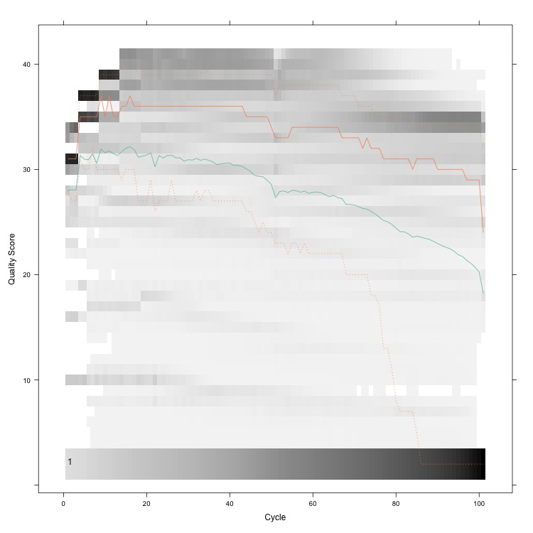
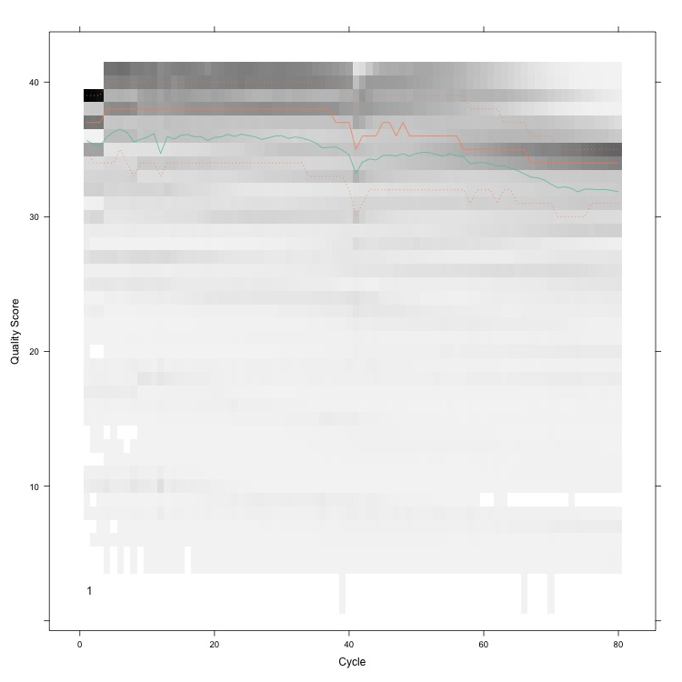

```{r setup, include=FALSE} 
knitr::opts_chunk$set(warning = FALSE, message = FALSE)
rm(list = ls())
```

Most expression studies try to identify the subset of genes that are differentially expressed between two or more conditions (differential gene expression (DGE) analysis).

**Note:** RNA-seq is the platform of choice for expression studies due to its next generation high-throughput sequencing capabilities.

# Experimental design

* Depth of sequencing: it refers to the number of reads that are sequenced. At a higher cost, a higher depth can be obtained which improves statistical power. Note that adding more depth after 10M reads does not greatly increase power.
* Biological replicates: have at least eight samples per treatment arm.
* Do not to confuse pseudo-replicates (different samples from the same individual) and technical replicates with true biological replicates.

# Import data
## Affymetrix data
In this example, we will use Affymetrix GeneChip bovine microarrays. It consists of five control slides and five treatment slides.
```{r}
# Import data
library(affy)
filenames = c(paste("ctrl", 1:5, ".CEL", sep = ""),
              paste("treat", 1:5, ".CEL", sep = ""))
Names = c(paste("C", 1:5, sep = ""), paste("T", 1:5, sep = ""))
slides = ReadAffy(filenames = paste("Data/", filenames, sep = ""),
                  sampleNames = Names)
print(slides)
```

## RNA-seq data
RNA-Seq (named as an abbreviation of RNA sequencing) is a sequencing technique which uses next-generation sequencing (NGS) to reveal the presence and quantity of RNA in a biological sample. It facilitates the ability to look at alternative gene spliced transcripts, post-transcriptional modifications, gene fusion, SNPs and changes in gene expression over time, or differences in gene expression in different groups or treatments.
```{r}
# Import data
library(ShortRead)
seq = readFastq("Data/RNAseq.fastq")

# Check sequence reads
sread(seq)[1:2]

# Check quality scores
quality(seq)[1:2]
```

# Quality control (QC)
## Spatial effects in Affymetrix data
```{r}
# Image of log intensities for the first slide
library(affyPLM)
PLM = fitPLM(slides)
par(mfrow = c(2, 2))
image(slides[, 1], main = "Log intensities")
image(
  PLM,
  type = "weights",
  which = 1,
  xlab = XLabel,
  main = "Weights"
)
image(
  PLM,
  type = "resids",
  which = 1,
  xlab = XLabel,
  main = "Residuals"
)
image(
  PLM,
  type = "sign.resids",
  which = 1,
  xlab = XLabel,
  main = "Sign of residuals"
)
```

This slide is of bad quality due to its spatial effect. An example of a good slide is the following:
```{r}
# Image of log intensities for the fifth slide
library(affyPLM)
PLM = fitPLM(slides)
par(mfrow = c(2, 2))
image(slides[, 5], main = "log intensities")
image(
  PLM,
  type = "weights",
  which = 5,
  xlab = XLabel,
  main = "Weights"
)
image(
  PLM,
  type = "resids",
  which = 5,
  xlab = XLabel,
  main = "Residuals"
)
image(
  PLM,
  type = "sign.resids",
  which = 5,
  xlab = XLabel,
  main = "Sign of residuals"
)
```

We can also use relative log expression as another QC measure:
```{r}
treatcol = c(3, 3, 3, 3, 3, 2, 2, 2, 2, 2)
Mbox(PLM,
     col = treatcol,
     main = "Relative log expression",
     yaxt = 'n',
     show.names = TRUE)
```

We would hope the medians are close to zero and the spread across arrays is similar. Slides C1, T1, and T2 look somewhat worrisome.

We could also make boxplots or histograms of the raw log intensities:
```{r}
par(mfrow = c(2, 1))
boxplot(slides,
        col = treatcol,
        main = "Raw log intensities",
        yaxt = 'n',
        show.names = TRUE)
hist(
  slides,
  col = treatcol,
  lty = 1,
  xlab = "log2 intensities",
  yaxt = 'n',
  main = "Raw log intensities"
)
```

It is also useful to plot the correlations between slides:
```{r}
library(ABarray)
Cor = pm(slides)
Cor = cor(Cor)
matrixPlot(Cor,
           nrgcols = 21,
           k = 21,
           title = "Perfect match probes (PM)")
```

Overall, it seems that slides C1 and T1 could be excluded due to low quality.

## QC of RNA-Seq
For RNA-seq data, **fastQC** is a popular non-R program for QC. A similar job can be done in R with **ShortRead** package.
```{r}
# QC
seqQC = qa("Data/RNAseq.fastq")

# Save report
report(seqQC, dest = "Output/QCreport")
```

The "quality score per cycle" graph looks like this:



```{bash echo=FALSE}
rm -rf Output/QCreport
```

Notice how quality starts to drop after around 80 bp. In this case we might want to trim the last 10–20. bases.

# Preprocessing
## Affymetrix data
Steps required include:

* Background correction to remove intensity measures that are not due to the target.
* Normalization which is necessary for across array comparisons.
* A summarization step which is more specific to Affymetrix GeneChips since these are unique in the use a set of short oligos to target a transcript. Various summarization algorithms have been proposed. The main ones are: MAS 5.0, RMA, GCRMA, PLIER, VSN, and MBEI. RMA is the most widely used.

RMA, GCRMA, PLIER, and VSN already return intensities in log 2 scale. MAS does not.
```{r}
# MAS
library(affy)
MAS = mas5(slides, sc = 200)
MAS = exprs(MAS)
MAS = log2(MAS)

# MASCalls
MASCalls = mas5calls(slides)
MASCalls = exprs(MASCalls)

# RMA
RMA = rma(slides)
RMA = exprs(RMA)

# GCRMA
GCRMA = gcrma(slides)
GCRMA = exprs(GCRMA)

# PLIER
library(plier)
PLIER = justPlier(slides, normalize = TRUE)
PLIER = exprs(PLIER)

# VSN
library(vsn)
VSN = vsnrma(slides)
VSN = exprs(VSN)

# MBEI
MBEI = expresso(
  slides,
  normalize.method = "invariantset",
  bg.correct = FALSE,
  pmcorrect.method = "pmonly",
  summary.method = "liwong"
)
MBEI = exprs(MBEI)
MBEI = log2(MBEI)
```

The **MASCalls** function returns a matrix with flag calls for the expression of each probe in each sample. The flags are P—present, M—marginal, and A—absent. It's best to remove all probes that are flagged as M or A in all arrays.

```{r}
print(MASCalls[1:5, 1:3])
```

Now let's recheck the data for RMA:
```{r}
par(mfrow = c(2, 1))
boxplot(RMA,
        col = treatcol,
        main = "Normalized log intensities",
        yaxt = 'n',
        show.names = TRUE)
plot(
  density(RMA[, 1]),
  col = treatcol[1],
  main = "Normalized log intensities ",
  yaxt = 'n',
  xlim = c(min(RMA), max(RMA)),
  xlab = "log2 intensity"
)
for (j in 2:length(treatcol)) {
  lines(density(RMA[, j]), col = treatcol[j])
}
```

Now let's filter out the control probes and the probes that were flagged as A or M:
```{r}
# Identify the control probes (Affymetrix uses AFFY in the probe names)
index1 = grep("AFFX", row.names(RMA), ignore.case = TRUE)

# Count the number of P calls for each probe
Pcounts = apply(MASCalls, 1, function(x) {
  length(which(x == "P"))
})

# Get the indices of those with 4 or less Ps per probe (6 will be A or M)
index2 = which(Pcounts <= 4)

# Filter them out
fRMA = RMA[-unique(c(index1, index2)), ]
```

Another interesting graph is PCA of the data. We would expect that the samples from the same group would be more similar to each other and cluster together while the distances between groups would be greater. If you notice that the samples group into, e.g., dates of running the hybridization or slide batches (could fit these effects as a color code), then you have a concern. Slides that are very far apart from others (irrespective of group) also should be looked at more closely.
```{r}
# PCA
PCA = princomp(RMA)
PCA = loadings(PCA)[, 1:2]
plot(
  PCA,
  col = treatcol,
  main = "Principal Components",
  pch = treatcol,
  xlab = "PCA1",
  ylab = "PCA2",
  xaxt = 'n',
  yaxt = 'n',
  labels = FALSE
)
legend(
  "topright",
  c("Treatment", "Control"),
  pch = c(2, 3),
  col = c(2, 3),
  cex = 0.8
)
```

As we see, three slides are quite different from the others. We can find these slides using:
```{r}
which(PCA[, 1] < 0.31)
```

## RNA-seq data
Steps required include:

* Filter the data by removing adapters.
* Trim low quality cycles.
* Remove low quality reads.

A good program for Illumina data is **trimmomatic**:
```{bash}
Java -jar /Users/av/Trimmomatic/dist/jar/trimmomatic-0.40-rc1.jar SE -phred33 Data/RNAseq.fastq Output/trimmedRNA.fastq ILLUMINACLIP:/Users/av/Trimmomatic/adapters/TruSeq3-PE.fa:2:30:10 LEADING:3 TRAILING:3 SLIDINGWINDOW:4:15 MINLEN:50 HEADCROP:10 CROP:80
```

Notice that:

* **SE** means single end reads, for paired-end data use **PE**.
* **phred** is the quality scoring scheme.
* **ILLUMINACLIP** points to the file with the adapters.
* **LEADING** and **TRAILING** remove bases at the beginning and end of the reads below a score of 3.
* **SLIDINGWINDOW** slides across the sequence and removes those inside a window of length 4 that have an average quality below 15.
* **MINLEN** removes sequences that are shorter than 50 after filtering.
* **HEADCROP** removes the first 10 sequences at the start of the run.
* **CROP** deletes everything after the first 80 bases (recall the quality was not so good after 80 cycles).

Now, let's run QC again:
For RNA-seq data, **fastQC** is a popular non-R program for QC. A similar job can be done in R with **ShortRead** package.
```{r}
# QC
seqQC = qa("Output/trimmedRNA.fastq")

# Save report
report(seqQC, dest = "Output/QCreport_2")
```

The "quality score per cycle" graph looks like this now:



Things look better now.

```{bash echo=FALSE}
rm -rf Output/QCreport_2
rm Output/trimmedRNA.fastq
```

Now we have to align the data against a reference genome. **bowtie2** is a good software for this. For this purpose, first download the reference genome (index) from [bowtie2 website](http://bowtie-bio.sourceforge.net/bowtie2/index.shtml) or [Illumina website](http://support.illumina.com/sequencing/sequencing_software/igenome.html) and then run the following codes:
```{bash}
# bowtie2-align-s -p 80 -x "reference genome" Output/trimmedRNA.fastq -S alignedRNA
```

The aligned data is in SAM format. The last step is to convert the SAM file into BAM, sort and index it. For this we will use **samtools**:
```{bash}
# samtools import "reference genome" Output/alignedRNA.sam Output/alignedRNA.bam
# samtools sort Output/alignedRNA.bam Output/sortedAlignedRNA.bam
# samtools index Output/sortedAlignedRNA.bam
```

The output should be **sortedAlignedRNA.bam** and the index has the same name with extension **.bai**. Finally, to concatenate data from a sample that is spread across two or more SAM/BAM files, use the **merge** command from samtools.

Now, let's match sequence reads to functional annotations:
```{r}
library(GenomicFeatures)
library(GenomicAlignments)
library(biomaRt)
txdb = makeTxDbFromBiomart(biomart = "ENSEMBL_MART_ENSEMBL", dataset = 'btaurus_gene_ensembl')
txGene = transcriptsBy(txdb, 'gene')
```

Now to match the genomic data with the annotations:
```{r}
# Read in the preprocessed BAM file
reads = readGAlignments("Data/sortedAlignedRNA.bam")
reads[1]

# Add ranges
reads = GRanges(
  seqnames = seqnames(reads),
  ranges = IRanges(start = start(reads), end = end(reads)),
)
reads[1]

# Create a vector with the number of alignments that correspond to
# each of the identifiers (gene ids) in txGene
counts = countOverlaps(txGene, reads)
head(counts)
```


# Analysis of differential expression (DE)
## Affymetrix data
There are many ways of testing for DE ranging from simple mean fold change differences between treatments to mixed models with various effects. We will use linear model.

We need three things:

* Our data
* A design matrix: simply states which arrays belong to which treatment
* A contrasts matrix: defines which treatment combinations we want to test

```{r}
# Design matrix
Design = cbind(c(rep(1, 5), rep(0, 5)), c(rep(0, 5), rep(1, 5)))
colnames(Design) = c("ctrl", "treat")
print(Design)

# Contrasts matrix
Contrasts = matrix(c(1, -1), byrow = F)
colnames(Contrasts) = "ctrl-treat"
rownames(Contrasts) = c("ctrl", "treat")
print(Contrasts)
```

Let's fit the model:
```{r}
library(limma)
Fit = lmFit(fRMA, Design)
Fitc = contrasts.fit(Fit, Contrasts)
## to test for DE we use an empirical Bayes shrinkage of SEs
Fitb = eBayes(Fitc)

# Coefficients from model fitted to data and design matrix
head(Fit$coefficients)

# Next we tested our contrast
head(Fitc$coefficients)
```

In our case we know that the contrast is control– treatment, hence any positive difference in expression means that the control is more expressed than the treatment and any negative difference means the treatment is more expressed than the control.

```{r}
# Retrieve the results from the moderated t-test and corresponding p-values
## t score
head(Fitb$t)

## p-value
head(Fitb$p.value)
```

If there were more contrasts we could also retrieve the F-statistics and their p-values.

After all, which are the differentially expressed probes?
```{r}
res = data.frame(
  FoldChange = Fitb$coefficients,
  p.value = Fitb$p.value,
  Amean = Fitb$Amean
)
names(res) = c("FoldChange", "p.value", "Avalue")
res = res[order(res$p.value), ]
DE = res[res$p.value < 0.01, ]
head(DE)
```

For the case of multiple testing, Bonferroni correction is probably too stringent for most cases. A reasonable compromise option is the Benjamin and Hochberg method:
```{r}
adjusted = p.adjust(res$p.value, method = "BH")
min(adjusted)
```

Not a single probe survived multiple testing correction. Given the bad quality of three slides and the fact that we did not have a real contrast, it’s probably a good thing.

## RNA-seq data
First, let's plot gene counts:
```{r}
plot(
  sort(counts),
  col = "blue",
  pch = 20,
  main = "Sorted RNA-seq counts",
  xlab = "Genes",
  ylab = "Counts",
  cex.main = 0.9
)
```

How many genes are known?
```{r}
length(counts)
```

How many genes are expressed at least once in this sample?
```{r}
length(which(counts > 0))
```

How many transcripts have more than 200 counts?
```{r}
length(which(counts >= 200))
```

How much of the data (in percents) they account for?
```{r}
sum(counts[which(counts >= 200)]) / sum(counts) * 100
```

In our RNA-seq data, we only had one sample. Instead, we will import another data with 20 samples (10 controls × 10treatments) using the same 4492 genes. We also import a second file that matches samples to treatment groups and is useful to build design matrices and contrasts.
```{r}
library(edgeR)
counts = read.table("Data/RNAdat.txt", header = T, sep = "\t")
contrast = read.table("Data/RNAcontrast.txt", header = T, sep = "\t")


# Create a container to assign group classes to the respective samples
DGE = DGEList(counts, group = contrast$contrast)

# Estimate the normalization and dispersion factors
DGE = calcNormFactors(DGE)
DGE = estimateCommonDisp(DGE)
DGE = estimateTagwiseDisp(DGE)
```

Now let's perform a simple contrast between the two groups:
```{r}
difexpEx = exactTest(DGE, pair = c("ctrl", "treat"))
resEx = topTags(difexpEx, n = nrow(DGE))
outEx = resEx$table
```

Let's plot the outcomes:
```{r}
par(mfrow = c(1, 2))
plotMeanVar(DGE, show.tagwise.vars = T, NBline = T)
plotBCV(DGE)
```

To see the significantly differentially expressed features (p < 0.05) after FDR correction:
```{r}
outEx[outEx$FDR<0.05,c(1,2,4)]
```

The data here is quite bad. Notice that the coefficient of variation is quite high at low counts. We can exclude these from the data and rerun the analysis.

A similar result can be obtained by fitting a GLM model instead of exactTest:
```{r}
# Create a design matrix
design = model.matrix( ~ contrast, contrast)

# Estimate design matrix dispersions
DGE2 = estimateGLMTrendedDisp(DGE, design)
DGE2 = estimateGLMTagwiseDisp(DGE2, design)

# Fit model
fit = glmFit(DGE2, design)

# Test contrast (coef) from design matrix
difexpGLM = glmLRT(fit, coef = 2)

# Extract outcomes
res = topTags(difexpGLM, n = nrow(DGE))
outGLM = res$table
outGLM[outGLM$FDR < 0.05, ]
```
