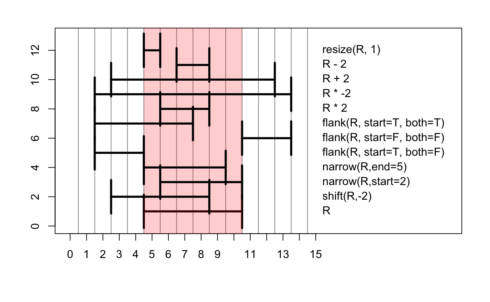
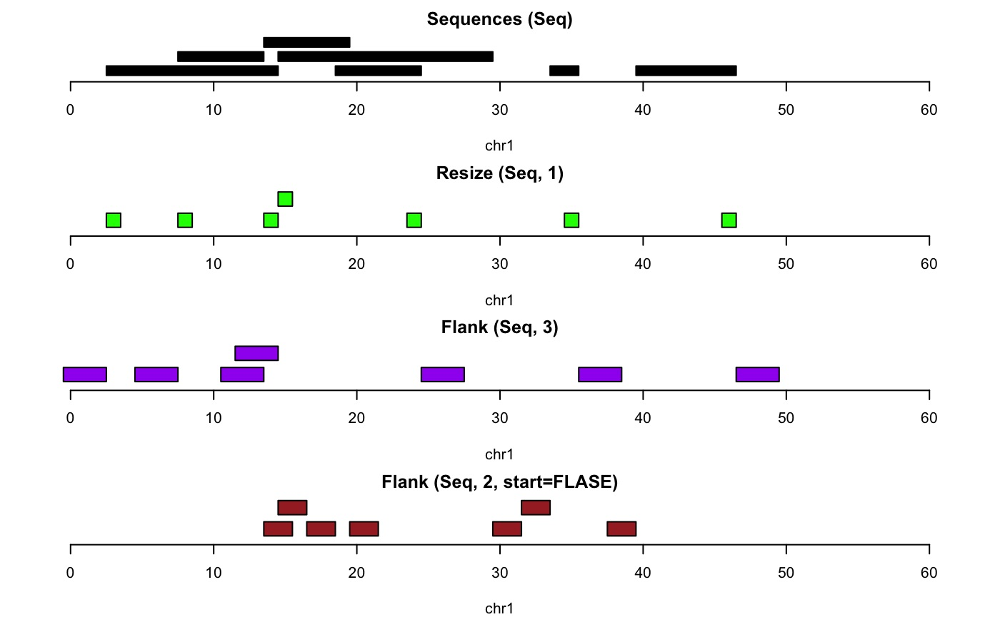
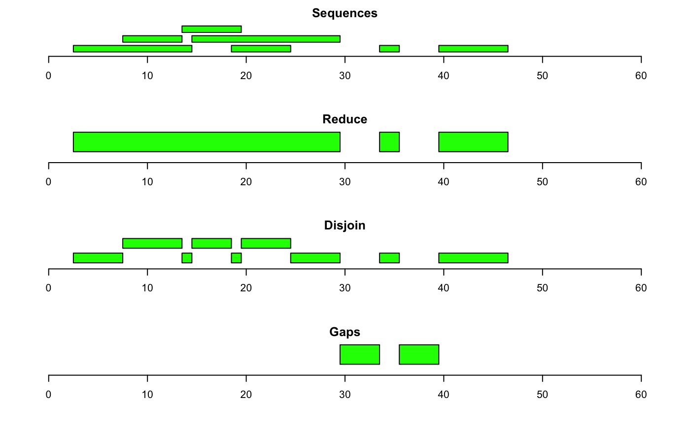
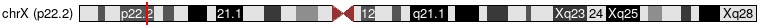
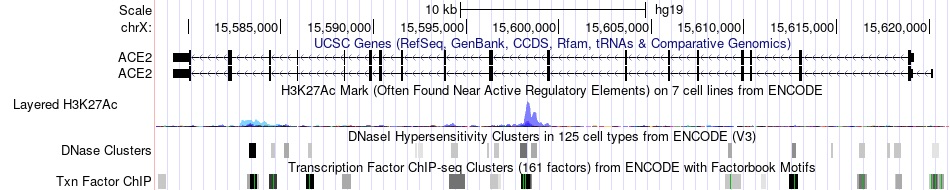
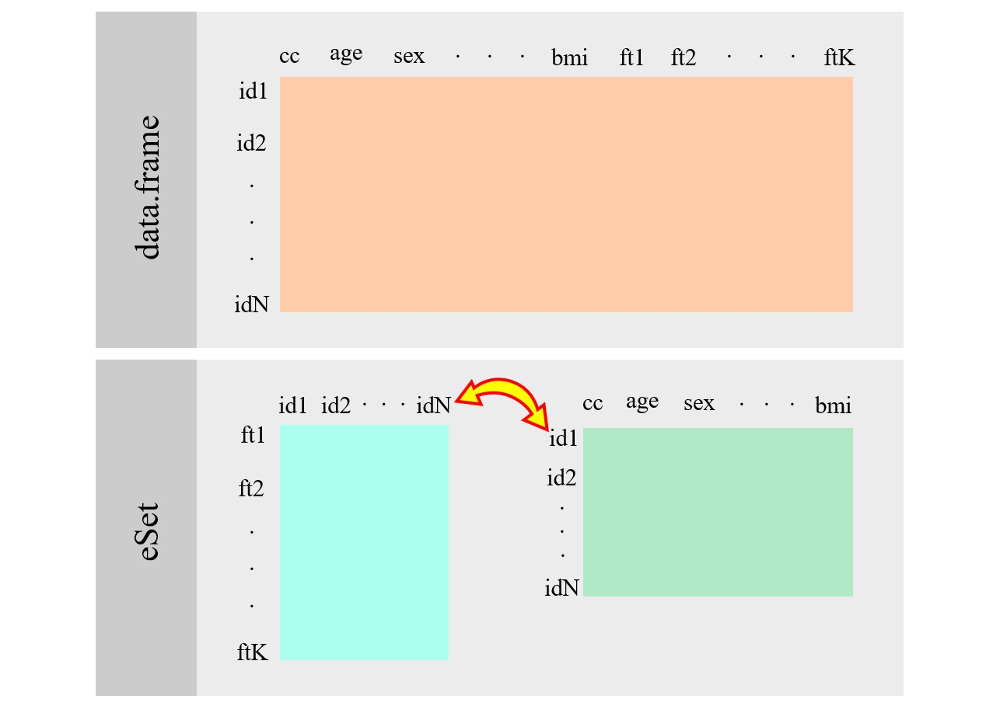
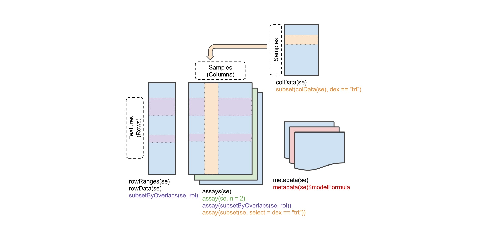

```{r setup, include=FALSE} 
knitr::opts_chunk$set(warning = FALSE, message = FALSE) 
rm(list = ls())
```

# GRanges
Let's start by creating a sample gene:
```{r}
# Import packages
library(GenomicRanges)

# Create an example gene
gen1 <- GRanges("chr1", IRanges(1000001, 1001000), strand = "+")
```

Now, let's check its specification:
```{r}
# Get gene spec
## Start
start(gen1)
## End
end(gen1)
## Width
width(gen1)
## Strand
strand(gen1)
## The 'metadata columns', any information stored alongside each range
mcols(gen1)
## IRanges
ranges(gen1)
## The chromosomes for each ranges
seqnames(gen1)
## The possible chromosomes
seqlevels(gen1)
## The lengths for each chromosome
seqlengths(gen1)
```

## Intra-range methods

Affects ranges independently.

| function  | description                                          |
|-----------|------------------------------------------------------|
| shift     | moves left/right                                     |
| narrow    | narrows by relative position within range            |
| resize    | resizes to width, fixing start for +, end for -      |
| flank     | returns flanking ranges to the left +, or right -    |
| promoters | similar to flank                                     |
| restrict  | restricts ranges to a start and end position         |
| trim      | trims out of bound ranges                            |
| +/-       | expands/contracts by adding/subtracting fixed amount |
| \*        | zooms in (positive) or out (negative) by multiples   |





## Inter-range methods

Affects ranges as a group.

| function | description                                               |
|----------|-----------------------------------------------------------|
| range    | one range, leftmost start to rightmost end                |
| reduce   | cover all positions with only one range                   |
| gaps     | uncovered positions within range                          |
| disjoin  | breaks into discrete ranges based on original starts/ends |



## ENCODE project experiment

Scenario: A ChIP-seq experiment to identify the ESRRA nuclear protein binding sites in HepG2 cell line (of liver origin) and GM12878 cell line (of lymphoblastoid origin).

*ESRRA: Estrogen Related Receptor Alpha*





Let's start by importing and preprocessing the data:
```{r}
# Load data
library(ERBS)
data(HepG2)
data(GM12878)

# Check data
HepG2[1:5, 4:5]

# Extract data as Rle data
## Extract seqnames (chromosomes)
chr <- seqnames(HepG2)[1:5,]
## Extract ranges
r <- ranges(HepG2)[1:5,]
## Extract values
vals <- values(HepG2)[1:5,]

# Convert extracted data to character
chr <- as.character(chr)
chr
r <- as.data.frame(r)
r
vals <- as.data.frame(vals)
vals[, 4:7]

# Cross-tab
table(chr)

# Subset operation
chr20 <- HepG2[seqnames(HepG2) == "chr20", ]
chr20[1:5, 7]

# Re-order the data by seqnames and ranges
HepG2_ordered = HepG2[order(HepG2),]
HepG2_ordered[1:5, 7]
```

Now, we are going to find binding sites and extract their ranges:
```{r}
# Find binding sites common to both HepG2 and GM12878
res = findOverlaps(HepG2, GM12878)
res[1]
HepG2[1]
GM12878[12]

# Ranges from the query for which we found a hit in the subject
index = queryHits(res)
erbs = HepG2[index,]
erbs[1:5]

# Extract only the ranges
erbs = granges(erbs)
erbs[1:5]
```

### Acquisition of gene transcription start sites
Using the binding sites, we want to know which genes are preceded by each binding site.

*Note:* This information is strand-based, meaning that "preceding" depends on the direction of which we read the genome.

```{r}
# Define human genes
library(Homo.sapiens)
ghs = genes(Homo.sapiens)
ghs[1:5]

# First three ERBS ranges
erbs[1:3]

# For each range in ERBS, find the closest preceding genes in GHS
index = precede(erbs, ghs)

# First three closest preceding genes in GHS to ERBS ranges
ghs[index[1:3]]

# Distance between binding sites and nearest preceding genes
distance(erbs, ghs[index])[1:3]
```

Now, let's find the transcription start site nearest to each binding site:
```{r}
# Get all TSS of human genome
tssgr = resize(ghs, 1)
tssgr[1:3]

# Distance between erbs binding sites and nearest TSS
d = distanceToNearest(erbs, tssgr)
d[1:3]
dists = values(d)$distance

# Get the TSS of genes that are less than 1000 bases away from the erbs BS
index = subjectHits(d)[dists < 1000]
index[1:3]
tssgr[index, ]

# Extract those genes IDs
keys = as.character(values(tssgr[index])$GENEID)
keys[1:3]

# Extract the symbole and names of those IDs
res = select(
  Homo.sapiens,
  keys = keys,
  columns = c("SYMBOL", "GENENAME"),
  keytype = "GENEID"
)
res[1:3,]
```

These genes are the genes that are:

* common between both HepG2 and GM12878 cell lines;
* their TSS are close (<1000 bases far from) to the ESRRA nuclear protein BS;
* as a result, most probably activated by estrogen via Estrogen Related Receptor Alpha (ESRRA).

**Conclusion:** So basically, we went from the protein binding sites of a specific nuclear protein to the genes that are activated via it.

# DNAStrings
Let's start by creating a sample DNA string:
```{r}
library(Biostrings)

# Define a DNAString
dna <- DNAString("TCGAGCAAT")
dna
```

In *DNAStrings* there are the four bases (ACGT), the wild card or unknown base (N), and the dash representing a gap (-).

```{r}
# Create a set of DNAStrings (DNAStringSet)
set1 <- DNAStringSet(c("TCA", "AAATCG", "ACGTGCCTA", "CGCGCA", "GTT", "TCA"))
set1

# Extract a base from a seq
set1[[1]][2]

# Number of DNAStrings in the set
length(set1)

# Width of each DNAString in the set
width(set1)
```

Some other functions:

| function               | description                                               |
|------------------------|-----------------------------------------------------------|
| duplicated             | detect which sequences are duplicated                     |
| unique                 | keep only unique sequences                                |
| sort                   | sort sequences alphabetically                             |
| letterFrequency        | find the freq of one character                            |
| dinucleotideFrequency  | find the freq of all dinucleotides                        |
| trinucleotideFrequency | find the freq of all trinucleotides                       |
| countPattern           | find the freq of a pattern                                |
| matchPattern           | find the locations of a pattern                           |
| reverseComplement      | find the reverse complement of a DNAString                |
| translate              | find the amino acid translation of a DNAString            |

Let's check a specific pattern in our DNAString sample:
```{r}
# Check for a pattern in a DNAString
dna_seq <- DNAString("ATGCGCGCGGCTA")
matchPattern("CGC", dna_seq)
```

Because DNA is double-stranded, when checking for a pattern, you should also check for its complement:
```{r}
# Check for a the reverse complement of a pattern in a DNAString
matchPattern(reverseComplement(DNAString("CGC")), dna_seq)
```

A somehow similar process goes with DNAStringSets, only with a different command name:
```{r}
# Check for a pattern in a DNAStringSet
set2 <- DNAStringSet(c("AACCGGTTTCGA", "CGATCGCGCCGG"))
vmatchPattern("CG", set2)
```

Now let's get back to the ENCODE project and find DNAStrings where ChIP-seq binding peaks are:
```{r}
# Load human reference genome
library(BSgenome.Hsapiens.UCSC.hg19)

# Get DNAStrings of human genome where ChIP-seq binding peaks are
hepseq = getSeq(Hsapiens, HepG2)
hepseq[1:5]
```

**Note:** A DNA motif is defined as a nucleic acid sequence pattern that has some biological significance such as being DNA binding sites for a regulatory protein, i.e., a transcription factor.

Count occurrences of a motif in the gathered DNAStrings:
```{r}

mot = "TCAAGGTCA"
sum(vcountPattern(mot, hepseq),
    vcountPattern(mot, reverseComplement(hepseq)))
```

# Data classes
In this section, we will work with different forms of genome data classes.

## PLINK
PLINK format includes three files:

* .bed: Contains the genomic SNP data (Homozygous normal 00, Heterozygous 10, Homozygous variant 11, missing 01)
* .bim: Contains SNPs annotations
* .fam: Contains the subject’s information

```{bash, echo=FALSE}
cat Data/obesity1.bed Data/obesity2.bed Data/obesity3.bed Data/obesity4.bed \
> Output/obesity.bed
```

```{r}
library(snpStats)
snps <- read.plink(bed = "Output/obesity.bed",
                   bim = "Data/obesity.bim",
                   fam = "Data/obesity.fam")
geno <- snps$genotypes
pheno <- snps$fam
annotation <- snps$map
```

### Coordinating information from diverse tables
We will use a dataset which has three objects, like those of the PLINK format: a SnpMatrix and two dataframes.
```{r}
# Load sample data
library(GSE5859Subset)
data(GSE5859Subset)
```

Upon attachment and loading of data, we have three data elements:

* geneAnnotation
* geneExpression
* sampleInfo

```{r}
# Check elements
geneExpression[1:2, 1:4]
geneAnnotation[1, ]
sampleInfo[1, ]
```

Now to integrate data:
```{r}
# Integrate data
cbind(sampleInfo[1:3, ], colnames(geneExpression)[1:3], t(geneExpression)[1:3, 1:4])
```

## ExpressionSet
An ExpressionSet is another form of data container which is designed to combine several different sources of information into a single convenient structure. The data in an ExpressionSet consists of expression data from microarray experiments, `meta-data’ describing samples in the experiment, annotations and meta-data about the features on the chip and information related to the protocol used for processing each sample.



```{r}
# Import packages
library(Biobase)
```

Let's convert our previous PLINK data to an ExpressionSet:
```{r}
# Bind the previous tables in an ExpressionSet
rownames(sampleInfo) = sampleInfo$filename
rownames(geneAnnotation) = geneAnnotation$PROBEID
es5859 = ExpressionSet(assayData = geneExpression)
pData(es5859) = sampleInfo
fData(es5859) = geneAnnotation
```

And we can easily subset data like the following:
```{r}
# Subsetting data from an ExpressionSet
es5859_Y = es5859[which(fData(es5859)$CHR == "chrY"), ]
```

### Annotation in ExpressionSet

*annotation* argument in an ExpressionSet points to a character describing the platform on which the samples were assayed. This is often the name of a Bioconductor chip annotation package, which facilitated down-stream analysis.

```{r}
# Set annotation for the ExpressionSet
annotation(es5859) = "hgfocus.db"
```

### ExperimentData in ExpressionSet

*experimentData* argument in an ExpressionSet points to an optional MIAME (Minimum Information About a Microarray Experiment) instance with meta-data (e.g., the lab and resulting publications from the analysis) about the experiment.

```{r}
# Set experimentData for the ExpressionSet
library(annotate)
experimentData(es5859) = pmid2MIAME("17206142")
```

```{r}
# Check experimentData
experimentData(es5859)
```

```{r}
# Check abstract
abstract(es5859)
```

## SummarizedExperiment
SummarizedExperiment is a comprehensive data structure that can be used to store expression and methylation data from microarrays or read counts from RNA-seq experiments.It can contain slots for one or more omic datasets, feature annotation (e.g. genes, transcripts, SNPs, CpGs), individual phenotypes and experimental details,



Let's load a sample SummarizedExperiment data:
```{r}
# Load sample data (RNA-seq study)
library(airway)
library(SummarizedExperiment)
data(airway)
```

Check the data:
```{r}
# Get metadata about the experiment
metadata(airway)

# Get the first four feature names
rownames(airway)[1:4]

# Get the first four exon coordinates for a specific gene
rowRanges(airway)$ENSG00000172057[1:4]

# Get the sample-level data
colData(airway)

# Check for the existence of overlapping regions
# in the exon coordinates of one specific gene
reduce(rowRanges(airway)$ENSG00000172057)

# Check sample groups
table(airway$dex)
```

# Expression array archives
Expression array archives contain the ExpressionSet for a lot of various species and experiments.
Expression array archive in the US:

* Gene Expression Omnibus (GEO)
* Package: *GEOquery*

Expression array archive in Europe:

* European Molecular Biology Laboratories (EMBL)
* Package: *ArrayExpress*

## Obtaining the ExpressionSet for a GEO series

```{r}
library(GEOquery)
# glioMA = getGEO("GSE78703")[[1]]
```

## Obtaining the ExpressionSet for an EMBL series

```{r}
library(ArrayExpress)
# glioMA = getAE("E-MTAB-5797")
```

# Storing data
In this section, we will learn how to store data in a database and manipulate that data.

This dataset can quite easily be handled directly in R, but for larger datasets dimensionality can become a problem. The simplest workaround is to store the data in a SQL query and retrieve only the parts of the data that are needed at any given time.

In here, we will use two files:

* a genotypes file: contains all genotype calls for all SNP and all samples.
* a map file: holds mapping information of the SNP, e.g., chromosome, physical location, etc.

We want to create a database. There are two ways:

## Using command line
For our database we need to create a schema (a schema is simply a text file that describes the database structure and is used to create the initial empty DB). A simple schema will consist of two tables, one for each of the files and one column for each source of information.

```{bash}
#cat Data/snpDB.sql
```

We are ready to create the database, named "SNPsmall":

```{bash}
#sqlite3 Data/SNPsmall < Data/snpDB.sql
```

## Using R
This process does not need an schema.

```{r}
# Load package
library(RSQLite)

# Create a new blank database called SNPsmall
con = dbConnect(dbDriver("SQLite"), dbname = "Output/SNPsmall")

# Upload files to the database
dbWriteTable(
  con,
  "snpmap",
  "Data/SNPmap.txt",
  header = TRUE,
  append = T,
  sep = "\t"
)

dbWriteTable(
  con,
  "SNP",
  "Data/SNPSample1.txt",
  append = T,
  header = TRUE,
  skip = 0,
  sep = "\t"
)

# Take a look at the tables and fields in the databse
con = dbConnect(dbDriver("SQLite"), dbname = "Output/SNPsmall")
dbListTables(con)
dbListFields(con, "snpmap")
dbListFields(con, "SNP")
```


You can add indexes to the database to make it faster.
```{r}
dbGetQuery(con, "CREATE INDEX chromosome_idx ON snpmap(chromosome)")
dbGetQuery(con, "CREATE INDEX snp_idx ON SNP(animal)")
dbGetQuery(con, "CREATE INDEX ID_idx ON SNP(snp)")
```

The function **dbGetQuery** is used to send an SQL query to the DB and return the data in a single step.

```{r}
# Retrieve the number of records in a table
dbGetQuery(con, "select count (*) from snpmap")

# Retrieve sample ids
sampleids_s1 = as.vector(dbGetQuery(con, "select distinct animal from SNP"))$animal
head(sampleids_s1)

# Retrieve all data associated with the first sample
hold_s1 = dbGetQuery(con,
                  paste("select * from SNP where animal='", sampleids_s1[1], "'", sep = ""))
head(hold_s1)
```

When we are finished with the database we should close the connection.
```{r}
dbDisconnect(con)
```

Let's delete the output:
```{bash}
rm Output/SNPsmall
```

# Reference genomes
Let's check how to load some refernce genomes and specially human reference genome:
```{r}
# Import packages
library(BSgenome)
library(Biostrings)
```

```{r}
# Check some of the available reference genomes
available.genomes()[1:5]
```

```{r}
# Load Hsapiens.UCSC.hg19 reference seq
library(BSgenome.Hsapiens.UCSC.hg19)
hs = BSgenome.Hsapiens.UCSC.hg19
```

```{r}
# Acquire a chromosome’s sequence
hs$chr17
```

# Annotations
Let's see how to annotate the data now. We will try with human reference genome annotation.

## UCSC annotation
```{r}
# Load Hsapiens.UCSC.hg19 transcripts and genes
library(TxDb.Hsapiens.UCSC.hg19.knownGene)
hs_txdb = TxDb.Hsapiens.UCSC.hg19.knownGene
hs_txdb
```

```{r}
# Get the addresses of genes by Entrez gene IDs
genes(hs_txdb)
```

```{r}
# Get the addresses of exons
exons(hs_txdb)
```

```{r}
# Get the addresses of transcripts
transcripts(hs_txdb)
```

```{r}
# Filter all exons identified for two different genes (by their Entrez gene IDs)
exons(
  hs_txdb,
  columns = c("EXONID", "TXNAME", "GENEID"),
  filter = list(gene_id = c(100, 101))
)
```

## ENSEMBL annotation
```{r}
# Load Hsapiens.v75 transcripts, genes, and proteins
library(ensembldb)
library(EnsDb.Hsapiens.v75)
hs_edb = EnsDb.Hsapiens.v75
hs_edb
```

```{r}
# List attributes
listTables(hs_edb)
```

```{r}
# Return seq_name (i.e., chr name) for transcripts of a specific gene
transcripts(hs_edb,
            filter = GenenameFilter("ZBTB16"),
            columns = "seq_name")
```

## OrgDb annotation
```{r}
# Import packages
library(AnnotationDbi)
library(org.Hs.eg.db)
```

```{r}
# View the first five columns' names
columns(org.Hs.eg.db)[1:5]

# View the first 5 keys (i.e., values) in a specific column (i.e., keytype)
keys(org.Hs.eg.db, keytype = "ENSEMBL")[1:5]

# Map the ID from a specific key (e.g., ENSG00000175899) from its
# corresponding keytype (e.g., ENSEMBL) to another keytype (e.g., ENTREZID)
mapIds(org.Hs.eg.db,
       keys = "ENSG00000175899",
       column = "ENTREZID",
       keytype = "ENSEMBL")
```

```{r}
# A process similar to the mapIds function from the AnnotationDbi package,
# this time in the biomaRt package
library(biomaRt)
mart <-
  useMart(biomart = "ensembl",
          dataset = "hsapiens_gene_ensembl",
          host = "https://useast.ensembl.org")
getBM(
  mart = mart,
  attributes = "entrezgene_id",
  filters = "ensembl_gene_id",
  values = "ENSG00000175899"
)
```

```{r}
# List the first 5 attributes for a specific mart object
listAttributes(mart)[1:5,]

# List the first 5 filters for a specific mart object
listFilters(mart)[1:5,]
```

## Gene sets and pathways
### Gene Ontology
Gene Ontology (GO) organizes terms relevant to the roles of genes and gene products in:

* biological processes
* molecular functions
* cellular components

```{r}
# Import packages
library(GO.db)
library(AnnotationDbi)
```

```{r}
# View the columns' names
columns(GO.db)

# View the first 5 keys (i.e., values) in a specific column (i.e., keytype)
keys(GO.db, keytype = "ONTOLOGY")[1:5]
```

### KEGG: Kyoto Encyclopedia of Genes and Genomes
```{r}
# Import packages
library(KEGGREST)
```

```{r}
# Get data for the gene with the Entrez ID 675 (i.e., BRCA2 gene)
brca2K = keggGet("hsa:675")

# List gene attributes
names(brca2K[[1]])

# Get its seq data
brca2K[[1]]$NTSEQ
```

```{r}
# Get the list of genes making up a pathway model
brpat = keggGet("path:hsa05212")

# List pathway attributes
names(brpat[[1]])

# Get the Entrez IDs for the first five genes
brpat[[1]]$GENE[seq(1, 10, 2)]
```

```{r}
# Get an illustration of the pathway
library(png)
library(grid)
brpng = keggGet("hsa05212", "image")
grid.raster(brpng)
```

```{bash, echo=FALSE}
rm Output/obesity.bed
```

