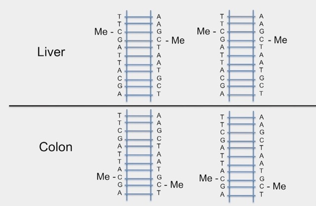
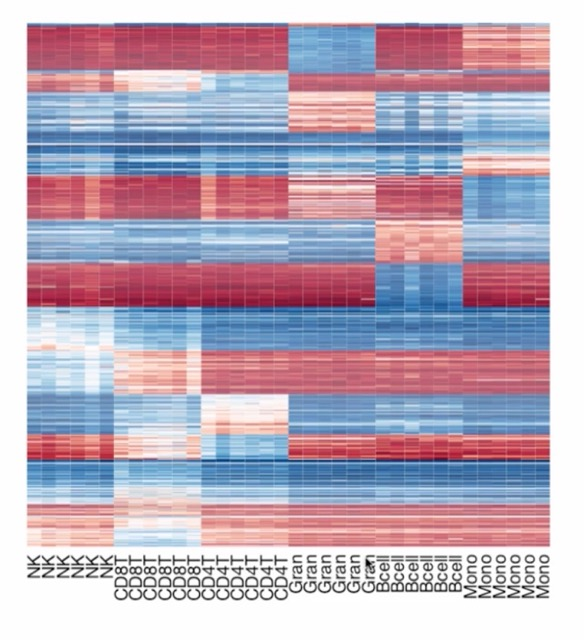
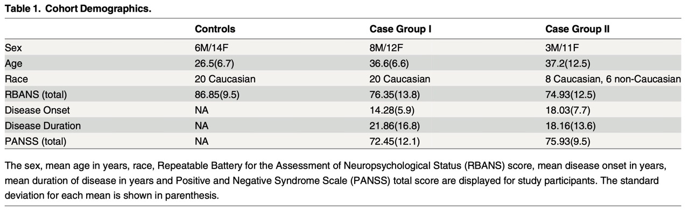
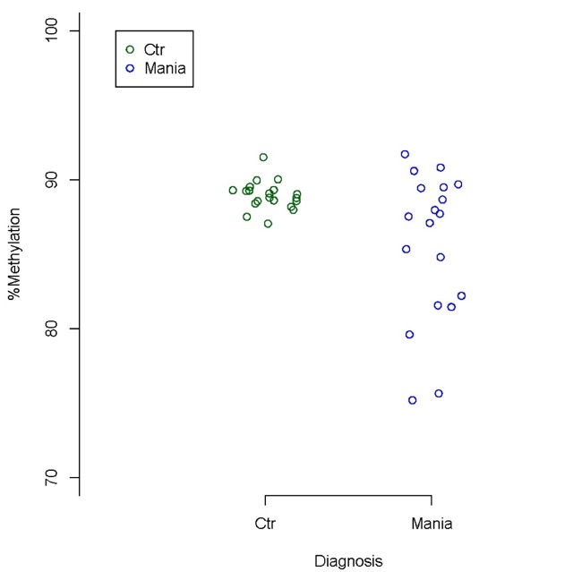

```{r setup, include=FALSE} 
knitr::opts_chunk$set(warning = FALSE, message = FALSE)
rm(list = ls())
```

# Introduction
**Transcription regulation:** Transcription factors (TF) bind to chromatin in sequence-specific manner (TF binding motif) to regulate gene expression. Genes co-expressed in different conditions are likely under the control of the same TB.

**ChIP-Seq:** A method used to analyze protein interactions with DNA. ChIP-seq combines chromatin immunoprecipitation (ChIP) with massively parallel DNA sequencing to identify genome-wide binding site (BS) of TFs. It is often conducted in millions of cells, where protein-DNA interactions are fixed, then chromatin is sheared into small pieces. Then a factor-specific antibody is used to pull down the factor as well as the DNA attached to it.

```{r, echo=FALSE, fig.align='center', fig.pos='H', fig.show='hold', fig.cap="9-1", out.width = '100%'}

```

# ChIP-seq technique
The technique consists of the following steps:

1- Crosslink proteins and DNA
2- Break DNA into pieces with sonication
3- Add TF-specific antibody
4- Perform immunoprecipitation
5- Reverse crosslinks
6- Purify and amplify DNA
7- Sequence DNA

A typical control sample for a ChIP-seq experiment is a separate sample from the same experimental condition that has not been enriched by antibody treatment and immunoprecipitation.

# ChIP-seq quality control
We use *FASTQC* app for QC:

* A score of < 30 usually means very poor control.
* We should also check for mapability. The higher the uniquely mapped reads, the better.
* Also, the higher uniquely mapped locations, the better.
* PBC score is another indicator of data quality. The higher the better.
* FRiP score is another quality score. It is an indicator of signal to noise ratio. The higher the better.
* ChIP-seq peak overlap with DNase hypersensitivity regions is also an indicator of good data quality.

Other measures of high quality include:

* If the ChIP-seq experiment of a TF had a good quality, then it should capture all the BSs of the TF in that cell condition. Because TF BSs are under more evolutionary constraint, they will have overall better conservation than genome background. However, non-conserved sites might still be functional, and very often only a small portion of the total binding peaks have good evolutionary conservation.
* When replicates of the same individuals are performed, under good quality conditions, signal correlation > 0.6 and peak overlap over 60% are considered good replicate agreement.
* For TF ChIP-seq, the correct TF motif should be enriched more in the stronger peaks, and more enriched in the peak center (summit).
* Even though only small % of all the TF BSs are at the gene promoters, there is still an enrichment of overall ChIP-seq peak and signal enrichment near the transcription start sites of genes.

In the following table you can see an example of a QC report of high quality data:

| Field                                 | Result  |
| ------------------------------------- | ------- |
| Raw sequence median quality score     | 30      |
| % Reads uniquely mapped               | 91.5%   |
| PCR bottleneck coefficient (PBC)      | 95.3%   |
| Fraction of reads in peaks (FRiP)     | 49.1%   |

# ChIP-seq alignment
For aligning sequence reads to the genome, one can use the following algorithms:

* Bowtie and BWA: specifically useful for single-end seq data.
* STAR: for paired-end read data.

# ChIP-seq peak calling
**ChIP-seq peak:** We call a ChIP-seq BS a ChIP-seq peak if the number of reads in the treatment sample are significantly different from that in the control samples.

**MACS:** TF BSs are enriched in the ChIP protocol, and in sequencing the plus-strand reads will be mapped to the left of the precise binding location, while minus-strand reads will be mapped to the right of binding. ChIP fragments are often 100-300bp long, and sequencing only sequences the ends of the fragments. If plus-strand reads (to the left of binding) and minus-strand reads (to the right of the binding) are separated by 120bp, the precise binding site should be right in the middle of the two. So shifting reads by 60bp in 3' direction will find the precise binding location. Model-based analysis for ChIP-seq (MACS), is an algorithm that models the shift size of ChIP-Seq tags, and uses it to improve the spatial resolution of predicted BSs.

```{r, echo=FALSE, fig.align='center', fig.pos='H', fig.show='hold', fig.cap="9-2", out.width = '75%'}

```

# Target genes
Wherever a TF binds to a promoter of a gene, we assume that gene is being regulated by that TF. There are different regulatory rules:

```{r, echo=FALSE, fig.align='center', fig.pos='H', fig.show='hold', fig.cap="9-3", out.width = '100%'}

```

However, only 3% of TFs in the human genome bind to the promoter of a gene. This makes the process of finding the target gene challenging. To tackle this problem, we look at the transcription start site (TSS) of a gene and evaluate the BSs within 100kb from it, weighting them by their distance, also checking if these genes show differential expression. Note that TFs could cause activation as well as repression of a gene, or both. Also note, TF binding and target gene is a many-by-many relationship: one BS can regulate the expression of multiple genes (stochastic so might be different in different cells) and one gene is regulated by multiple nearby enhancers.

**BETA:** Binding expression target analysis (BETA) is an algorithm for finding the target gene of a TF, as well as evaluating the activating or repressing role of a TF on a gene. The TF is a transcriptional activator if genes with better regulatory potential of the TF binding (i.e. more BSs and binding closer to the TSS of the genes) are more activated in expression than random genome background, and vice versa.

# Cistrome data browser
Cistrome DB in an online platform (available at http://cistrome.org/db) that can be used to check what factors regulate a gene of interest and what factors bind in a interval or have a significant binding overlap with a peak set. It specifically:

* Collects and processes public ChIP-seq and DNase-seq data in human and mouse.
* Can visualize the processed data in genome browsers.
* Can find similar datasets to a particular dataset in the DB.
* Shows quality metrics of the data.

# Cistrome analysis pipeline
Cistrome functions can be divided into three categories: data preprocessing, gene expression and integrative analysis. A general workflow using Cistrome is to upload datasets, preprocess them using peak calling tools to generate peak locations in BED format and signal profiles in WIGGLE format, upload gene expression data to produce specific gene lists, and then use various integrative analysis tools to generate figures and reports.
An overview of the pipeline is presented bellow:

```{r, echo=FALSE, fig.align='center', fig.pos='H', fig.show='hold', fig.cap="9-4; The left panel shows available tools, the middle panel shows messages, tool options, or result details, and the right panel shows the datasets organized in the user's history, including datasets that have been or are being processed (in green and yellow, respectively), or waiting in the queue (in gray). CEAS,; DC, Data Collection module; GEO, Gene Expression Omnibus; NPS, Nucleosome Positioning from Sequencing.", out.width = '70%'}

```

Correlation and association tools consists of the following:

```{r, echo=FALSE, fig.align='center', fig.pos='H', fig.show='hold', fig.cap="9-5", out.width = '70%'}
knitr::include_graphics("Figures/10-5.jpeg")
```

(a) Correlation plots using different histone marks in C. elegans early embryos. Cistrome correlation tools can generate either a heatmap with hierarchical clustering according to pair-wise correlation coefficients or a grid of scatterplots. (b) Venn diagram showing the overlap of H3K4me3 peaks (in blue) with TSS for all the genes (in red) in the C. elegans genome. (c) Meta-gene plot generated by CEAS showing the H3K4me3 signals enriched at gene promoter regions; the top expressed genes (red) have higher H3K4me3 signals than the bottom expressed genes (purple). (d) Conservation plot showing that the human androgen receptor (AR) binding sites from ChIP-chip are more conserved than their flanking regions in placental mammals.

1- Upload BAM files from "Data/Cisterome". Make sure the correct genome (mm9 in this case) is selected.

```{r, echo=FALSE, fig.align='center', fig.pos='H', fig.show='hold', fig.cap="9-6", out.width = '60%'}
knitr::include_graphics("Figures/10-6.jpeg")
```

2- Call peaks from alignment results:

```{r, echo=FALSE, fig.align='center', fig.pos='H', fig.show='hold', fig.cap="9-7", out.width = '60%'}
knitr::include_graphics("Figures/10-7.jpeg")
```

3- Check peak calling results:

```{r, echo=FALSE, fig.align='center', fig.pos='H', fig.show='hold', fig.cap="9-8", out.width = '100%'}
knitr::include_graphics("Figures/10-8.jpeg")
```

# BETA software suite
BETA integrates ChIP-seq data and gene expression data. It has 3 major functions:

* Predict if a factor has an an activating or repressive function.
* Identify the motifs enriched in a set of ChIP-seq peaks.
* Infer a factor's direct target genes.

Sub-commands include:

* Basic: Predict activating or repressive function of a TF and the direct target genes. Requires differential gene expression data + ChIP-seq peak data.
* Plus: Beta basic + motif analysis on target regions. Requires the same data as basic + genome FASTA data.
* Minus: Predict TF target genes. Requires only ChIP-seq peak data.

Input files include:

* ChIP-seq binding data:
  * Generated by ChIP-seq peak calling algorithm (MACS2).
  * Is in .BED format:
    * 3 cols: chr, start, end
    * 5 cols: chr, start, end, peak_name, score
    * Remove header line if present.
* Expression data:
  * A tab-delimited file with:
    * GeneID (official gene symbol or ref-seq ID)
    * Regulatory status (up- or down-regulated)
    * Statistical value (FDR, p-value, adjusted p-value)
  * Standard options include:
    * Limma output (LIM)
    * Cuffdiff output (CUF)
    * Or custom format.

Output files include:
* Function prediction:

```{r, echo=FALSE, fig.align='center', fig.pos='H', fig.show='hold', fig.cap="9-9; In this example, the TF is both activating and repressing.", out.width = '50%'}
knitr::include_graphics("Figures/10-9.jpeg")
```

* Target genes:

```{r, echo=FALSE, fig.align='center', fig.pos='H', fig.show='hold', fig.cap="9-10", out.width = '75%'}
knitr::include_graphics("Figures/10-10.jpeg")
```

* Associated peaks:

```{r, echo=FALSE, fig.align='center', fig.pos='H', fig.show='hold', fig.cap="9-11; This data tells us what specific peaks contributed to the finding of target genes.", out.width = '75%'}
knitr::include_graphics("Figures/10-11.jpeg")
```

* motifs enriched in ChIP-seq peaks:

```{r, echo=FALSE, fig.align='center', fig.pos='H', fig.show='hold', fig.cap="9-12", out.width = '75%'}
knitr::include_graphics("Figures/10-12.jpeg")
```
