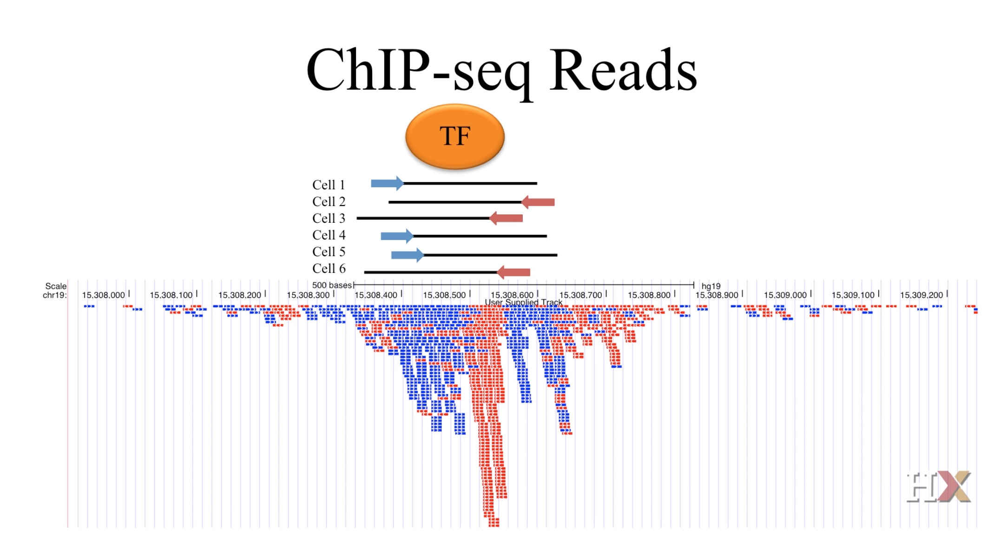
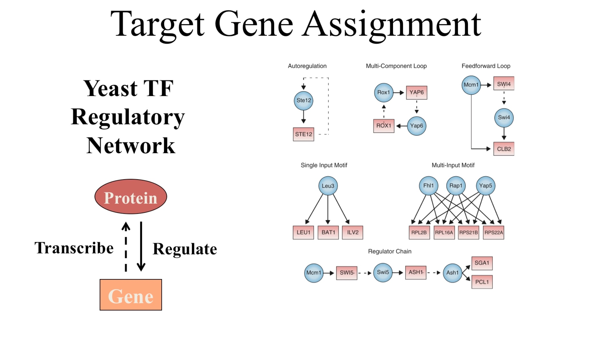
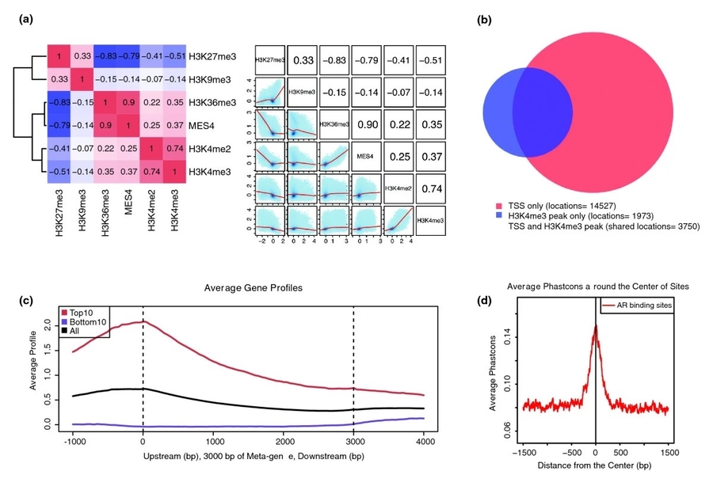

```{r setup, include=FALSE} 
knitr::opts_chunk$set(warning = FALSE, message = FALSE)
rm(list = ls())
```

\newpage

# Introduction
**QTL:** A quantitative trait locus (QTL) is a locus that correlates with variation of a quantitative trait in the phenotype of a population of organisms. QTLs are mapped by identifying which molecular markers (such as SNPs or AFLPs) correlate with an observed trait.

**Locus:** A genomic region that explains phenotypic differences due to genetic polymorphisms.

**Quantitative trait:** Also known as complex traits, are traits that do not behave according to simple Mendelian inheritance laws.

There are some different types of QTL:

* **eQTL:** Expression quantitative trait loci (eQTL) are genomic loci that explain variation in expression levels of mRNAs.
* **mQTL:** Methylation quantitative trait loci (mQTL) are genomic loci that explain variation in methylation levels of DNA.
* **sQTL:** Splicing quantitative trait loci (sQTL) are genomic loci that explain variation in regulation of alternative splicing of pre-mRNA.

# Crosses
**Backcross** is the simplest form of crossing where F1 individuals are crossed to one of the two parental strains. In a backcross to the A strain, one may detect a QTL only if the A allele is not dominant.

```{r, echo=FALSE, fig.align='center', fig.pos='H', fig.show='hold', fig.cap="Backcrossing", out.width = '90%'}

```

**Intercross** is the most widely used form of crossing. The intercross allows the detection of QTL for which one allele is dominant. Moreover, the intercross allows one to estimate the degree of dominance at a QTL.

```{r, echo=FALSE, fig.align='center', fig.pos='H', fig.show='hold', fig.cap="Intercrossing", out.width = '90%'}

```

**Recombinant inbred lines (RIL)** is another form beginning with an intercross, and then mating pairs of F2 siblings, followed by a parallel series of repeated sibling mating to construct a new panel of inbred lines whose genomes are a mosaic of the two initial lines. In RIL we can achieve better mapping resolution, but it is expensive.

```{r, echo=FALSE, fig.align='center', fig.pos='H', fig.show='hold', fig.cap="Recombinant inbred lines", out.width = '50%'}

```

# QTL mapping
The key idea in QTL mapping is to obtain phenotype data on a number of backcross or intercross progeny and then identify regions in the genome where genotype is associated with the phenotype. The genotype is observed at genetic markers (SNP, microsatellites, etc.). The principal goals of QTL mapping are:

* First, we seek to detect QTL (and, potentially, interactions among QTL).
* Second, we seek confidence regions for the locations of the QTL.
* Finally, we seek to estimate the effects of the QTL (i.e., the effect, on the phenotype, of substituting one allele for another).

# Import data
Let's import and check *listeria* dataset. The listeria data set is from Boyartchuk et al. (2001). This is an intercross using the C57BL/6ByJ and BALB/cByJ inbred mouse strains. There are 120 female intercross individuals (though only 116 were phenotyped). Mice were injected with Listeria monocytogenes; the phenotype is survival time (in hours). A large proportion of the mice (35/116) survived past the 240-hour time point and were considered to have recovered from the infection; their phenotype was recorded as 264.

Let's check the data now:
```{r}
# Import data
library(qtl)
data("listeria")

# Check data summary
summary(listeria)
```

Let's plot data summaries:
```{r, fig.align='center', out.width = '75%'}
# The pattern of missing genotype data
plotMissing(listeria)

# The genetic map of the typed markers
plot.map(listeria)

# A histogram of the phenotype
plotPheno(listeria, 1, xlab = "", main = "Survival time (hr)")

# A bar plot of the sexes
plotPheno(
  listeria,
  2,
  xlab = "",
  main = "Sex",
  col = "blue",
  space = 1.5,
  names.arg = c("Female", "Male")
)
```

Other functions for checking data includes:
```{r}
# Number of individuals
nind(listeria)

# Number of phenotypes
nphe(listeria)

# Number of markers
totmar(listeria)

# Number of chromosomes
nchr(listeria)

# Numbers of markers on individual chromosomes
nmar(listeria)
```

Now let's check geno and pheno data:
```{r}
# Marker geno data for chr 1
## Backcross codes: 1 for homozygotes and 2 for heterozygotes
## Intercross codes: 1 for AA, 2 for AB, 3 for BB, 4 for not BB, 5 for not AA
listeria$geno[[1]]$data[1:2, 1:4]

# On the chr X, all individuals are coded with genotypes 1/2
listeria$geno[[20]]$data[1:2, 1:2]

# Positions of the markers, in cM, for chr 1
listeria$geno[[1]]$map[1:4]

# Chromosome class of chr 19 and chr X
sapply(listeria$geno, class)[19:20]

# Pheno data
## Rows correspond to individuals and columns correspond to phenotypes
listeria$pheno[1:3, ]
```

Let's create a matrix containing the pairwise recombination fractions and LOD scores. Values on the diagonal are the number of individuals that were genotyped for the corresponding marker. Values above the diagonal are LOD scores for a test of linkage; values below the diagonal are estimated recombination fractions.
```{r}
listeria <- est.rf(listeria)
listeria$rf[1:3, 1:3]
```

# Quality control
## Phenotypes
We begin by considering the example data, ch3a:
```{r}
# Import data
library(qtl)
library(qtlbook)
data(ch3a)
```

These data have five related phenotypes. Let's create histograms of the phenotypes:
```{r, fig.align='center', out.width = '70%'}
par(mfrow = c(2, 3))
for (i in 1:5) {
  plotPheno(ch3a, pheno.col = i, main = paste("Individual", i), xlab = "")
}
```

Now let's create scatterplots of the phenotypes against one another:
```{r, fig.align='center', out.width = '100%'}
pairs(
  jitter(as.matrix(ch3a$pheno)),
  cex = 0.6,
  las = 1,
  col = "red",
  labels = c("Ind 1", "Ind 2", "Ind 3", "Ind 4", "Ind 5"),
  xaxt = 'n',
  yaxt = 'n'
)
```

Each panel contains the data for one phenotype plotted against the data for another phenotype. The individual with 0 at the fourth phenotype now stands out.

We know plot the individuals’ phenotypes against their index, which may correspond to the order in which they were measured:
```{r, fig.align='center', out.width = '70%'}
par(mfrow = c(1, 2),
    las = 1,
    cex = 0.8)
means <- apply(ch3a$pheno, 1, mean)
plot(means, xlab = "Index", ylab = "Means", col = "blue")
plot(sample(means), xlab = "Random index", ylab = "Means", col = "blue")
```

There is a clear pattern in the average phenotype that is not seen in the case that the data have been randomized.

## Segregation distortion
The genotypes should appear in the expected proportions. Apparent distortion may indicate genotyping problems. We consider the example data, ch3b:
```{r}
# Import data
library(qtl)
library(qtlbook)
data(ch3b)
```

Let's inspect the genotype frequencies at each marker:
```{r}
gt <- geno.table(ch3b)

# Inspect data for one marker
gt[1, ]
```

The last column in the output is a p-value for a chi-squared test of Mendelian proportions (1:2:1 in an intercross). Now we check for extreme distortions:
```{r}
gt[gt$P.value < 1e-7, ][1:4, 3:7]
```

It is likely that these problems are due to genotyping errors.

## Compare individuals’ genotypes
It is occasionally useful to compare the genotype data for each pair of individuals from a cross, to identify pairs that have unusually similar genotypes. These may indicate sample mix-ups:
```{r, fig.align='center', out.width = '75%'}
cg <- comparegeno(ch3a)
hist(cg,
     breaks = 200,
     xlab = "Proportion of identical genotypes",
     xlim = c(0, 1))
rug(cg)
```

With the following code, we can identify the pairs of individuals with very similar genotype data:
```{r}
which(cg > 0.9, arr.ind = TRUE)
```

Individuals 5 and 138 have identical genotypes at all 86 markers at which they were both typed; individuals 12 and 55 have the same genotype at 75/76 markers. Real backcross individuals shouldn’t show such similarity in their genotypes, and so these individuals’ data should be viewed with suspicion.

## Check marker order
It is critical that one check that markers are placed on the correct chromosomes and in the correct order.

### Pairwise recombination fractions
The first thing to do is to estimate, for each pair of markers, the recombination fraction between them, "r", and calculate a LOD score for the test of r = 1/2. Markers on different chromosomes should not appear linked, and for markers on the same chromosome, the estimated recombination fraction should be smaller for more closely linked markers:
```{r}
# Import data
library(qtl)
library(qtlbook)
data(ch3c)

# Estimate recombination fractions
ch3c <- est.rf(ch3c)

# Check problematic markers
checkAlleles(ch3c)
```

There appear to be problems on chromosomes 1 and 7. Let us look in more detail at the genotype data for the markers on chr 1:
```{r}
# Display the map for chr 1
pull.map(ch3c, 1)

# Create tables of genotypes at one marker against genotypes at another marker
geno.crosstab(ch3c, "c1m3", "c1m4")
geno.crosstab(ch3c, "c1m3", "c1m5")
geno.crosstab(ch3c, "c1m4", "c1m5")
```

It looks like marker "c1m3" is the problem: for that marker, relative to markers "c1m4" and "c1m5", the double-recombinant classes are more common than the nonrecombinant ones, while the table of two-locus genotypes for markers "c1m4" and "c1m5" looks okay.

To fix the problem, we pull out the genotypes for chr 1, swap the alleles (replacing 1’s with 3’s and vice versa), and then put the new data back:
```{r}
g <- pull.geno(ch3c, 1)
g[, "c1m3"] <- 4 - g[, "c1m3"]
ch3c$geno[[1]]$data <- g
```

By a similar approach, we find that it is "c7m2" on chr 7 that is the problem. We fix it as follows:
```{r}
g <- pull.geno(ch3c, chr = 7)
g[, "c7m2"] <- 4 - g[, "c7m2"]
ch3c$geno[[7]]$data <- g
```

Now, let's recheck:
```{r}
ch3c <- est.rf(ch3c)
checkAlleles(ch3c)
```

Now plot the pairwise recombination fractions and LOD scores:
```{r, fig.align='center', out.width = '75%'}
plotRF(
  ch3c,
  alternate.chrid = TRUE,
  main = "",
  col.scheme = "redblue"
)
```

The estimated recombination fractions between markers are in the upper left, and the LOD scores are in the lower right. Red indicates pairs of markers that appear to be linked, and blue indicates pairs that are not linked. There are a number of red points in the lower right, indicating markers on different chromosomes that appear linked. In particular, there appear to be problems on chromosomes 1, 7, 12, 13, and 15. We plot the results for just those chromosomes:
```{r, fig.align='center', out.width = '65%'}
plotRF(
  ch3c,
  chr = c(1, 7, 12, 13, 15),
  main = "",
  col.scheme = "redblue"
)
```

The results indicate that the 4th marker on chr 7 belongs on chr 15, the 1st marker on chr 12 belongs on chr 7, the 2nd marker on chr 12 belongs on chr 1, the 1st marker on chr 13 belongs on chr 12, and the 5th marker on chr 15 belongs on chr 12.

It is also valuable to use the available genotype data to re-estimate the intermarker distances of the genetic map:
```{r, fig.align='center', out.width = '65%'}
# We assume a 0.1% genotyping error rate
nm <- est.map(ch3c, error.prob = 0.001)
plot(nm)
```

The estimated map indicates clear problems on chr 7, 12 and 15: enormous map expansion occurs as a result of markers that do not belong on those chromosomes.

Let's move these markers to the positions that they appear to be linked:
```{r}
ch3c <- movemarker(ch3c, find.marker(ch3c, 7, index = 4), 15)
ch3c <- movemarker(ch3c, find.marker(ch3c, 12, index = 2), 1)
ch3c <- movemarker(ch3c, find.marker(ch3c, 12, index = 1), 7)
ch3c <- movemarker(ch3c, find.marker(ch3c, 13, index = 1), 12)
ch3c <- movemarker(ch3c, find.marker(ch3c, 15, index = 5), 12)
```

Let's re-check now:
```{r, fig.align='center', out.width = '65%'}
plotRF(
  ch3c,
  chr = c(1, 7, 12, 13, 15),
  main = "",
  col.scheme = "redblue"
)
```

The markers now appear to be on the correct chromosomes, though there remain some problems with the order of markers within the chromosomes.

### Rippling marker order
Now we check the order of markers within a chromosome. As the number of all possible orderings of markers is huge, we consider a sliding window of markers and consider all possible orders of the markers within the window:
```{r}
rip <- ripple(
  ch3c,
  chr = 1,
  window = 5,
  method = "countxo",
  verbose = FALSE
)
summary(rip)
```

The first row is the original marker order. Other marker orders are sorted by the number of obligate crossovers. We can adopt the second order (with the minimal number of obligate crossovers):
```{r}
ch3c <- switch.order(ch3c, chr = 1, order = rip[2,])
```

We will recheck again but with a smaller window size, to see if the likelihood approach is inconsistent with the approximate method. We assume a genotyping error rate of 0.001:
```{r}
rip <- ripple(
  ch3c,
  chr = 1,
  window = 3,
  method = "likelihood",
  error.prob = 0.001,
  verbose = FALSE
  )
summary(rip)
```

The LOD score (log10 likelihood ratio) compares the original order to the alternative order: a negative value (as here) indicates that the original order has higher likelihood. The last column gives the estimated genetic length of the chromosome with the different marker orders; the best marker order is generally that giving the shortest chromosome length. We see that no further change is needed.

We would now use the same approach with all other chromosomes:
```{r}
# Create a list for the output
rip <- vector("list", nchr(ch3c))

# Assign it the names of the chromosomes
names(rip) <- names(ch3c$geno)

# Check the order of markers
for (i in names(ch3c$geno)) {
  rip[[i]] <- ripple(
    ch3c,
    chr = i,
    window = 7,
    method = "countxo",
    verbose = FALSE
    )
}

# Extract for each chr, the difference in the number of obligate crossovers
# between the initial order and the best of the other orders
dif.nxo <- sapply(rip, function(a) {
  a[1, ncol(a)] - a[2, ncol(a)]
})

# Switch the order of markers
for(i in names(ch3c$geno)) {
  if (dif.nxo[i] > 0) {
    ch3c <- switch.order(ch3c, i, rip[[i]][2, ])
  }
}

# Repeat the process to see if any further improvement may be found
for(i in names(ch3c$geno)) {
  rip[[i]] <- ripple(
    ch3c,
    chr = i,
    window = 7,
    method = "countxo",
    verbose = FALSE
    )
}

dif.nxo <- sapply(rip, function(a) {
  a[1, ncol(a)] - a[2, ncol(a)]
})
any(dif.nxo > 0)
```

Finally, we go back through all of the chromosomes with ripple, this time using likelihood method and a window size of 3 markers:
```{r}
# Create a list for the output
rip <- vector("list", nchr(ch3c))

# Assign it the names of the chromosomes
names(rip) <- names(ch3c$geno)

# Check the order of markers
for(i in names(ch3c$geno)){
  rip[[i]] <- ripple(
  ch3c,
  chr = i,
  window = 3,
  method = "likelihood",
  error.prob = 0.001,
  verbose = FALSE
  )
}

lod <- sapply(rip, function(a) {
  a[2, ncol(a) - 1]
})
lod[lod > 0]
```

The X chromosome shows some improvement, and so we look at those results more closely:
```{r}
summary(rip[["X"]])
```

The second order increases the likelihood by a factor of 10 ^ 1.7 = 50, but leads to a longer chromosome. As a LOD score of 1.7 is not exceptionally strong, we do not need to switch the orders.

Finally, we may take another look at the pairwise recombination fractions, at least for chromosomes that were shown in the previous section:
```{r, fig.align='center', out.width = '75%'}
ch3c <- est.rf(ch3c)
plotRF(
  ch3c,
  chr = c(1, 7, 12, 13, 15),
  main = "",
  col.scheme = "redblue"
)
```

The results are just what we want: red along the diagonal, fading to blue off the diagonal.

### Estimate genetic map
Now we estimate the intermarker distances from the observed data and compare the results to the map that was included with the data:
```{r, fig.align='center', out.width = '65%'}
nm <- est.map(ch3c, error.prob = 0.001, verbose = FALSE)
plot.map(ch3c, nm)
```

For many chromosomes, the estimated map is identical to the one within the dataset.  Several chromosomes exhibit considerable map expansion (e.g., chromosome 6): the estimated map is quite a bit longer than the map in the data. This may indicate the presence of genotyping errors.

One may wish, at this point, to replace the map within the dataset with that estimated from the data. Reference genetic maps are often based on a rather small number of individuals. One’s own data often contains many more individuals, and so may produce a more accurate map. The only caveat is that reference genetic maps generally contain a much more dense set of markers, which provides greater ability to detect genotyping errors. Thus reference genetic maps may be based on cleaner genotype data.

Let's replace the genetic map in the dataset with that estimated from the data and recheck the plot:
```{r, fig.align='center', out.width = '65%'}
ch3c <- replace.map(ch3c, nm)
plot.map(ch3c, nm)
```

## Identifying genotyping errors
Genotyping errors may appear as apparent tight double crossovers. Meiosis generally exhibits strong crossover interference, and so crossovers will not occur too close together. Thus, if the genotype at a single marker is out of phase with the surrounding markers, it is likely in error. Let's calculate the genotyping error LOD scores, but first, we may first wish to replace the map in the data with that estimated from the data:
```{r}
data(hyper)
newmap <- est.map(hyper, error.prob = 0.01)
hyper <- replace.map(hyper, newmap)
hyper <- calc.errorlod(hyper)
top <- top.errorlod(hyper, cutoff = 5)
top
```

Let's plot the results for chr 16:
```{r, fig.align='center', out.width = '100%'}
plotGeno(hyper, chr = 16, top$id[top$chr == 16], cutoff = 5)
```

A small number of genotyping errors will not have much influence on the results.

## Counting crossovers
Another useful diagnostic is to count the number of crossovers implied by the genotype data in each individual. Individuals with an unusually small or large number of crossovers should be viewed with suspicion:
```{r, fig.align='center', out.width = '100%'}
nxo <- countXO(hyper)
plot(nxo, ylab = "Num of crossovers", col = "red")
```

We see a large shift in the distribution between the first 92 individuals and the remaining 158 individuals. Particularly interesting are the two individuals with > 25 crossovers:
```{r}
nxo[nxo > 25]
```

The 56th individual exhibited 37 crossovers. If we pull out the crossover counts for each chromosome for individual 56, we can identify the chromosomes that are particularly problematic:
```{r}
countXO(hyper, bychr = TRUE)[56, ]
```

The genotype data for chromosome 6 are particularly suspicious, and deserve further investigation.

## Missing genotype information
Now we compute the proportion of missing genotype information at positions along the genome, given the available marker data. This can help us to identify regions where further markers might be added:
```{r, fig.align='center', out.width = '75%'}
plotInfo(hyper, method = "both", col = c("blue", "red"))
```

The entropy and variance versions of the results are plotted in blue and red, respectively. The proportion of missing genotype information is effectively 0 at the fully typed markers. For several chromosomes, the minimal missing information is about 63%, as only the 92 individuals (out of 250) with extreme phenotypes were genotyped.

We can get the results just at the markers as follows:
```{r, fig.align='center', out.width = '75%'}
z <- plotInfo(hyper, method = "both", step = 0)
z[z[, 1] == 14, ]
```

We can get a histogram of the number of missing genotypes at the markers:
```{r, fig.align='center', out.width = '70%'}
hist(
  nmissing(hyper, what = "mar"),
  breaks = 50,
  main = "",
  xlab = "Num of missing genotypes",
   col = "blue"
)
```

About 40 markers were typed on essentially everyone; over 100 were typed on only the 92 individuals with extreme phenotypes. The remaining 29 mark- ers were typed only on a few individuals.

# Single-QTL analysis
The most commonly used method for QTL analysis is interval mapping, in which one posits the presence of a single QTL and considers each point on a dense grid across the genome, one at a time, as the location of the putative QTL. But first, we describe an even simpler method, sometimes called marker regression.

## Marker regression
It consists of considering each marker individually, splitting the individuals into groups, according to their genotypes at the marker, and comparing the groups’ phenotype averages. Consider, for example, the *hyper* data. The blood pressure phenotype is plotted against the genotype at markers "D4Mit214" and "D12Mit20":
```{r, fig.align='center', out.width = '100%'}
library(qtl)
data(hyper)
par(mfrow = c(1, 2))
plotPXG(hyper, "D4Mit214", ylab = "Blood Pressure")
plotPXG(hyper, "D12Mit20", ylab = "Blood Pressure")
```

At "D4Mit214", the homozygous individuals exhibit a larger average phenotype than the heterozygotes, indicating that this marker is linked to a QTL.

In a backcross, we test for linkage of a marker to a QTL by a t test; in an intercross, we would use analysis of variance (ANOVA), which gives an F statistic. Traditionally, evidence for linkage to a QTL is measured by a LOD score: the log10 likelihood ratio comparing the hypothesis that there is a QTL at the marker to the hypothesis that there is no QTL anywhere in the genome:
```{r, fig.align='center', out.width = '80%'}
# Fit of single-QTL models
out.mr <- scanone(hyper, method = "mr")

# Take a peak at the results
out.mr[out.mr$chr == 12, ]

# Show just those with a LOD > 3
summary(out.mr, threshold = 3)

# Plot of the LOD scores at chr 1, 4, and 12
plot(out.mr, chr = c(1, 4, 12), ylab = "LOD score", col = "red")
```

The jagged appearance of the LOD curve for chromosome 4 is due to the pattern of missing marker genotype data.

## Interval mapping
Interval mapping improves on the marker regression method by taking account of missing genotype data at a putative QTL. In this section, we consider several variants on interval mapping.

### Standard interval mapping
Standard interval mapping uses maximum likelihood estimation under a mixture model. The most important disadvantage of interval mapping is that we are still considering only a single-QTL model, and so we have limited ability to separate linked QTL and no ability to assess possible interactions among QTL. Note that no two markers should be placed at precisely the same position. Marker positions may be moved apart slightly as follows:
```{r}
hyper <- jittermap(hyper)
```

Now to perform standard interval mapping:
```{r, fig.align='center', out.width = '80%'}
# Calculate the conditional genotype probabilities
hyper <- calc.genoprob(hyper, step = 1, error.prob = 0.001)

# Perform interval mapping
out.em <- scanone(hyper, method = "em")

# Plot the results and compare it with marker regression
plot(
  out.em,
  out.mr,
  chr = c(1, 4, 12),
  col = c("blue", "red"),
  ylab = "LOD score"
)
legend(
  x = "topright",
  legend = c("Standard interval mapping", "Marker regression"),
  col = c("blue", "red"),
  lty = 1,
  cex = 0.8
)
```

### Haley–Knott regression
Haley–Knott regression provides a fast approximation of the results of standard interval mapping. Haley–Knott regression provides a fast approximation of the results of standard interval mapping:
```{r, fig.align='center', out.width = '80%'}
# Calculate the conditional genotype probabilities
hyper <- calc.genoprob(hyper, step = 1, error.prob = 0.001)

# Perform Haley–Knott regression
out.hk <- scanone(hyper, method = "hk")

# Plot the results and compare it with the previous ones
plot(
  out.em,
  out.mr,
  out.hk,
  chr = c(1, 4, 12),
  col = c("blue", "red", "green"),
  ylab = "LOD score"
)
legend(
  x = "topright",
  legend = c(
    "Standard interval mapping",
    "Marker regression",
    "Haley–Knott regression"
  ),
  col = c("blue", "red", "green"),
  lty = 1,
  cex = 0.8
)
```

### Extended Haley–Knott regression
The extended Haley–Knott method is not as fast as Haley–Knott regression, but it provides an improved approximation and is still somewhat faster than standard interval mapping. Most importantly, the extended Haley–Knott method is more robust than standard interval mapping:
```{r, fig.align='center', out.width = '80%'}
# Calculate the conditional genotype probabilities
hyper <- calc.genoprob(hyper, step = 1, error.prob = 0.001)

# Perform Haley–Knott regression
out.ehk <- scanone(hyper, method = "ehk")

# Plot the results and compare it with the previous ones
plot(out.mr, chr = c(1, 4, 12), col = "red", ylab = "LOD score")
plot(out.em, chr = c(1, 4, 12), col = "blue", add = TRUE)
plot(out.hk, chr = c(1, 4, 12), col = "green", add = TRUE)
plot(out.ehk, chr = c(1, 4, 12), col = "purple", add = TRUE)
legend(
  x = "topright",
  legend = c(
    "Marker regression",
    "Standard interval mapping",
    "Haley–Knott regression",
    "Extended Haley–Knott regression"
  ),
  col = c("red", "blue", "green", "purple"),
  lty = 1,
  cex = 0.6
)
```

### Multiple imputation
The multiple imputation approach dispenses with the missing data problem by filling in all missing genotype data, even at sites between markers. For example, the following figure illustrates the imputation of a single backcross individual’s genotype data:
```{r, echo=FALSE}
set.seed(12201969 + 15)

data(hyper)
hyper <- subset(hyper, chr = 12, ind = 1:10)
m <- c(0, 16, 22, 40, 56)
names(m) <- names(hyper$geno[[1]]$map)
hyper$geno[[1]]$map <- m
marpos <- round(pull.map(hyper)[[1]])

par(mar = rep(0.1, 4), bty = "n")
plot(
  0,
  0,
  type = "n",
  xlab = "",
  ylab = "",
  xaxt = "n",
  yaxt = "n",
  xlim = c(6, 100),
  ylim = c(3.5, 103.5),
  xaxs = "i",
  yaxs = "i"
)
xl <- c(30, 97)
yp <- 93
yd <- 1
segments(xl[1], yp, xl[2], yp)

L <- diff(range(marpos))
otherpos <- seq(0, L, by = 2)
otherpos <- otherpos[is.na(match(otherpos, marpos))]

xotherpos <- otherpos * diff(xl) / L + xl[1]
xmarpos <- marpos * diff(xl) / L + xl[1]
segments(xmarpos, yp - yd * 2, xmarpos, yp + yd * 2)
segments(xotherpos, yp - yd, xotherpos, yp + yd)
text(xmarpos, yp + yd * 6, marpos)

xd <- 4
text(xl[1] - xd, yp, "Genetic map:", adj = c(1, 0.5))

yp2 <- yp - yd * 8
ind <- 9 # or 13, 14, 57, 58
nmar <- length(marpos)
nother <- length(otherpos)
points(
  xmarpos,
  rep(yp2, nmar),
  pch = 22,
  cex = 1.5,
  bg = c("red", "blue")[hyper$geno[[1]]$data[ind, ]],
  col = "black"
)
points(xotherpos, rep(yp2, nother), pch = 0, cex = 1.5)

text(xl[1] - xd, yp2, "Observed data:", adj = c(1, 0.5))

hyper <- sim.geno(hyper, n.draws = 64, step = 2)
hyper$geno[[1]]$draws <- hyper$geno[[1]]$draws[, , -(11:22)]
xallpos <- sort(c(xmarpos, xotherpos))
npos <- length(xallpos)
yp3 <- yp2 - yd * 8
text(xl[1] - xd, yp3, "Imputations:", adj = c(1, 0.5))
i <- 1
for (i in 1:15) {
  points(
    xallpos,
    rep(yp3, npos),
    pch = 22,
    cex = 1.5,
    bg = c("red", "blue")[hyper$geno[[1]]$draws[ind, , i]],
    col = "black"
  )
  yp3 <- yp3 - yd * 5
}

yp4 <- yp2 - yd * 6 - yd * 3 * 5
xp2 <- 12
yd2 <- yd * 6
points(
  xp2,
  yp4,
  pch = 22,
  cex = 1.5,
  bg = "red",
  col = "black"
)
text(xp2 + xd * 0.5, yp4, "= AA", adj = c(0, 0.5))

points(
  xp2,
  yp4 - yd2,
  pch = 22,
  cex = 1.5,
  bg = "blue",
  col = "black"
)
text(xp2 + xd * 0.5, yp4 - yd2, "= AB", adj = c(0, 0.5))

points(xp2, yp4 - 2 * yd2, pch = 0, cex = 1.5)
text(xp2 + xd * 0.5, yp4 - 2 * yd2, "= missing", adj = c(0, 0.5))
```

The observed genotype data at five genetic markers is shown at the top, followed by the imputed genotypes for 15 different imputations. Note that the positions of the recombination events vary among the imputations, and a couple of imputations exhibit double-crossovers between markers.

The multiple imputation approach has greatest value for the fit and exploration of multiple-QTL models:
```{r}
# Perform the imputations
hyper <- sim.geno(hyper,
                  step = 1,
                  n.draws = 64,
                  error.prob = 0.001)

# Perform multiple imputation
out.imp <- scanone(hyper, method = "imp")

# Plot the results and compare it with the previous ones
plot(out.mr, chr = c(1, 4, 12), col = "red", ylab = "LOD score")
plot(out.em, chr = c(1, 4, 12), col = "blue", add = TRUE)
plot(out.hk, chr = c(1, 4, 12), col = "green", add = TRUE)
plot(out.ehk, chr = c(1, 4, 12), col = "purple", add = TRUE)
plot(out.imp, chr = c(1, 4, 12), col = "black", add = TRUE)
legend(
  x = "topright",
  legend = c(
    "Marker regression",
    "Standard interval mapping",
    "Haley–Knott regression",
    "Extended Haley–Knott regression",
    "Multiple imputations"
  ),
  col = c("red", "blue", "green", "purple", "black"),
  lty = 1,
  cex = 0.6
)
```

### Comparison of methods
Relative advantages and disadvantages of the four interval mapping methods are shown below:

| Method                      | Use of genotype information  | Robustness | Selective genotyping | Speed |
| --------------------------- | ---------------------------- | ---------- | ---------- | ------ |
| Standard interval mapping   | ++                           | -          | +         | -      |
| Haley–Knott                 | -                            | +          | -         | +      |
| Extended Haley–Knott        | +                            | +          | +         | -      |
| Multiple imputation         | ++                           | +          | +         | --     |

## Significance thresholds
A LOD score indicates evidence for the presence of a QTL, with larger LOD scores corresponding to greater evidence. We compare our observed LOD scores to the distribution of the genome-wide maximum LOD score, in the case that there were no QTL anywhere. The 95th percentile of this distribution may be used as a genome-wide LOD threshold. One may derive this null distribution by permutation test. While we generally use 1000 permutation replicates initially, we may go up to 10,000 or even 100,000 replicates in order to achieve greater precision.
Alternatively, one may calculate a genome-scan-adjusted p-value corresponding to an observed LOD score.

Let us illustrate the permutation test:
```{r}
# Import data
data(hyper)

# Obtain the QTL genotype probabilities
hyper <- calc.genoprob(hyper, step = 1, error.prob = 0.001)

# Do the permutation test
operm <- scanone(hyper, n.perm = 1000, verbose = FALSE)

# Plot a histogram of the permutation results
plot(operm, col = "blue", xlab = "Max of LOD score")

# Obtain genome-wide LOD thresholds for significance levels 20% and 5%
summary(operm, alpha = c(0.20, 0.05))
```

In the above, we used the traditional permutation test. However, for the *hyper* data, a selective genotyping strategy was used, and so it is best to use a stratified permutation test, permuting individuals’ phenotypes separately within strata defined by the extent of genotyping. We must first define a vector that indicates the strata. This may be done as follows. We place individuals who were genotyped at more than 100 markers in one group and the other individuals in a second group:
```{r}
strat <- (ntyped(hyper) > 100)
```

We then rerun the permutation test:
```{r}
# Do the permutation test
operms <-
  scanone(hyper,
          n.perm = 1000,
          perm.strata = strat,
          verbose = FALSE)

# Plot a histogram of the permutation results
plot(operm, col = "blue", xlab = "Max of LOD score")

# Obtain genome-wide LOD thresholds for significance levels 20% and 5%
summary(operm, alpha = c(0.20, 0.05))
```

In this particular case, we see little difference in the significance threshold when using the stratified permutation test.

Turning now to the use of the permutation results, we can pick out the LOD peaks (no more than one per chromosome) that meet the 10% significance level with the genome-scan-adjusted p-value for the results of single-QTL analysis using the following commands:
```{r}
summary(out.em, perms = operms, alpha = 0.1, pvalues = TRUE)
```

For the QTL on chromosome 4, our estimated p-value is 0. Citing a p-value of 0 doesn’t seem right, but we can get an upper confidence limit on the true p-value as follows:
```{r}
binom.test(0, 1000)$conf.int
```

Thus, we might report p < 0.004.

## The X chromosome
The X chromosome exhibits special behavior and must be treated differently from the autosomes in QTL mapping.

```{r, echo=FALSE, fig.align='center', fig.pos='H', fig.show='hold', fig.cap="The behavior of the X chromosome in a backcross. Circles and squares correspond to females and males, respectively. The small bar is the Y chromosome.", out.width = '40%'}

```

```{r, echo=FALSE, fig.align='center', fig.pos='H', fig.show='hold', fig.cap="The behavior of the X chromosome in a intercross Circles and squares correspond to females and males, respectively. The small bar is the Y chromosome.", out.width = '40%'}

```

If not taken into account, such systematic differences can lead to large LOD scores on the X chromosome even in the absence of X chromosome linkage. Finally, to account for the fact that the number of degrees of freedom for the linkage test on the X chromosome may be different from that on the autosomes, an X-chromosome-specific significance threshold is required.

### Analysis
For all interval mapping methods, the actual analysis is essentially the same for the X chromosome as for the autosomes. As each backcross or intercross individual has a single X chromosome that was subject to recombination,the calculation of the genotype probabilities given the available multipoint marker genotype data is identical to those for an autosome in a backcross, and so nothing new is needed there.

### Significance thresholds
We use a constant LOD threshold across the autosomes and a separate threshold for the X chromosome. The precise estimation of the X-chromosome-specific LOD threshold will require considerably more permutation replicates.

### Example
As an example, we consider the data of Grant et al. (2006), which concerns the basal iron levels in the liver and spleen of intercross mice. Both sexes from reciprocal intercrosses with the "C57BL/6J/Ola" and "SWR/Ola" strains were used; there are 284 individuals in total. There are two phenotypes: the level of iron (in μg/g) in the liver and spleen. There are approximately equal proportions of males and females and of mice from each cross direction:
```{r}
# Import data
library(qtlbook)
data(iron)

# Plot histograms of the liver and spleen phenotypes
plot(iron, pheno = 1:2)

# The pattern of missing genotype data
plotMissing(listeria)

# The genetic map of the typed markers
plot.map(listeria)

# A histogram of the phenotype
plotPheno(listeria, 1, xlab = "", main = "Survival time (hr)")

# A bar plot of the sexes
plotPheno(
  listeria,
  2,
  xlab = "",
  main = "Sex",
  col = "blue",
  space = 1.5,
  names.arg = c("Female", "Male")
)
```

