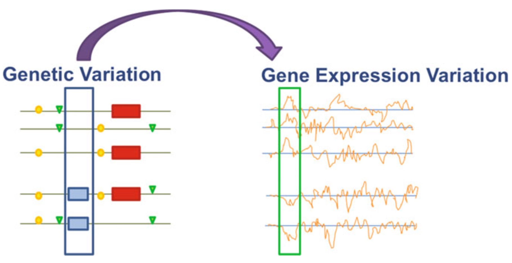

```{r setup, include=FALSE} 
knitr::opts_chunk$set(warning = FALSE, message = FALSE)
rm(list = ls())
```

\newpage

# Introduction
Expression quantitative trait loci (eQTL) are genomic loci that explain variation in expression levels of mRNAs. By using the expression of mRNA transcripts for genes as a phenotype of interest, one may quantify on a continuous scale the effect of regulatory variation by calculating the correlations between genetic differences and respective transcript abundance or probe intensity values.

```{r, echo=FALSE, fig.align='center', fig.pos='H', fig.show='hold', out.width = '60%'}

```

Typically, eQTLs may be annotated as single nucleotide polymorphisms (SNPs), large structural variants (SVs), or copy number variants (CNVs). 
For the relative location of the eQTL to the gene, a window of ±1 Megabase of genomic sequence is a common choice for practice in the literature