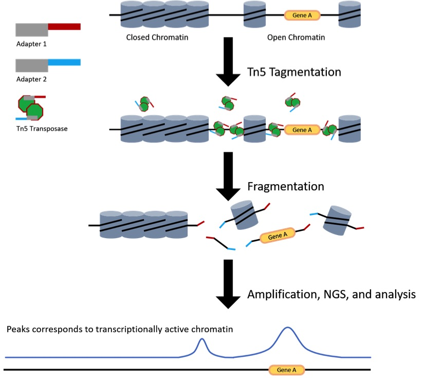
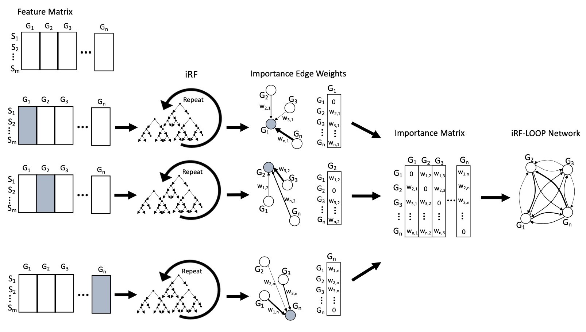

```{r setup, include=FALSE} 
knitr::opts_chunk$set(warning = F, message = F)
rm(list = ls())
```

\newpage

# Introduction
Gene Regulatory Networks (GRNs) are crucial to understanding biological systems since they show the regulatory relationships between transcription factors and target genes. A conceptual expansion on the GRN is the Predictive Expression Network (PEN). Algorithms that produce PENs utilize all genes in the input data, creating an all-to-all genes network.

# RF as a feature selection method
Some feature selection methods:

* Pearson Correlation
* Mutual Information (MI)
* Sequential Feature Selection (SFS)
* Lasso
* Ridge Regression
* Random Forest (RF): not a classical feature selection method

An RF is an ensemble of decision trees (DT). The number of trees in a forest is a parameter that is chosen by the user. During the training phase, DTs are built, where a random subset of features for a random subset of samples are examined at each decision point and the one that best divides the data is chosen. Once a forest has been generated, the importance of each feature can be calculated from node impurity using one of the following methods:

* Gini index: for classification
* Variance explained: for regression
* Permutation importance

Because of the nature of DTs, the importance of any chosen feature is inherently conditional on the previously chosen features. In this way, RF can account for some of the interconnected dependencies that occur in biological systems.

# Iterative RF (iRF)
It is an algorithmic advancement of RF, which produces a more accurate model by iteratively creating weighted forests. First, an RF is created where features are unweighted and have an equal chance of being randomly sampled at any given node. The resulting importance scores for the features are then used for weighting the features in the next forest, thus increasing the chance that important features are evaluated at any given node. This process is repeated *i* times.

```{r, echo=FALSE, fig.align='center', fig.pos='H', fig.show='hold', out.width = '70%'}

```

**Note:** Due to the ability to easily follow the decisions that these models make, they have been named explainable AI (X-AI).

## Implementation of iRF in R
**iRF** is an R package for iRF implementation. Unfortunately, this implementation is not very effective with big data.

## Implementation of iRF in C++
**Ranger-Based iRF (RB-iRF)** is an implementation of iRF in C++. **Ranger** is an open-source RF implementation in C++. RB-iRF has used *ranger* as the core of its iRF implementation.

# iRF-LOOP
iRF Leave One out Prediction (iRF-LOOP) is a method for the creation of PENs on the order of 40,000 genes or more. The method is as follows:

1. Given a gene expression matrix of *m* samples (rows) and *n* genes (columns), iRF-LOOP starts by treating each gene as the dependent variable (*Y*) and the remaining *n - 1* genes as predictor matrix (*X*) of size *m x (n - 1)*.
2. Using an iRF model, the importance score of each gene in *X*, for predicting *Y*, is calculated. The result is a vector, of size *n*, of importance scores (the importance score of *Y*, for predicting itself, has been set to zero).
3. This process is repeated for each of the *n* genes, requiring *n* iRF runs.
4. The *n* vectors of importance scores are concatenated into an *n x n* importance matrix.
5. To keep importance scores on the same scale across the importance matrix, each column is normalized relative to the sum of the column.
6. Finally, from the importance matrix we will generate a network. Generally, the scores (weights) are thresholded at some value and only edges with large enough weights are included in the final network. For example, we may produce four thresholded networks, keeping the top 10%, 5%, 1%, and 0.1% of edge scores, respectively.

```{r, echo=FALSE, fig.align='center', fig.pos='H', fig.show='hold', out.width = '85%'}

```

**Note:** A common setting for the number of trees is the square root of the number of genes.

## Example
The following file contains RNA-seq data for 22 samples of different human tissues and 52580 genes:
```{r}
# Import data
library(Biobase)
load("Data/wang_eset.RData")
exprs_data <- exprs(wang.eset)
rm(wang.eset)
```

Sample names include: SRX003935, SRX003921, ...
Gene names include: ENSG00000000003, ENSG00000000005, ...

Let's take a peak:
```{r}
dim(exprs_data)
exprs_data[1:5, 1:3]
```

So:

* *m* = 22
* *n* = 52580

Now, we will create an iRF with the expression values for the first gene (ENSG00000000003) as *Y* and the expression values for the rest of the 52579 genes as predictor matrix *X* of size 22 * 52579:
```{r}
Y = matrix(exprs_data[1, ],
  ncol = 1,
  dimnames = list(colnames(exprs_data), rownames(exprs_data)[1]))
X = t(exprs_data[c(-1), ])

# Take a peak
X[1:3, 1:3]
Y[1:3, ]
```

Now we perform iRF:
```{r}
imp_score <- iRF(X, Y, n.iter = 5, ntree = 229, verbose = F, n.core = -1)

# Set the importance score of Y for predicting itself as 0
imp_score <- rbind(0, imp_score[[2]])
rownames(imp_score)[1] <- rownames(exprs_data)[1]

# Check the highest value
imp_score[which(imp_score == max(imp_score)), ]
```

Let's do min-max feature scaling:
```{r}
imp_score <- (imp_score - min(imp_score)) / (max(imp_score) - min(imp_score))
```

Now, we will define a loop to do the same for all genes:
```{r}
imp_matrix <- c()
n_trees <- round(sqrt(dim(exprs_data)[1]) , digits = 0)

for (i in 1:dim(exprs_data)[1]) {
  Y = matrix(exprs_data[i, ],
    ncol = 1,
    dimnames = list(colnames(exprs_data), rownames(exprs_data)[i]))
  X = t(exprs_data)
  imp_score <- iRF(X, Y, n.iter = 5, ntree = n_trees, verbose = F, n.core = -1)
  imp_score <- imp_score[[2]]
  colnames(imp_score) <- rownames(exprs_data)[i]
  imp_score[i, ] <- 0
  imp_score <- (imp_score - min(imp_score)) / (max(imp_score) - min(imp_score))
  imp_matrix <- cbind(imp_matrix, imp_score)
  if (i %% 1000 == 0) {
    print(paste(i, "of", dim(exprs_data)[1], "Completed"))
  }
}
```

Keep the top *n* percent of each column:
```{r}
n = 10
for (i in 1:dim(exprs_data)[1]) {
  imp_matrix[, i] <- sort(imp_matrix[, i], decreasing = T)
  thresh <- imp_matrix[round(length(imp_matrix[, i]) / n, digits = 0), i]
  imp_matrix[which(imp_matrix[, i] <= thresh), i] <- NA
}
```

