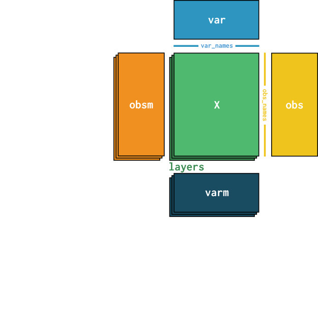
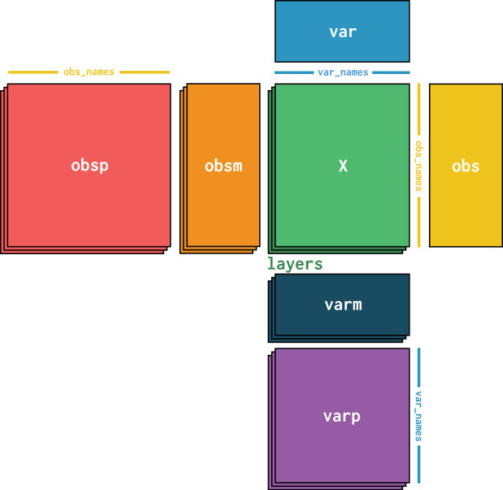
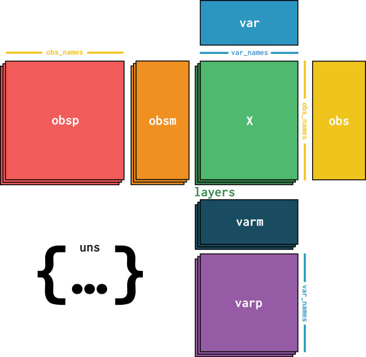
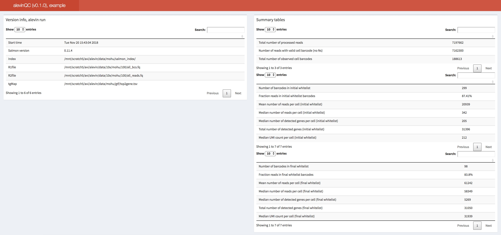
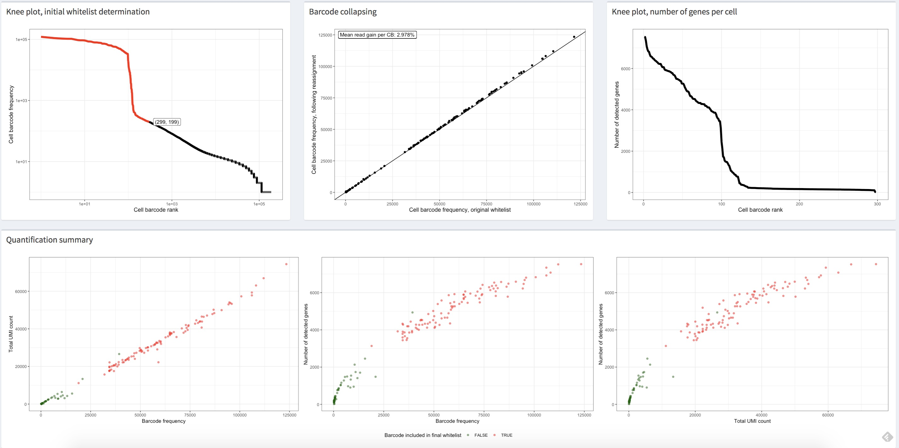
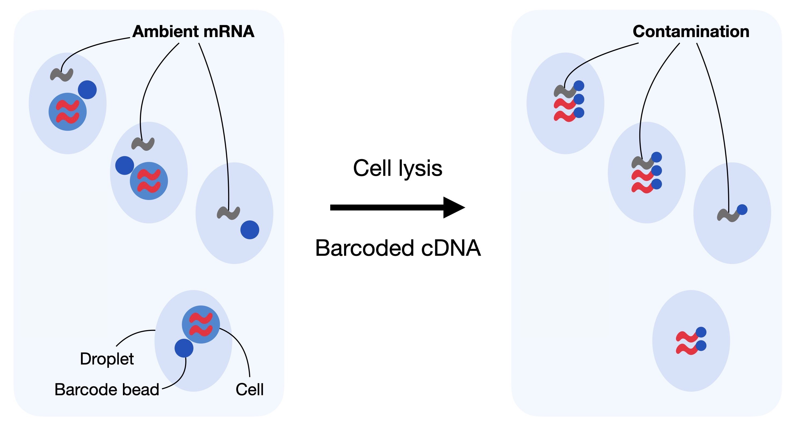
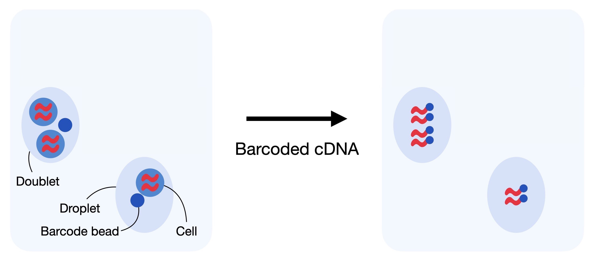
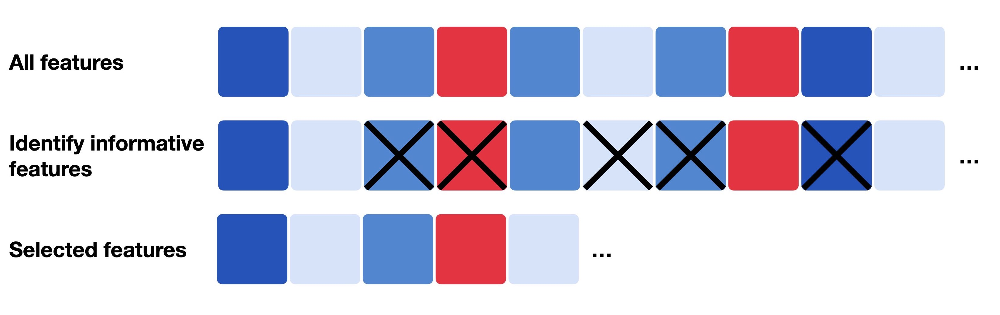
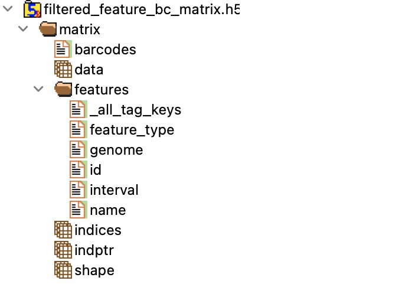

```{r setup, include=FALSE}
knitr::opts_chunk$set(warning = FALSE, message = FALSE)
rm(list = ls())
```

\newpage

# Experimental procedures
## History of technology
```{r, echo=FALSE, fig.align='center', fig.pos='H', fig.show='hold', out.width = '100%'}
knitr::include_graphics("Figures/18-1.jpeg")
```

## An overview of scRNA-Seq procedures
```{r, echo=FALSE, fig.align='center', fig.pos='H', fig.show='hold', out.width = '100%'}
knitr::include_graphics("Figures/18-2.jpeg")
```

A) Single-cell isolation and capture is the process of capturing high-quality individual cells from a tissue, thereby extracting precise genetic and biochemical information and facilitating the study of unique genetic and molecular mechanisms. The most common techniques of single-cell isolation and capture include limiting dilution, fluorescence-activated cell sorting (FACS), magnetic-activated cell sorting, microfluidic system, and laser microdissection.

B) After the process of converting RNA into the first-strand cDNA, the resulting cDNA are amplified by either polymerase chain reaction (PCR) or in vitro transcription (IVT). To overcome amplification-associated biases, unique molecular identifiers (UMIs) were introduced to barcode each individual mRNA molecule within a cell in the reverse transcription step.

## Limitations
The scRNA-seq has gradually revealed some inherent methodological issues, such as ‘artificial transcriptional stress responses’. It means that the dissociation process could induce the expression of stress genes, which lead to artificially changes in cell transcription patterns. Dissociation of tissues into single-cell suspension at 4°C has thus been suggested to minimize the isolation procedure-induced gene expression changes.

## snRNA-Seq
Single-nucleus RNA sequencing (snRNA-seq) is an alternative single-cell sequencing method. Instead of sequencing all the mRNA in the cytoplasm of cells, scRNA-seq only captures the mRNAs in the nucleus of cells. snRNA-seq becomes very useful in many tissue types, such as muscle tissue, heart, kidney, lung, pancreas, and various tumor tissues. It is particularly applicable in brain tissues, which are difficult to be dissociated to obtain intact cells.

It should be noted that snRNA-seq only captures transcripts in the nucleus, which might fail to capture important biological processes related to, that is, mRNA processing, RNA stability and metabolism.

## Protocols
```{r, echo=FALSE, fig.align='center', fig.pos='H', fig.show='hold', out.width = '100%'}
knitr::include_graphics("Figures/18-3.jpeg")
```

# Roadmap for typical scRNA-Seq analysis
```{r, echo=FALSE, fig.align='center', fig.pos='H', fig.show='hold', out.width = '100%'}
knitr::include_graphics("Figures/18-4.jpeg")
```

# Raw data processing
Basic formats of raw sequencing data for single-cell transcriptome include FASTQ and BCL format, which depend on the data source and sequencing platform.

```{r, echo=FALSE, fig.align='center', fig.pos='H', fig.show='hold', out.width = '100%'}
knitr::include_graphics("Figures/18-5.jpeg")
```

The fundamental steps in raw data processing include: quality control, read alignment/mapping, cell barcode (CB) identification and correction, and the estimation of molecule counts through the resolution of unique molecular identifiers (UMIs).

## Quality control
**FastQC** can be applied on FASTQ data to assess the quality of raw scRNA-Seq data.

## Alignment and quantification
High-quality reads need to be mapped to the specific reference genome using an appropriate aligner. Depending on the sequencing protocol, the resulting raw sequence file contains the cell-level information, commonly known as cell barcodes (CB), the unique molecule identifier (UMI), and the raw cDNA sequence (read sequence) generated from the molecule.

The *count* is the most important function of **Cell Ranger**, which has wrapped up the alignment, filtering, UMI counting, and other practical steps internally. The Cell Ranger uses an aligner called **STAR**, which performs splicing-aware alignment of reads to the genome and then uses transcriptional annotation GTF file to categorize these reads into exons, introns, and intergenic based on whether the reads are aligned to the genome confidently.

## Cell barcode correction
The RNA material of each cell is extracted within a water-based droplet encapsulation along with a barcoded bead. These beads tag the RNA content of individual cells with unique oligonucleotides, called cell barcodes (CBs), that are later sequenced along with the fragments of the cDNAs. The beads contain high-diversity DNA barcodes enabling parallel barcoding of the cell’s molecular content and in silico demultiplexing of the sequencing reads into individual cellular bins.

**Focus:**  It is important to note that the term “barcode” is used here instead of “cell” as a barcode might wrongly have tagged multiple cells (doublet) or might have not tagged any cell (empty droplet/well).

## UMI resolution
Reads must be deduplicated, based upon their UMI, to assess the true count of sampled molecules. The UMI deduplication step aims to identify the set of reads and UMIs derived from each original, pre-PCR molecule in each cell captured and sequenced in the experiment. The result of this process is to allocate a molecule count to each gene in each cell.

## Storing count matrix
After alignment and gene annotation, genomics data is typically summarized to a feature matrix. This matrix contains count data and is in the **shape** of *obs_names* which are cellular barcodes and *var_names* which are gene identifiers. In the scverse ecosystem, **AnnData** is used to store this data. An AnnData object stores this matrix in *X*.

```{r, echo=FALSE, fig.align='center', fig.pos='H', fig.show='hold', out.width = '100%'}
knitr::include_graphics("Figures/18-6.jpeg")
```

This matrix X is surrounded by Pandas DataFrames *obs* which correspond to annotations of cells and *var* which correspond to annotations of genes.

```{r, echo=FALSE, fig.align='center', fig.pos='H', fig.show='hold', out.width = '100%'}
knitr::include_graphics("Figures/18-7.jpeg")
```

Further, AnnData saves whole matrices of calculations for the observations *obsm* or variables *varm* with the corresponding dimensions.

```{r, echo=FALSE, fig.align='center', fig.pos='H', fig.show='hold', out.width = '100%'}

```

Graph like structures which associate cells with cells or genes with genes are usually saved in *obsp* and *varp*.

```{r, echo=FALSE, fig.align='center', fig.pos='H', fig.show='hold', out.width = '100%'}

```

Any other unstructured data which does not fit any other slot is saved as unstructured data in *uns*.

```{r, echo=FALSE, fig.align='center', fig.pos='H', fig.show='hold', out.width = '100%'}

```

It is further possible to store more values of X in *layers*. Use cases for this are for example the storage of raw, unnormalized count data in a counts layer and the normalized data in the unnamed default layer.

For storing data, AnnData comes with its own persistent HDF5-based file format: **h5ad**.

## A real world example
To start, we need the sequenced reads from a single-cell experiment in FASTQ format and the reference (e.g., transcriptome) against which the reads will be mapped. Usually, a reference includes the genome sequences and the corresponding gene annotations of the sequenced species in the FASTA and GTF format, respectively. In this example, we will use chromosome 5 of the human genome and its related gene annotations as the reference.

```{bash, echo=FALSE}
tar -xzvf Data/af_xmpl_run/genome1.fa.tar.gz -C Output/
tar -xzvf Data/af_xmpl_run/genome2.fa.tar.gz -C Output/
tar -xzvf Data/af_xmpl_run/genome3.fa.tar.gz -C Output/
tar -xzvf Data/af_xmpl_run/toy_ref_read.tar.gz -C Output/
gunzip -c Data/af_xmpl_run/3M-february-2018.txt.gz > Output/3M-february-2018.txt
cat Output/genome1.fa Output/genome2.fa Output/genome3.fa > Output/genome.fa

mv Output/genome.fa Output/toy_ref_read/toy_human_ref/fasta/
mv Output/toy_ref_read/toy_human_ref Output/
mv Output/toy_ref_read/toy_read_fastq Output/
rm -r Output/toy_ref_read
rm Output/genome1.fa
rm Output/genome2.fa
rm Output/genome3.fa
mv Output/toy_human_ref Output/ref_dir
mv Output/toy_read_fastq Output/fastq_dir
```

### Simplified raw data processing pipeline
**Simpleaf** is designed to simplify the *alevin-fry* interface for single-cell and nucleus raw data processing. It encapsulates the whole processing pipeline into two steps:

1- *simpleaf index*: indexes the provided reference or makes a splici reference (spliced transcripts + introns) and index it.

```{zsh, engine.opts="-i", results=FALSE, warning=FALSE, message=FALSE}
cd Output/
conda activate simpleaf
mkdir alevin_fry_home
export ALEVIN_FRY_HOME='alevin_fry_home'
simpleaf set-paths
simpleaf index \
-o simpleaf_index \
-f ref_dir/fasta/genome.fa \
-g ref_dir/genes/genes.gtf \
-r 90 \
-t 8
conda deactivate
```

2- *simpleaf quant*: maps the sequencing reads against the indexed reference and quantifies the mapping records to generate a gene count matrix.

```{zsh, engine.opts="-i", results=FALSE, warning=FALSE, message=FALSE}
cd Output/
conda activate simpleaf
export ALEVIN_FRY_HOME='alevin_fry_home'
simpleaf set-paths
reads1=fastq_dir/selected_R1_reads.fastq
reads2=fastq_dir/selected_R2_reads.fastq
simpleaf quant \
-c 10xv3 -t 8 \
-1 $reads1 -2 $reads2 \
-i simpleaf_index/index \
-u -r cr-like \
-m simpleaf_index/index/t2g_3col.tsv \
-o simpleaf_quant
conda deactivate
```

The results are three files:*quants_mat.mtx*, *quants_mat_cols.txt*, and *quants_mat_rows.txt*, which correspond, respectively, to the count matrix, the gene names for each column of this matrix, and the corrected, filtered cell barcodes for each row of this matrix. The tail lines of these files are shown below:

```{zsh, engine.opts="-i"}
cd Output/

# The count matrix. Each line represents a non-zero entry in the format row column entry
tail -3 simpleaf_quant/af_quant/alevin/quants_mat.mtx

# The gene names for each column. Each line is a splice status of a gene in the format (gene name)-(splice status)
tail -3 simpleaf_quant/af_quant/alevin/quants_mat_cols.txt

# The corrected, filtered cell barcodes for each row. Each line is a corrected (and, potentially, filtered) cell barcode
tail -3 simpleaf_quant/af_quant/alevin/quants_mat_rows.txt
```

Of note here is the fact that *alevin-fry* was run in the "unspliced, spliced, and ambiguous" mode and so quantification was performed for both the spliced and unspliced status of each gene. Thus, the resulting *quants_mat_cols.txt* file will then have a number of rows equal to 3 times the number of annotated genes which correspond, to the names used for the spliced (S), unspliced (U), and splicing-ambiguous variants (A) of each gene.

We can load the count matrix into Python as an *AnnData* object using the *load_fry* function from **pyroe**:

```{python}
import pyroe

quant_dir = 'Output/simpleaf_quant/af_quant'
adata_sa = pyroe.load_fry(quant_dir)
adata_sa[1:3,1:3].to_df()
```

The default behavior loads the X layer of the Anndata object as the sum of the spliced and ambiguous counts for each gene. The count matrix containing the total counts for each gene can be simply obtained as follows:

```{python}
import pyroe

quant_dir = 'Output/simpleaf_quant/af_quant'
adata_usa = pyroe.load_fry(quant_dir, output_format={'X' : ['U','S','A']})
adata_usa[1:3,1:3].to_df()
```

### The complete alevin-fry pipeline
#### Building the index
First, we process the genome FASTA file and gene annotation GTF file to obtain the splici index. This includes two steps:

1. Building the splici reference (spliced transcripts + introns).
2. Indexing the splici reference.

```{zsh, engine.opts="-i", results=FALSE, warning=FALSE, message=FALSE}
# Make splici reference
cd Output/
conda activate simpleaf
pyroe make-splici \
ref_dir/fasta/genome.fa \
ref_dir/genes/genes.gtf \
90 \
splici_rl90_ref

# Index the reference
salmon index \
-t $(ls splici_rl90_ref/*\.fa) \
-i salmon_index \
-p 8
conda deactivate
```

#### Mapping and quantification
Next, we will map the sequencing reads recorded against the splici index.

```{zsh, engine.opts="-i", results=FALSE, warning=FALSE, message=FALSE}
# Collect FASTQ files
cd Output/
conda activate simpleaf
reads1=fastq_dir/selected_R1_reads.fastq
reads2=fastq_dir/selected_R2_reads.fastq

# Mapping
salmon alevin \
-i salmon_index \
-l ISR \
-1 ${reads1} \
-2 ${reads2} \
-p 8 \
-o salmon_alevin \
--chromiumV3 \
--sketch
conda deactivate
```

#### Cell barcode correction
The *generate-permit-list* command is used for cell barcode correction. The *collate* command filters out invalid mapping records, corrects cell barcodes and collates mapping records originating from the same corrected cell barcode. Here, the reads that map to the reverse complement strand of transcripts are filtered out by specifying `-d fw`.

```{zsh, engine.opts="-i", results=FALSE, warning=FALSE, message=FALSE}
# Cell barcode correction
cd Output/
conda activate simpleaf
alevin-fry generate-permit-list \
-u 3M-february-2018.txt \
-d fw \
-i salmon_alevin \
-o alevin_fry_gpl

# Filter mapping information
alevin-fry collate \
-i alevin_fry_gpl \
-r salmon_alevin \
-t 8
conda deactivate
```

#### UMI resolution + quantification
The *quant* command performs UMI resolution and quantification.

```{zsh, engine.opts="-i", results=FALSE, warning=FALSE, message=FALSE}
cd Output/
conda activate simpleaf
alevin-fry quant -r cr-like \
-m $(ls splici_rl90_ref/*3col.tsv) \
-i alevin_fry_gpl \
-o alevin_fry_quant \
-t 8
conda deactivate
```

The resulting quantification information can be found in *alevin_fry_quant/alevin*.

```{zsh, engine.opts="-i"}
cd Output/

# The count matrix. Each line represents a non-zero entry in the format row column entry
tail -3 alevin_fry_quant/alevin/quants_mat.mtx

# The gene names for each column. Each line is a splice status of a gene in the format (gene name)-(splice status)
tail -3 alevin_fry_quant/alevin/quants_mat_cols.txt

# The corrected, filtered cell barcodes for each row. Each line is a corrected (and, potentially, filtered) cell barcode
tail -3 alevin_fry_quant/alevin/quants_mat_rows.txt
```

# Data preprocessing
## Count matrix quality control
The **alevinQC** R package provides functionality for generating QC reports.

The first section of an alevinQC report shows a summary of the input files and the processing result.

```{r, echo=FALSE, fig.align='center', fig.pos='H', fig.show='hold', out.width = '100%'}

```

The top right summary table provides the summary statistics for various components of the single-cell library, for example, the number of sequencing reads, the number of selected cell barcodes at various levels of filtering, and the total number of deduplicated UMIs.

Next we will check some other plots.

```{r, echo=FALSE, fig.align='center', fig.pos='H', fig.show='hold', out.width = '100%'}

```

In all plots shown above, each point represents a corrected cell barcode, with its x-coordinate corresponding to its cell barcode frequency rank. In the top left plot, the y-coordinate corresponds to the observed frequency of the corrected barcode. Generally, this plot shows a “knee”-like pattern, which can be used to identify the initial list of high-quality barcodes. The red dots in the plot represent the cell barcodes selected as the high-quality cell barcodes in the case that “knee”-based filtering was applied. In other words, these cell barcodes contain a sufficient number of reads to be deemed high-quality and likely derived from truly present cells. One should be skeptical of the data quality if the frequency is consistently low across all cell barcodes.

The barcode collapsing plot, the upper middle plot shows the number of reads assigned to a cell barcode after sequence correction of the cell barcodes versus prior to correction. Generally, we would see that all points fall close to the line representing x = y, which means that the reassignments in CB correction usually do not drastically change the profile of the cell barcodes.

The upper right plot shows the distribution of the number of observed genes of all processed cell barcodes. Generally, a mean of 2000 genes per cell is considered modest but reasonable for the downstream analyses. One should double-check the quality of the data if all cells have a low number of observed genes.

The bottom plots compare the cell barcode frequency, the total number of UMIs after deduplication and the total number of non-zero genes using scatter plots. In general, in each plot, the plotted data should demonstrate a positive correlation, and, if high-quality filtering (e.g., knee filtering) has been performed, the high-quality cell barcodes should be well separated from the rest. Moreover, one should expect all three plots to convey similar trends. If using an external permit list, all the dots in the plots will be colored red, as all these cell barcodes are processed and reported in the gene count matrix. If all of these metrics are consistently low across cells or if these plots convey substantially different trends, then one should be concerned about the data quality.

## Low quality cell filtration
To eliminate the gene expression interference from low-quality cells, it is necessary to conduct a second round of QC. The following covariates must be taken into consideration:

- The number of counts per barcode (count depth)
- The number of genes per barcode
- The fraction of counts from mitochondrial genes per barcode

Usually thresholding is used for this filtration step, which could be achieved through automatic thresholding via **MAD** (median absolute deviations). We mark cells as outliers if they differ by 5 MADs which is a relatively permissive filtering strategy.

## Correction of ambient RNA
Droplet-based scRNA-seq methods assume that each droplet contains mRNA from single cells. However, sometimes it is common that certain barcodes are associated with ambient RNA instead of the RNA of a captured cell. This happens when droplets fail to capture a cell or have cell-free RNA. This contamination of cell-free mRNA in the input solution is typically called “the soup” which is created by cell lysis.

```{r, echo=FALSE, fig.align='center', fig.pos='H', fig.show='hold', out.width = '100%'}

```

## Doublet detection
In addition to determining which cell barcodes correspond to empty droplets or damaged cells, one may also wish to identify those cell barcodes that correspond to doublets or multiplets as they can result in a skewed distribution for these cell barcodes in terms of quantities like the number of reads and UMIs they represent, as well as gene expression profiles they display. Doublets formed from different cell types or states are called heterotypic. Their identification is crucial.

```{r, echo=FALSE, fig.align='center', fig.pos='H', fig.show='hold', out.width = '100%'}

```

The *scDblFinder* R package is an ideal tool for doublet detection.

## Normalization
Normalization is intended to counteract technical noise or bias and to ensure comparability between each cell. We introduce three different normalization techniques:

- Shifted logarithm transformation: works beneficial for stabilizing variance for subsequent dimensionality reduction and identification of differentially expressed genes.
- Scran normalization: used for batch correction tasks.
- Analytic approximation of Pearson residuals: well suited for selecting biologically variable genes and identification of rare cell types.

## Feature selection
A standard preprocessing pipeline involves the step of feature selection which aims to exclude uninformative genes which might not represent meaningful biological variation across samples. Traditional approaches and pipelines either compute the coefficient of variation (highly variable genes; HVG selection) or the average expression level (highly expressed genes; HEG selection) of all genes.

```{r, echo=FALSE, fig.align='center', fig.pos='H', fig.show='hold', out.width = '100%'}

```

## Dimensionality reduction
For scRNA-Seq data, two rounds of dimension reduction are generally required:

1. Principal component analysis (PCA) dimension reduction first,
2. Then t-distributed stochastic neighbor embedding (t-SNE) or Uniform Manifold Approximation and Projection (UMAP) dimension reduction for visualization. UMAP has a clear advantage over t-SNE in the continuity of the cell subsets because it preserves more of the global structure, although t-SNE is still applied in many single-cell studies, seemingly due to better visual preferences.

## Clustering
In scRNA-seq data analysis, we describe cellular structure in our dataset with finding cell identities that relate to known cell states or cell cycle stages. This process is usually called cell identity annotation. For this purpose, we structure cells into clusters to infer the identity of similar cells.

Dense regions in the KNN-graph are detected by community detection methods like Leiden and Louvain. The Leiden algorithm is as an improved version of the Louvain algorithm which outperformed other clustering methods for scRNA-Seq data analysis.

## Cell type annotation
Generally, the workflow for annotating cells in scRNA-seq data includes three main steps: automatic annotation, manual annotation, and validation with wet experiments. **Seurat** is the best tool for annotating the major cell types.

```{bash, echo=FALSE}
cd Output/
rm -r *
rm *
```

## A real world example
We use a dataset that captures single-cell multiomics data from bone marrow mononuclear cells of 12 healthy human donors measured at four different sites to obtain nested batch effects. In this tutorial, we will use one batch of the aforementioned dataset, sample 4 of donor 8.

```{zsh, results=FALSE, warning=FALSE, message=FALSE}
cd Output/
wget https://figshare.com/ndownloader/files/39546196/filtered_feature_bc_matrix.h5
```

If we open the file using the **HDFView** app, we see the following components:

```{r, echo=FALSE, fig.align='center', fig.pos='H', fig.show='hold', out.width = '100%'}

```

Now, let's setup the environment:
```{python}
import numpy as np
import scanpy as sc
import seaborn as sns
from scipy.stats import median_abs_deviation

sc.settings.verbosity = 0
sc.settings.set_figure_params(
    dpi = 80,
    facecolor = "white",
    frameon = False,
)
```

Now, load the data:
```{python}
adata = sc.read_10x_h5(filename = "Output/filtered_feature_bc_matrix.h5")
```

After reading the data, scanpy displays a warning that not all variable names are unique. This indicates that some variables (=genes) appear more than once which can lead to errors. Let's make the variable name unique by appending a number string to each duplicate index element: ‘1’, ‘2’, etc.
```{python}
adata.var_names_make_unique()
adata
```

The dataset has the shape *n_obs* 16,934 x *n_vars* 36,601. This translates into barcodes x number of transcripts. We additionally inspect further information in var in terms of *gene_ids* (Ensembl Id), *feature_types* and *genome*.

### Low quality cell filtration
First, we calculate the proportions of counts for specific gene populations. We define mitochondrial, ribosomal and hemoglobin genes. It is important to note that mitochondrial counts are annotated either with the prefix "MT-".

```{python}
# Mitochondrial genes
adata.var["mt"] = adata.var_names.str.startswith("MT-")
# Ribosomal genes
adata.var["ribo"] = adata.var_names.str.startswith(("RPS", "RPL"))
# Hemoglobin genes.
adata.var["hb"] = adata.var_names.str.contains(("^HB[^(P)]"))
```

We can now calculate the respective QC metrics with scanpy.
```{python}
sc.pp.calculate_qc_metrics(adata, qc_vars = ["mt", "ribo", "hb"], inplace = True, percent_top = [20], log1p = True)
adata
```

- **n_genes_by_counts** in *.obs* is the number of genes with positive counts in a cell.
- **total_counts** is the total number of counts for a cell, this might also be known as library size.
- **pct_counts_mt** is the proportion of total counts for a cell which are mitochondrial.

We now plot the three QC covariates per sample to assess how well the respective cells were captured.
```{python}
p1 = sc.pl.violin(adata, 'total_counts')
p2 = sc.pl.violin(adata, "pct_counts_mt")
p3 = sc.pl.scatter(adata, "total_counts", "n_genes_by_counts", color="pct_counts_mt")
```

The plots indicate that some reads have a relatively high percentage of mitochondrial counts which are often associated with cell degradation. Now we will show QC with automatic thresholding and filtering based on MAD.
```{python}
def is_outlier(adata, metric: str, nmads: int):
    M = adata.obs[metric]
    outlier = (M < np.median(M) - nmads * median_abs_deviation(M)) | (
        np.median(M) + nmads * median_abs_deviation(M) < M
    )
    return outlier

adata.obs["outlier"] = (
    is_outlier(adata, "log1p_total_counts", 5)
    | is_outlier(adata, "log1p_n_genes_by_counts", 5)
    | is_outlier(adata, "pct_counts_in_top_20_genes", 5)
)
adata.obs.outlier.value_counts()
```

**pct_counts_Mt** is filtered with 3 MADs. Additionally, cells with a percentage of mitochondrial counts exceeding 8% are filtered out.
```{python}
adata.obs["mt_outlier"] = is_outlier(adata, "pct_counts_mt", 3) | (
    adata.obs["pct_counts_mt"] > 8
)
adata.obs.mt_outlier.value_counts()
```

We now filter our AnnData object based on these two additional columns.
```{python}
print(f"Total number of cells: {adata.n_obs}")
adata = adata[(~adata.obs.outlier) & (~adata.obs.mt_outlier)].copy()
print(f"Number of cells after filtering of low quality cells: {adata.n_obs}")
```

Let's plot the result now:
```{python}
p1 = sc.pl.violin(adata, 'total_counts')
p2 = sc.pl.violin(adata, "pct_counts_mt")
p3 = sc.pl.scatter(adata, "total_counts", "n_genes_by_counts", color="pct_counts_mt")
```

Let's save the data now:
```{python}
import anndata
anndata.AnnData.write(adata, "Output/adata.h5ad")
```

```{r setup, include=FALSE}
knitr::opts_chunk$set(warning = FALSE, message = FALSE)
rm(list = ls())
```

### Correction of ambient RNA
We use **SoupX** for this step. SoupX can be run without clustering information, however the results are better if a basic clustering is provided. SoupX can be used with the default clustering produced by *cellranger* or by manually defining clusters. We will showcase the latter. We now create a copy of our AnnData object, normalize it, reduce its dimensionality and compute default Leiden clusters on the processed copy. We save the obtained clusters as *soupx_groups* and delete the copy of the AnnData object to save some memory in our notebook.
```{python, results=FALSE, warning=FALSE, message=FALSE}
# Hide output messages
import sys
import os
sys.stdout = open(os.devnull, "w")
sys.stderr = open(os.devnull, "w")

# Load data
adata = anndata.read_h5ad("Output/adata.h5ad")

# Correction
adata_pp = adata.copy()
sc.pp.normalize_per_cell(adata_pp)
sc.pp.log1p(adata_pp)
sc.pp.pca(adata_pp)
sc.pp.neighbors(adata_pp)
sc.tl.leiden(adata_pp, key_added = "soupx_groups")

# Preprocess variables for SoupX
soupx_groups = adata_pp.obs["soupx_groups"]

soupx_groups_list = []
for i in range (len(soupx_groups)):
  soupx_groups_list.append(soupx_groups[i])
file = open('Output/soupx_groups.txt','w')
for item in soupx_groups_list:
	file.write(item+"\n")
file.close()

# Delete the copy of our AnnData object
del adata_pp

# Get output messages back to default settings
sys.stdout = sys.__stdout__
sys.stderr = sys.__stderr__
```

Next, we save the cell names, gene names and the data matrix of the filtered cellranger output. SoupX requires a matrix of shape features x barcodes, so we have to transpose X.
```{python, results=FALSE, warning=FALSE, message=FALSE}
# Hide output messages
import sys
import os
sys.stdout = open(os.devnull, "w")
sys.stderr = open(os.devnull, "w")

# Save data
cells = adata.obs_names
genes = adata.var_names
data = adata.X.T

import scipy
scipy.io.mmwrite("Output/data.mtx", data)

genes_list = []
for i in range (len(genes)):
  genes_list.append(genes[i])
file = open('Output/genes.txt','w')
for item in genes_list:
	file.write(item+"\n")
file.close()

cells_list = []
for i in range (len(cells)):
  cells_list.append(cells[i])
file = open('Output/cells.txt','w')
for item in cells_list:
	file.write(item+"\n")
file.close()

# Get output messages back to default settings
sys.stdout = sys.__stdout__
sys.stderr = sys.__stderr__
```

SoupX additionally requires the raw gene by cells matrix.
```{python, results=FALSE, warning=FALSE, message=FALSE}
# Hide output messages
import sys
import os
sys.stdout = open(os.devnull, "w")
sys.stderr = open(os.devnull, "w")

adata_raw = sc.read_10x_h5(filename="Output/filtered_feature_bc_matrix.h5")
adata_raw.var_names_make_unique()
data_tod = adata_raw.X.T
scipy.io.mmwrite("Output/data_tod.mtx", data_tod)
del adata_raw

# Get output messages back to default settings
sys.stdout = sys.__stdout__
sys.stderr = sys.__stderr__
```

We have now everything in place to run SoupX. The inputs are the filtered cellranger matrix of shape *barcodes* x *cells*, the raw table of droplets from cellranger of shape *barcodes x droplets*, the gene and cell names and the clusters obtained by simple leiden clustering. The output will be the corrected count matrix.

We first construct a so called SoupChannel from the table of droplets and the table of cells. Next, we add metadata to the SoupChannel object which can be any metadata in the form of a dataframe.
```{r, results=FALSE, warning=FALSE, message=FALSE}
library(Matrix)
library(SoupX)

data_tod <- readMM("Output/data_tod.mtx")
data <- readMM("Output/data.mtx")
genes <- read.table("Output/genes.txt")
cells <- read.table("Output/cells.txt")
soupx_groups <- read.table("Output/soupx_groups.txt")

# Specify row and column names of data
data = as(data, "CsparseMatrix")
dimnames(data) = list(genes[, 1], cells[, 1])

# Ensure correct sparse format for table of counts and table of droplets
data <- as(data, "sparseMatrix")
data_tod <- as(data_tod, "sparseMatrix")

# Generate SoupChannel Object for SoupX 
sc = SoupChannel(data_tod, data, calcSoupProfile = FALSE)

# Add extra meta data to the SoupChannel object
soupProf = data.frame(
  row.names = rownames(data),
  est = rowSums(data) / sum(data),
  counts = rowSums(data)
)
sc = setSoupProfile(sc, soupProf)

# Set cluster information in SoupChannel
sc = setClusters(sc, soupx_groups[, 1])

# Estimate contamination fraction
sc  = autoEstCont(sc, doPlot = FALSE)

# Infer corrected table of counts and round to integer
out = adjustCounts(sc, roundToInt = TRUE)

# Save output
writeMM(out, "Output/corrected_counts.mtx")
```

SoupX successfully inferred corrected counts, which we can now use to overwrite *X*:
```{python, results=TRUE, warning=TRUE, message=TRUE}
import anndata
import scipy

# Load data
adata = anndata.read_h5ad("Output/adata.h5ad")
out = anndata.read_mtx("Output/corrected_counts.mtx")

# Overwrite
adata.X = out.T.X
```

Next, we additionally filter out genes that are not detected in at least 20 cells as these are not informative.
```{python, results=TRUE, warning=TRUE, message=TRUE}
import scanpy as sc
print(f"Total number of genes: {adata.n_vars}")

# Min 20 cells - filters out 0 count genes
sc.pp.filter_genes(adata, min_cells = 20)
print(f"Number of genes after cell filter: {adata.n_vars}")

# Hide output messages
import sys
import os
sys.stdout = open(os.devnull, "w")
sys.stderr = open(os.devnull, "w")

# Save the data
cells = adata.obs_names
genes = adata.var_names
data_mat = adata.X.T
anndata.AnnData.write(adata, "Output/adata2.h5ad")
scipy.io.mmwrite("Output/data_mat.mtx", data_mat)

genes_list = []
for i in range (len(genes)):
  genes_list.append(genes[i])
file = open('Output/genes.txt','w')
for item in genes_list:
	file.write(item+"\n")
file.close()

cells_list = []
for i in range (len(cells)):
  cells_list.append(cells[i])
file = open('Output/cells.txt','w')
for item in cells_list:
	file.write(item+"\n")
file.close()

# Get output messages back to default settings
sys.stdout = sys.__stdout__
sys.stderr = sys.__stderr__
```

```{r setup, include=FALSE}
knitr::opts_chunk$set(warning = FALSE, message = FALSE)
rm(list = ls())
```

### Doublet detection
We first load some R packages.
```{r, results=FALSE, warning=FALSE, message=FALSE}
library(Seurat)
library(scater)
library(scDblFinder)
library(BiocParallel)
```

Let's load the data:
```{r, results=FALSE, warning=FALSE, message=FALSE}
library(Matrix)
data_mat <- readMM("Output/data_mat.mtx")
genes <- read.table("Output/genes.txt")
cells <- read.table("Output/cells.txt")

data_mat = as(data_mat, "CsparseMatrix")
dimnames(data_mat) = list(genes[, 1], cells[, 1])
```

We can now launch the doublet detection:
```{r, results=FALSE, warning=FALSE, message=FALSE}
set.seed(123)
sce = scDblFinder(SingleCellExperiment(list(counts = data_mat),))
doublet_score = sce$scDblFinder.score
doublet_class = sce$scDblFinder.class

# Save output
write.table(doublet_score, "Output/doublet_score.txt")
write.table(doublet_class, "Output/doublet_class.txt")
```

Now let's get back to python and add this to our AnnData:
```{python}
import anndata
import pandas as pd
import numpy as np
adata = anndata.read_h5ad("Output/adata2.h5ad")
doublet_score = pd.read_csv('Output/doublet_score.txt', sep = " ").values
doublet_class = pd.read_csv('Output/doublet_class.txt', sep = " ").values

adata.obs["scDblFinder_score"] = doublet_score
adata.obs["scDblFinder_class"] = doublet_class
adata.obs.scDblFinder_class.value_counts()
```

We leave identified doublets in the dataset for now and inspect doublets during visualization. We can now save the dataset:
```{python}
anndata.AnnData.write(adata, "Output/adata3.h5ad")
```

```{r setup, include=FALSE}
knitr::opts_chunk$set(warning = FALSE, message = FALSE)
rm(list = ls())
```

### Normalization
We first load packages and data:
```{python}
import scanpy as sc
import numpy as np
import seaborn as sns
from matplotlib import pyplot as plt
import logging
from scipy.sparse import issparse

adata = sc.read("Output/adata3.h5ad")
```

We can now ispect the distribution of the counts:
```{python}
p1 = sns.histplot(adata.obs["total_counts"], bins = 100, kde = False)
plt.show()
```

The first normalization technique we will introduce is the shifted logarithm.
```{python}
scales_counts = sc.pp.normalize_total(adata, target_sum = None, inplace = False)
adata.layers["log1p_norm"] = sc.pp.log1p(scales_counts["X"], copy = True)
```

We can now inspect how the distribution of our counts changed:
```{python}
fig, axes = plt.subplots(1, 2, figsize = (10, 5))
p1 = sns.histplot(adata.obs["total_counts"], bins = 100, kde = False, ax = axes[0])
axes[0].set_title("Total counts")
p2 = sns.histplot(adata.layers["log1p_norm"].sum(1), bins = 100, kde = False, ax = axes[1])
axes[1].set_title("Shifted logarithm")
plt.show()
```

A second normalization method is Scran’s pooling-based size factor estimation method:
```{python, results=FALSE, warning=FALSE, message=FALSE}
# Hide output messages
import sys
import os
sys.stdout = open(os.devnull, "w")
sys.stderr = open(os.devnull, "w")

from scipy.sparse import csr_matrix, issparse

# Preliminary clustering for differentiated normalisation
adata_pp = adata.copy()
sc.pp.normalize_total(adata_pp)
sc.pp.log1p(adata_pp)
sc.pp.pca(adata_pp, n_comps = 15)
sc.pp.neighbors(adata_pp)
sc.tl.leiden(adata_pp, key_added = "groups")

data_mat = adata_pp.X.T

# convert to CSC if possible.
if issparse(data_mat):
    if data_mat.nnz > 2**31 - 1:
        data_mat = data_mat.tocoo()
    else:
        data_mat = data_mat.tocsc()

input_groups = adata_pp.obs["groups"]
input_groups_list = []
for i in range (len(input_groups)):
  input_groups_list.append(input_groups[i])
file = open('Output/input_groups.txt','w')
for item in input_groups_list:
	file.write(item+"\n")
file.close()

scipy.io.mmwrite("Output/data_mat2.mtx", data_mat)
del adata_pp

cells = adata.obs_names
genes = adata.var_names

genes_list = []
for i in range (len(genes)):
  genes_list.append(genes[i])
file = open('Output/genes.txt','w')
for item in genes_list:
	file.write(item+"\n")
file.close()

cells_list = []
for i in range (len(cells)):
  cells_list.append(cells[i])
file = open('Output/cells.txt','w')
for item in cells_list:
	file.write(item+"\n")
file.close()

# Get output messages back to default settings
sys.stdout = sys.__stdout__
sys.stderr = sys.__stderr__
```

We now compute the size factors based on the groups of cells we calculated before:
```{r, results=FALSE, warning=FALSE, message=FALSE}
library(Matrix)
library(scran)
library(BiocParallel)

data_mat <- readMM("Output/data_mat2.mtx")
genes <- read.table("Output/genes.txt")
cells <- read.table("Output/cells.txt")
input_groups <- readLines("Output/input_groups.txt")

# Specify row and column names of data
data = as(data_mat, "CsparseMatrix")
dimnames(data_mat) = list(genes[, 1], cells[, 1])

# Compute the size factors
size_factors = sizeFactors(
    computeSumFactors(
        SingleCellExperiment(
            list(counts = data_mat)), 
            clusters = input_groups,
            min.mean = 0.1,
            BPPARAM = MulticoreParam()
    )
)

write.table(size_factors, "Output/size_factors.txt")
```

We save size_factors in .obs and are now able to normalize the data and subsequently apply a log1p transformation:
```{python}
import pandas as pd

size_factors = pd.read_csv('Output/size_factors.txt', sep = " ").values
adata.obs["size_factors"] = size_factors
scran = adata.X / adata.obs["size_factors"].values[:, None]
adata.layers["scran_normalization"] = csr_matrix(sc.pp.log1p(scran))
```

Let's check the plots again:
```{python}
fig, axes = plt.subplots(1, 2, figsize = (10, 5))
p1 = sns.histplot(adata.obs["total_counts"], bins = 100, kde = False, ax = axes[0])
axes[0].set_title("Total counts")
p2 = sns.histplot(
    adata.layers["scran_normalization"].sum(1), bins=100, kde = False, ax = axes[1]
)
axes[1].set_title("log1p with Scran estimated size factors")
plt.show()
```

The third normalization technique we are introducing is the analytic approximation of Pearson residuals.
```{python}
analytic_pearson = sc.experimental.pp.normalize_pearson_residuals(adata, inplace = False)
adata.layers["analytic_pearson_residuals"] = csr_matrix(analytic_pearson["X"])
```

Let's check the plot for this method:
```{python}
fig, axes = plt.subplots(1, 2, figsize = (10, 5))
p1 = sns.histplot(adata.obs["total_counts"], bins = 100, kde = False, ax = axes[0])
axes[0].set_title("Total counts")
p2 = sns.histplot(
    adata.layers["analytic_pearson_residuals"].sum(1), bins = 100, kde = False, ax = axes[1]
)
axes[1].set_title("Analytic Pearson residuals")
plt.show()
```

We now save the data:
```{python}
import anndata
anndata.AnnData.write(adata, "Output/s4d8_normalization.h5ad")
```

### Feature selection
We start by setting up our environment.
```{python, results=FALSE, warning=FALSE, message=FALSE}
# Hide output messages
import sys
import os
sys.stdout = open(os.devnull, "w")
sys.stderr = open(os.devnull, "w")

# Import packages
import scanpy as sc
import anndata2ri
import logging
import numpy as np

sc.settings.verbosity = 0
sc.settings.set_figure_params(
    dpi=80,
    facecolor="white",
    frameon=False,
)

# Import data
adata = sc.read_h5ad("Output/s4d8_normalization.h5ad")

# Get output messages back to default settings
sys.stdout = sys.__stdout__
sys.stderr = sys.__stderr__
```

We can now directly call feature selection with deviance on the non-normalized counts matrix and export the binomial deviance values as a vector:
```{python}
from scipy import sparse
sparse_X = sparse.csr_matrix(adata.X).T
```

We can now directly call feature selection with deviance on the non-normalized counts matrix and export the binomial deviance values as a vector:
```{r}
library(scry)
library(reticulate)
sce = devianceFeatureSelection(py$sparse_X)
write.table(sce, "Output/sce.txt")
```

Let's read the output into python:
```{python}
with open('Output/sce.txt') as f:
    lines = f.readlines()
```

As a next step, we now sort the vector an select the top 4,000 highly deviant genes and save them as an additional column in .var as ‘highly_deviant’. We additionally save the computed binomial deviance in case we want to sub-select a different number of highly variable genes afterwards.
```{python}
import pandas as pd
binomial_deviance_array = pd.read_csv('Output/sce.txt', sep = " ", header = None, skiprows = [0], usecols = [1]).values

binomial_deviance = []
for i in range(0, len(binomial_deviance_array)):
  binomial_deviance.append(binomial_deviance_array[i].item())

idx = np.argsort(binomial_deviance)[-4000:]
mask = np.zeros(adata.var_names.shape, dtype = bool)
mask[idx] = True
adata.var["highly_deviant"] = mask
adata.var["binomial_deviance"] = binomial_deviance
```

Let's save the data again:
```{python}
import anndata
anndata.AnnData.write(adata, "Output/s4d8_feature_selection.h5ad")
```

```{r setup, include=FALSE}
knitr::opts_chunk$set(warning = FALSE, message = FALSE)
rm(list = ls())
```

### Dimensionality reduction
We will use a normalized representation of the dataset for dimensionality reduction and visualization, specifically the shifted logarithm:
```{python}
import scanpy as sc

sc.settings.verbosity = 0
sc.settings.set_figure_params(
    dpi = 80,
    facecolor = "white",
    frameon = False,
)

adata = sc.read("Output/s4d8_feature_selection.h5ad")
adata.X = adata.layers["log1p_norm"]
```

Now, let's implement PCA. It is typically used to select the top 10-50 PCs which are used for downstream analysis tasks:
```{python}
# setting highly variable as highly deviant to use scanpy 'use_highly_variable' argument in sc.pp.pca
adata.var["highly_variable"] = adata.var["highly_deviant"]
sc.pp.pca(adata, svd_solver = "arpack", use_highly_variable = True)
sc.pl.pca_scatter(adata, color = "total_counts")
```

On the other hand, t-SNE is a graph based, non-linear dimensionality reduction technique which projects the high dimensional data onto 2D or 3D components.
```{python}
sc.tl.tsne(adata, use_rep = "X_pca")
sc.pl.tsne(adata, color = "total_counts")
```

Finally, MAP is a graph based, non-linear dimensionality technique and principally similar to t-SNE. We first calculate PCA and subsequently a neighborhood graph on our data:
```{python, results=FALSE, warning=FALSE, message=FALSE}
# Hide output messages
import sys
import os
sys.stdout = open(os.devnull, "w")
sys.stderr = open(os.devnull, "w")

sc.pp.neighbors(adata)
sc.tl.umap(adata)
sc.pl.umap(adata, color = "total_counts")

# Get output messages back to default settings
sys.stdout = sys.__stdout__
sys.stderr = sys.__stderr__
```

We can now also inspect the quality control metrics we calculated previously in our PCA, TSNE or UMAP plot and potentially identify low-quality cells:
```{python, warning=FALSE, message=FALSE}
sc.pl.umap(
    adata,
    color = ["total_counts", "pct_counts_mt", "scDblFinder_score", "scDblFinder_class"],
)
```

As we can observe, cells with a high doublet score are projected to the same region in the UMAP. We will keep them in the dataset for now but might re-visit our quality control strategy later. Now, let's save the data:
```{python}
import anndata
anndata.AnnData.write(adata, "Output/s4d8_dimensionality_reduction.h5ad")
```

### Clustering
We will implement the Leiden algorithm in scanpy.
```{python, warning=TRUE, message=TRUE}
import scanpy as sc

sc.settings.verbosity = 0
sc.settings.set_figure_params(dpi = 80, facecolor = "white", frameon = False)
adata = sc.read("Output/s4d8_dimensionality_reduction.h5ad")
```

We can calculate the KNN graph on a lower-dimensional gene expression representation with the scanpy function *sc.pp.neighbors*. We call this function on the top 30 principal-components as these capture most of the variance in the dataset:
```{python, warning=FALSE, message=FALSE}
sc.pp.neighbors(adata, n_pcs = 30)
```

Visualizing the clustering can help us to understand the results, we therefore embed our cells into a UMAP embedding:
```{python}
sc.tl.umap(adata)
```

We can now call the Leiden algorithm:
```{python}
sc.tl.leiden(adata)
```

The default resolution parameter in scanpy is 1.0. However, in many cases the analyst may want to try different resolution parameters to control the coarseness of the clustering:
```{python}
sc.tl.leiden(adata, key_added = "leiden_res0_25", resolution = 0.25)
sc.tl.leiden(adata, key_added = "leiden_res0_5", resolution = 0.5)
sc.tl.leiden(adata, key_added = "leiden_res1", resolution = 1.0)
```

We now visualize the different clustering results obtained with the Leiden algorithm at different resolutions:
```{python, warning=FALSE, message=FALSE}
sc.pl.umap(
    adata,
    color = ["leiden_res0_25", "leiden_res0_5", "leiden_res1"],
    legend_loc = "on data",
)
```

Let's save the data:
```{python}
import anndata
anndata.AnnData.write(adata, "Output/s4d8_clustering.h5ad")
```

### Cell type annotation


```{bash, echo=FALSE}
cd Output/
rm -r *
rm *
```

# Exploratory analyses
## GSVA
GSVA is widely used in functional enrichment analysis and other standard analyses in a pathway-centered way. GSVA can calculate enrichment scores for different signaling pathways in each sample to assess the causes of phenotypic differences, which can be used as a supplement to the KEGG pathway to make the results more biologically explanatory.

## TF identification
To identify the transcription factors enriched in each cell cluster from scRNA-seq data, **SCENIC** was developed which enabled inferring TFs because it firstly achieves the enrichment of TF motifs by searching the putative regulatory regions of target genes. Then TF motif enrichment can realize the connection of candidate TF regulatory factors with candidate target genes.

## Cell trajectory
Pseudo-time analysis can be used to infer the trajectory of cells at the single-cell level, which is expected to discover rare cell types and cryptic states. **Monocle** is one of the most broadly used tool for pseudo-time analysis, which learns an explicit principal graph to describe the data and rebuilds single-cell trajectories by embedding reversed graph to improve the robustness and accuracy of predicted trajectories.

## Cell-cell interaction
- If the structural composition of the ligand and receptor is expected to be considered, **CellPhoneDB** should be used

- If the regulation of cofactors (such as promoters and antagonists) is expected to be taken into account, **CellChat** can be selected to improve performance.

- It is also recommended to combine multiple cell-cell communication analysis tools flexibly to avoid methodical bias.

## Cell cycle
The *CellCycleScoring* function in the **Seurat** assigns a quantitative score to each cell according to the expression of G2/M and S phase marker genes embedded in its built-in package.

```{bash, echo=FALSE}
cd Output/
rm -r *
rm *
```
