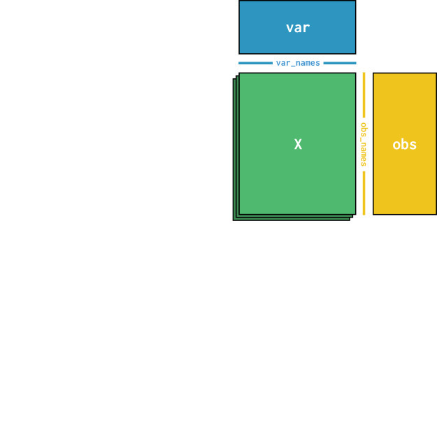

```{r setup, include=FALSE}
knitr::opts_chunk$set(warning = FALSE, message = FALSE)
rm(list = ls())
```

\newpage

# Experimental procedures
## History of technology
```{r, echo=FALSE, fig.align='center', fig.pos='H', fig.show='hold', out.width = '100%'}
knitr::include_graphics("Figures/18-1.jpeg")
```

## An overview of scRNA-Seq procedures
```{r, echo=FALSE, fig.align='center', fig.pos='H', fig.show='hold', out.width = '100%'}

```

A) Single-cell isolation and capture is the process of capturing high-quality individual cells from a tissue, thereby extracting precise genetic and biochemical information and facilitating the study of unique genetic and molecular mechanisms. The most common techniques of single-cell isolation and capture include limiting dilution, fluorescence-activated cell sorting (FACS), magnetic-activated cell sorting, microfluidic system, and laser microdissection.

B) After the process of converting RNA into the first-strand cDNA, the resulting cDNA are amplified by either polymerase chain reaction (PCR) or in vitro transcription (IVT). To overcome amplification-associated biases, unique molecular identifiers (UMIs) were introduced to barcode each individual mRNA molecule within a cell in the reverse transcription step.

## Limitations
The scRNA-seq has gradually revealed some inherent methodological issues, such as ‘artificial transcriptional stress responses’. It means that the dissociation process could induce the expression of stress genes, which lead to artificially changes in cell transcription patterns. Dissociation of tissues into single-cell suspension at 4°C has thus been suggested to minimize the isolation procedure-induced gene expression changes.

## snRNA-Seq
Single-nucleus RNA sequencing (snRNA-seq) is an alternative single-cell sequencing method. Instead of sequencing all the mRNA in the cytoplasm of cells, scRNA-seq only captures the mRNAs in the nucleus of cells. snRNA-seq becomes very useful in many tissue types, such as muscle tissue, heart, kidney, lung, pancreas, and various tumor tissues. It is particularly applicable in brain tissues, which are difficult to be dissociated to obtain intact cells.

It should be noted that snRNA-seq only captures transcripts in the nucleus, which might fail to capture important biological processes related to, that is, mRNA processing, RNA stability and metabolism.

## Protocols
```{r, echo=FALSE, fig.align='center', fig.pos='H', fig.show='hold', out.width = '100%'}
knitr::include_graphics("Figures/18-3.jpeg")
```

# Roadmap for typical scRNA-Seq analysis
```{r, echo=FALSE, fig.align='center', fig.pos='H', fig.show='hold', out.width = '100%'}
knitr::include_graphics("Figures/18-4.jpeg")
```

# Data preprocessing
Basic formats of raw sequencing data for single-cell transcriptome include FASTQ and BCL format, which depend on the data source and sequencing platform.

```{r, echo=FALSE, fig.align='center', fig.pos='H', fig.show='hold', out.width = '100%'}
knitr::include_graphics("Figures/18-5.jpeg")
```

The fundamental steps in raw data processing include: quality control, read alignment/mapping, cell barcode (CB) identification and correction, and the estimation of molecule counts through the resolution of unique molecular identifiers (UMIs).

## Quality control
**FastQC** can be applied on FASTQ data to assess the quality of raw scRNA-Seq data.

## Alignment and quantification
High-quality reads need to be mapped to the specific reference genome using an appropriate aligner. Depending on the sequencing protocol, the resulting raw sequence file contains the cell-level information, commonly known as cell barcodes (CB), the unique molecule identifier (UMI), and the raw cDNA sequence (read sequence) generated from the molecule.

The *count* is the most important function of **Cell Ranger**, which has wrapped up the alignment, filtering, UMI counting, and other practical steps internally. The Cell Ranger uses an aligner called **STAR**, which performs splicing-aware alignment of reads to the genome and then uses transcriptional annotation GTF file to categorize these reads into exons, introns, and intergenic based on whether the reads are aligned to the genome confidently.

## Cell barcode correction
The RNA material of each cell is extracted within a water-based droplet encapsulation along with a barcoded bead. These beads tag the RNA content of individual cells with unique oligonucleotides, called cell barcodes (CBs), that are later sequenced along with the fragments of the cDNAs. The beads contain high-diversity DNA barcodes enabling parallel barcoding of the cell’s molecular content and in silico demultiplexing of the sequencing reads into individual cellular bins.

## UMI resolution
Reads must be deduplicated, based upon their UMI, to assess the true count of sampled molecules. The UMI deduplication step aims to identify the set of reads and UMIs derived from each original, pre-PCR molecule in each cell captured and sequenced in the experiment. The result of this process is to allocate a molecule count to each gene in each cell.

## Count matrix quality control
### alevinQC
The **alevinQC** R package provides functionality for generating QC reports.

#### Metadata and summary tables
The first section of an alevinQC report shows a summary of the input files and the processing result.

```{r, echo=FALSE, fig.align='center', fig.pos='H', fig.show='hold', out.width = '100%'}
knitr::include_graphics("Figures/18-6.jpeg")
```

The top right summary table provides the summary statistics for various components of the single-cell library, for example, the number of sequencing reads, the number of selected cell barcodes at various levels of filtering, and the total number of deduplicated UMIs.

#### Knee plot, initial whitelist determination

```{r, echo=FALSE, fig.align='center', fig.pos='H', fig.show='hold', out.width = '100%'}

```

In all plots shown above, each point represents a corrected cell barcode, with its x-coordinate corresponding to its cell barcode frequency rank. In the top left plot, the y-coordinate corresponds to the observed frequency of the corrected barcode. Generally, this plot shows a “knee”-like pattern, which can be used to identify the initial list of high-quality barcodes. The red dots in the plot represent the cell barcodes selected as the high-quality cell barcodes in the case that “knee”-based filtering was applied. In other words, these cell barcodes contain a sufficient number of reads to be deemed high-quality and likely derived from truly present cells. One should be skeptical of the data quality if the frequency is consistently low across all cell barcodes.

The barcode collapsing plot, the upper middle plot shows the number of reads assigned to a cell barcode after sequence correction of the cell barcodes versus prior to correction. Generally, we would see that all points fall close to the line representing x = y, which means that the reassignments in CB correction usually do not drastically change the profile of the cell barcodes.

The upper right plot shows the distribution of the number of observed genes of all processed cell barcodes. Generally, a mean of 2000 genes per cell is considered modest but reasonable for the downstream analyses. One should double-check the quality of the data if all cells have a low number of observed genes.

The bottom plots compare the cell barcode frequency, the total number of UMIs after deduplication and the total number of non-zero genes using scatter plots. In general, in each plot, the plotted data should demonstrate a positive correlation, and, if high-quality filtering (e.g., knee filtering) has been performed, the high-quality cell barcodes should be well separated from the rest. Moreover, one should expect all three plots to convey similar trends. If using an external permit list, all the dots in the plots will be colored red, as all these cell barcodes are processed and reported in the gene count matrix. If all of these metrics are consistently low across cells or if these plots convey substantially different trends, then one should be concerned about the data quality.

### Empty droplet detection
It is common in droplet-based protocols that certain barcodes are associated with ambient RNA instead of the RNA of a captured cell. This happens when droplets fail to capture a cell. One simple method is to examine the cumulative frequency plot of the barcodes, in which barcodes are sorted in descending order of the number of distinct UMIs with which they are associated. This plot often contains a “knee” that can be identified as a likely point of discrimination between properly captured cells and empty droplets. Another more robust approach is using statistical models like the *emptyDropsCellRanger* function of **DropletUtils**.

### Doublet detection
In addition to determining which cell barcodes correspond to empty droplets or damaged cells, one may also wish to identify those cell barcodes that correspond to doublets or multiplets as they can result in a skewed distribution for these cell barcodes in terms of quantities like the number of reads and UMIs they represent, as well as gene expression profiles they display.

## A real world example
To start, we need the sequenced reads from a single-cell experiment in FASTQ format and the reference (e.g., transcriptome) against which the reads will be mapped. Usually, a reference includes the genome sequences and the corresponding gene annotations of the sequenced species in the FASTA and GTF format, respectively. In this example, we will use chromosome 5 of the human genome and its related gene annotations as the reference.

```{bash, echo=FALSE}
tar -xzvf Data/af_xmpl_run/genome1.fa.tar.gz -C Output/
tar -xzvf Data/af_xmpl_run/genome2.fa.tar.gz -C Output/
tar -xzvf Data/af_xmpl_run/genome3.fa.tar.gz -C Output/
tar -xzvf Data/af_xmpl_run/toy_ref_read.tar.gz -C Output/

cat Output/genome1.fa Output/genome2.fa Output/genome3.fa > Output/genome.fa
mv Output/genome.fa Output/toy_ref_read/toy_human_ref/fasta/
mv Output/toy_ref_read/toy_human_ref Output/
mv Output/toy_ref_read/toy_read_fastq Output/
rm -r Output/toy_ref_read
rm Output/genome1.fa
rm Output/genome2.fa
rm Output/genome3.fa
```


# General analyses
## Low quality cell filtration
To eliminate the gene expression interference from low-quality cells, it is necessary to conduct a second round of quality control with suitable tools, such as **Seurat**. The following QC indicators should be used to judge whether a cell should be retained:

- 200 < total number of expressed genes per cell (nGenes < 2500);
- 300 < total number of UMIs per cell (nUMIs < 15000);
- percentage of UMIs mapped to mitochondrial genes (MT%) < 10%.

**Focus:** It should be noted the filtration of cells based on mitochondrial genes should be carefully applied as some cell types, such as cardiomyocytes, are biologically more abundant in expressing these genes.

## Normalization
Normalization is intended to counteract technical noise or bias and to ensure comparability between each cell. Normalization could be achieved using the **Linnorm** tool.

## HVG selection
The subsets of features that exhibit high cell-to-cell variation in the data set are also called highly variable genes (HVGs). HVGs not only highlight biological signals but also greatly accelerate the downstream analysis of scRNA-Seq data due to the significant reduction in the computation volume. **scran** is the best tool for HVG selection.

## Batch rectification
A novel deep learning-based method, called **deepMNN**, is great for correcting batch effect in scRNA-Seq. data.

## Dimension reduction
For scRNA-Seq data, two rounds of dimension reduction are generally required:

1. Principal component analysis (PCA) dimension reduction first,
2. Then t-distributed stochastic neighbor embedding (t-SNE) or Uniform Manifold Approximation and Projection (UMAP) dimension reduction for visualization. UMAP has a clear advantage over t-SNE in the continuity of the cell subsets because it preserves more of the global structure, although t-SNE is still applied in many single-cell studies, seemingly due to better visual preferences.

## Clustering
**Seurat** is the best tool for clustering.

## Cell type annotation
Generally, the workflow for annotating cells in scRNA-seq data includes three main steps: automatic annotation, manual annotation, and validation with wet experiments. **Seurat** is the best tool for annotating the major cell types.

# Exploratory analyses
## GSVA
GSVA is widely used in functional enrichment analysis and other standard analyses in a pathway-centered way. GSVA can calculate enrichment scores for different signaling pathways in each sample to assess the causes of phenotypic differences, which can be used as a supplement to the KEGG pathway to make the results more biologically explanatory.

## TF identification
To identify the transcription factors enriched in each cell cluster from scRNA-seq data, **SCENIC** was developed which enabled inferring TFs because it firstly achieves the enrichment of TF motifs by searching the putative regulatory regions of target genes. Then TF motif enrichment can realize the connection of candidate TF regulatory factors with candidate target genes.

## Cell trajectory
Pseudo-time analysis can be used to infer the trajectory of cells at the single-cell level, which is expected to discover rare cell types and cryptic states. **Monocle** is one of the most broadly used tool for pseudo-time analysis, which learns an explicit principal graph to describe the data and rebuilds single-cell trajectories by embedding reversed graph to improve the robustness and accuracy of predicted trajectories.

## Cell-cell interaction
- If the structural composition of the ligand and receptor is expected to be considered, **CellPhoneDB** should be used

- If the regulation of cofactors (such as promoters and antagonists) is expected to be taken into account, **CellChat** can be selected to improve performance.

- It is also recommended to combine multiple cell-cell communication analysis tools flexibly to avoid methodical bias.

## Cell cycle
The *CellCycleScoring* function in the **Seurat** assigns a quantitative score to each cell according to the expression of G2/M and S phase marker genes embedded in its built-in package.
