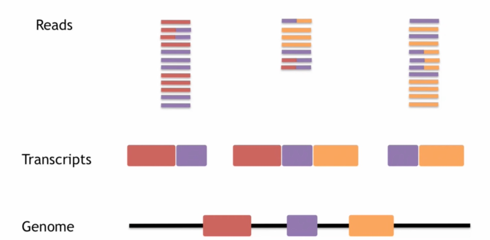
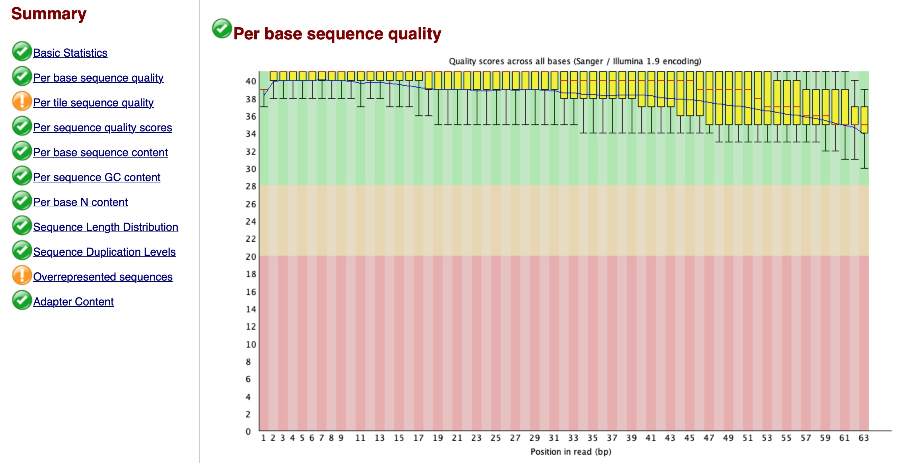
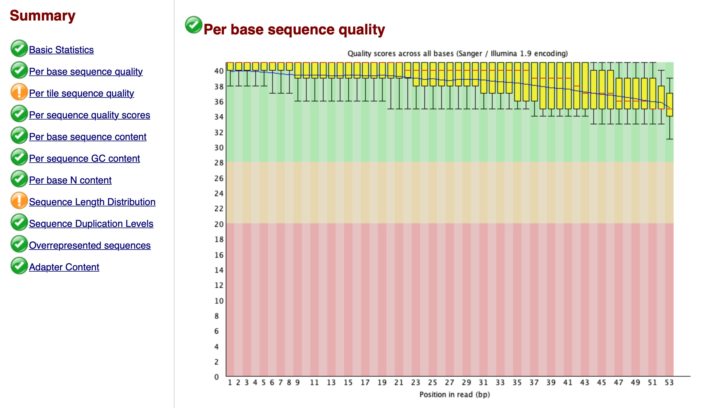
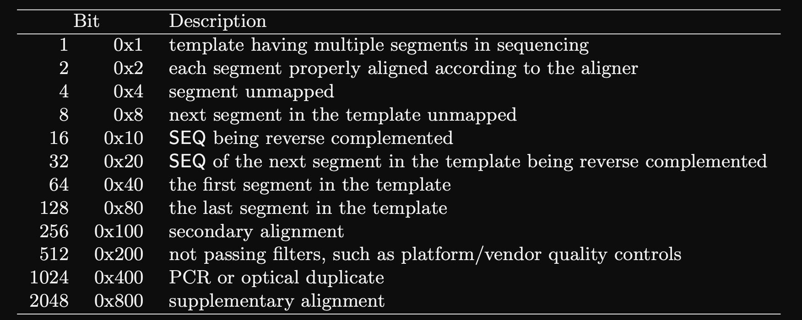
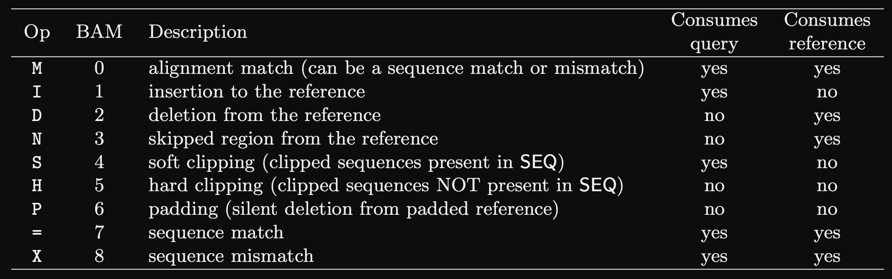
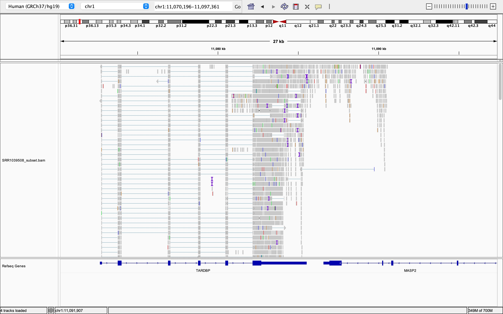
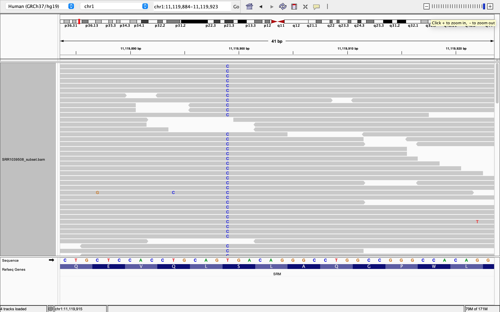

```{r setup, include=FALSE}
knitr::opts_chunk$set(warning = FALSE, message = FALSE)
rm(list = ls())
```

\newpage

# Python
## Read alignment problem, Exact matching
### Naive exact matching
Read genomic data:
```{python}
def readGenome(filename):
    genome = ''
    with open(filename, 'r') as f:
        for line in f:
            if not line[0] == '>':
                genome += line.rstrip()
    return genome

phix_genome = readGenome('Data/phi_x.txt')
print(phix_genome[:20])
```

Naive exact matching:
```{python}
def naive(p, t):
    occurrences = []
    for i in range(len(t) - len(p) + 1):
        match = True
        for j in range(len(p)):
            if not t[i+j] == p[j]:
                match = False
                break
        if match:
            occurrences.append(i)
    return occurrences

occur = naive('AGCG', phix_genome)
print(occur)
```

Generate random artificial reads from a genome:
```{python}
import random
def generateReads(genome, numReads, readLn):
    reads = []
    for _ in range(numReads):
        start = random.randint(0, len(genome)-readLn) - 1
        reads.append(genome[start : start+readLn])
    return reads

phix_art_seqs = generateReads(phix_genome, 100, 100)
```

Check how many of reads match the genome:
```{python}
def numMatched(reads, genome):
    numMatched = 0
    for read in reads:
        mtaches = naive(read, genome)
        if len(mtaches) > 0:
            numMatched += 1
    print(f'{numMatched} / {len(reads)} reads matched the genome exactly.')

numMatched(phix_art_seqs, phix_genome)
```

Read real reads from Phi X genome:
```{python}
def readReads(filename):
    sequences = []
    qualities = []
    with open(filename, 'r') as f:
        while True:
            f.readline()
            seq = f.readline().rstrip()
            f.readline()
            qual = f.readline().rstrip()
            if len(seq) == 0:
                break
            sequences.append(seq)
            qualities.append(qual)
    return sequences, qualities

phix_seqs, phix_quals = readReads('Data/ERR266411_1.first1000.txt')
print(phix_seqs[1])
print(phix_quals[1])
numMatched(phix_seqs, phix_genome)
```

Check how many of the first 30 bases in each read match the genome:
```{python}
def numMatched30(reads, genome):
    numMatched = 0
    for read in reads:
        read = read[:30]
        matches = naive(read, genome)
        if len(matches) > 0:
            numMatched += 1
    print(f'{numMatched} / {len(reads)} reads matched the genome exactly in their initial 30 bases.')

numMatched30(phix_seqs, phix_genome)
```

Check the exact matches in the antisense strand as well:
```{python}
def readGenome(filename):
    genome = ''
    with open(filename, 'r') as f:
        for line in f:
            if not line[0] == '>':
                genome += line.rstrip()
    return genome

lambda_virus_genome = readGenome('Data/lambda_virus.txt')
print(lambda_virus_genome[:20])

def reverseComplement(senseStrand):
    complement = {'A': 'T', 'T': 'A', 'C': 'G', 'G': 'C', 'N': 'N'}
    antisenseStrand = ''
    for base in senseStrand:
        antisenseStrand = complement[base] + antisenseStrand
    return antisenseStrand

lambda_virus_genomeAntisense = reverseComplement(lambda_virus_genome)
print(lambda_virus_genomeAntisense[:20])

def numMatched30BothStrands(reads, genome):
    numMatched = 0
    for read in reads:
        read = read[:30]
        matches = naive(read, genome)
        matches.extend(naive(reverseComplement(read), genome))
        if len(matches) > 0:
            numMatched += 1
    print(f'{numMatched} / {len(reads)} reads matched the genome exactly in their initial 30 bases.')

numMatched30BothStrands(phix_seqs, phix_genome)
```

### Boyer Moore exact matching

```{python}
import string

def z_array(s):
    """ Use Z algorithm (Gusfield theorem 1.4.1) to preprocess s """
    assert len(s) > 1
    z = [len(s)] + [0] * (len(s)-1)
    # Initial comparison of s[1:] with prefix
    for i in range(1, len(s)):
        if s[i] == s[i-1]:
            z[1] += 1
        else:
            break
    r, l = 0, 0
    if z[1] > 0:
        r, l = z[1], 1
    for k in range(2, len(s)):
        assert z[k] == 0
        if k > r:
            # Case 1
            for i in range(k, len(s)):
                if s[i] == s[i-k]:
                    z[k] += 1
                else:
                    break
            r, l = k + z[k] - 1, k
        else:
            # Case 2
            # Calculate length of beta
            nbeta = r - k + 1
            zkp = z[k - l]
            if nbeta > zkp:
                # Case 2a: Zkp wins
                z[k] = zkp
            else:
                # Case 2b: Compare characters just past r
                nmatch = 0
                for i in range(r+1, len(s)):
                    if s[i] == s[i - k]:
                        nmatch += 1
                    else:
                        break
                l, r = k, r + nmatch
                z[k] = r - k + 1
    return z


def n_array(s):
    """ Compile the N array (Gusfield theorem 2.2.2) from the Z array """
    return z_array(s[::-1])[::-1]


def big_l_prime_array(p, n):
    """ Compile L' array (Gusfield theorem 2.2.2) using p and N array.
        L'[i] = largest index j less than n such that N[j] = |P[i:]| """
    lp = [0] * len(p)
    for j in range(len(p)-1):
        i = len(p) - n[j]
        if i < len(p):
            lp[i] = j + 1
    return lp


def big_l_array(p, lp):
    """ Compile L array (Gusfield theorem 2.2.2) using p and L' array.
        L[i] = largest index j less than n such that N[j] >= |P[i:]| """
    l = [0] * len(p)
    l[1] = lp[1]
    for i in range(2, len(p)):
        l[i] = max(l[i-1], lp[i])
    return l


def small_l_prime_array(n):
    """ Compile lp' array (Gusfield theorem 2.2.4) using N array. """
    small_lp = [0] * len(n)
    for i in range(len(n)):
        if n[i] == i+1:  # prefix matching a suffix
            small_lp[len(n)-i-1] = i+1
    for i in range(len(n)-2, -1, -1):  # "smear" them out to the left
        if small_lp[i] == 0:
            small_lp[i] = small_lp[i+1]
    return small_lp


def good_suffix_table(p):
    """ Return tables needed to apply good suffix rule. """
    n = n_array(p)
    lp = big_l_prime_array(p, n)
    return lp, big_l_array(p, lp), small_l_prime_array(n)


def good_suffix_mismatch(i, big_l_prime, small_l_prime):
    """ Given a mismatch at offset i, and given L/L' and l' arrays,
        return amount to shift as determined by good suffix rule. """
    length = len(big_l_prime)
    assert i < length
    if i == length - 1:
        return 0
    i += 1  # i points to leftmost matching position of P
    if big_l_prime[i] > 0:
        return length - big_l_prime[i]
    return length - small_l_prime[i]


def good_suffix_match(small_l_prime):
    """ Given a full match of P to T, return amount to shift as
        determined by good suffix rule. """
    return len(small_l_prime) - small_l_prime[1]


def dense_bad_char_tab(p, amap):
    """ Given pattern string and list with ordered alphabet characters, create
        and return a dense bad character table.  Table is indexed by offset
        then by character. """
    tab = []
    nxt = [0] * len(amap)
    for i in range(0, len(p)):
        c = p[i]
        assert c in amap
        tab.append(nxt[:])
        nxt[amap[c]] = i+1
    return tab


class BoyerMoore(object):
    """ Encapsulates pattern and associated Boyer-Moore preprocessing. """
    
    def __init__(self, p, alphabet='ACGT'):
        self.p = p
        self.alphabet = alphabet
        # Create map from alphabet characters to integers
        self.amap = {}
        for i in range(len(self.alphabet)):
            self.amap[self.alphabet[i]] = i
        # Make bad character rule table
        self.bad_char = dense_bad_char_tab(p, self.amap)
        # Create good suffix rule table
        _, self.big_l, self.small_l_prime = good_suffix_table(p)
    
    def bad_character_rule(self, i, c):
        """ Return # skips given by bad character rule at offset i """
        assert c in self.amap
        ci = self.amap[c]
        assert i > (self.bad_char[i][ci]-1)
        return i - (self.bad_char[i][ci]-1)
    
    def good_suffix_rule(self, i):
        """ Given a mismatch at offset i, return amount to shift
            as determined by (weak) good suffix rule. """
        length = len(self.big_l)
        assert i < length
        if i == length - 1:
            return 0
        i += 1  # i points to leftmost matching position of P
        if self.big_l[i] > 0:
            return length - self.big_l[i]
        return length - self.small_l_prime[i]
    
    def match_skip(self):
        """ Return amount to shift in case where P matches T """
        return len(self.small_l_prime) - self.small_l_prime[1]

def boyer_moore(p, p_bm, t):
    """ Do Boyer-Moore matching """
    i = 0
    occurrences = []
    while i < len(t) - len(p) + 1:
        shift = 1
        mismatched = False
        for j in range(len(p)-1, -1, -1):
            if p[j] != t[i+j]:
                skip_bc = p_bm.bad_character_rule(j, t[i+j])
                skip_gs = p_bm.good_suffix_rule(j)
                shift = max(shift, skip_bc, skip_gs)
                mismatched = True
                break
        if not mismatched:
            occurrences.append(i)
            skip_gs = p_bm.match_skip()
            shift = max(shift, skip_gs)
        i += shift
    return occurrences
```

```{python}
t = 'GCTAGCTCTACGAGTCTA'
p = 'TCTA'
p_bm = BoyerMoore(p, alphabet='ACGT') # Preprocessing
boyer_moore(p, p_bm, t) # Boyer Moore function
```

### k-mer indexing

```{python}
import bisect
class Index(object):
    def __init__(self, t, k):
        self.k = k
        self.index = []
        for i in range(len(t) - k + 1):
            self.index.append((t[i:i+k], i))
        self.index.sort()
    
    def query(self, p):
        kmer = p[:self.k]
        i = bisect.bisect_left(self.index, (kmer, -1))
        hits = []
        while i < len(self.index):
            if self.index[i][0] != kmer:
                break
            hits.append(self.index[i][1])
            i += 1
        return hits

def queryIndex(p, t, index):
    k = index.k
    offsets = []
    for i in index.query(p):
        if p[k:] == t[i+k:i+len(p)]:
            offsets.append(i)
    print(offsets)
```

```{python}
# Test
t = 'GCTAGCTCTACGAGTCTA'
p = 'TCTA'

index = Index(t, 2)
queryIndex(p, t, index)
```

## Read alignment problem, Approximate matching
### Boyer Moore + Pigenhole principle
Approximate function:
```{python}
def approximate_match(p, t, n):
    segment_length = round(len(p) / (n+1))
    all_matches = set()
    
    for i in range(n+1):
        start = i * segment_length
        end = min((i+1) * segment_length, len(p))
        p_bm = BoyerMoore(p[start:end], alphabet='ATCG')
        matches = boyer_moore(p[start:end], p_bm, t)
        
        for m in matches:
            if m < start or m-start+len(p) > len(t):
                continue
            
            mismatches = 0
            for j in range(0, start):
                if not p[j] == t[m-start+j]:
                    mismatches += 1
                    if mismatches > n:
                        break
            
            for j in range(end, len(p)):
                if not p[j] == t[m-start+j]:
                    mismatches += 1
                    if mismatches > n:
                        break
            
            if mismatches <= n:
                all_matches.add(m - start)
    
    print(list(all_matches))
```

```{python}
# Test
p = 'AACTTG'
t = 'CACTTAATTTG'

approximate_match(p, t, 2)
```

### Edit distance
Recursive edit distance:
```{python}
def editDistRecursive(x, y):
    if len(x) == 0:
        return len(y)
    elif len(y) == 0:
        return len(x)
    else:
        distHor = editDistRecursive(x[:-1], y) + 1
        distVer = editDistRecursive(x, y[:-1]) + 1
        if x[-1] == y[-1]:
            distDiag = editDistRecursive(x[:-1], y[:-1])
        else:
            distDiag = editDistRecursive(x[:-1], y[:-1]) + 1
        return min(distHor, distVer, distDiag)
```

Dynamic edit distance:
```{python}
def editDistance(x, y):
    # Create distance matrix
    D = []
    for i in range(len(x)+1):
        D.append([0]*(len(y)+1))
    # Initialize first row and column of matrix
    for i in range(len(x)+1):
        D[i][0] = i
    for i in range(len(y)+1):
        D[0][i] = i
    # Fill in the rest of the matrix
    for i in range(1, len(x)+1):
        for j in range(1, len(y)+1):
            distHor = D[i][j-1] + 1
            distVer = D[i-1][j] + 1
            if x[i-1] == y[j-1]:
                distDiag = D[i-1][j-1]
            else:
                distDiag = D[i-1][j-1] + 1
            D[i][j] = min(distHor, distVer, distDiag)
    # Edit distance is the value in the bottom right corner of the matrix
    return D[-1][-1]
```

```{python}
# Test 1
x = 'ATCGATTGCGTG'
y = 'ATCCTTGC'
editDistRecursive(x, y)
```

```{python}
# Test 2
x = 'ATCGATTGCGTG'
y = 'ATCCTTGC'
editDistance(x, y)
```

### Global alignment

```{python}
def globalAlignment(x, y):
    alphabet = ['A', 'C', 'G', 'T']
    score = [[0, 4, 2, 4, 8],
             [4, 0, 4, 2, 8],
             [2, 4, 0, 4, 8],
             [4, 2, 4, 0, 8],
             [8, 8, 8, 8, 8]]
    
    # Create distance matrix
    D = []
    for i in range(len(x)+1):
        D.append([0] * (len(y)+1))
        
    # Initialize first column
    for i in range(1, len(x)+1):
        D[i][0] = D[i-1][0] + score[alphabet.index(x[i-1])][-1]

    # Initialize first row
    for j in range(1,len(y)+1):
        D[0][j] = D[0][j-1] + score[-1][alphabet.index(y[j-1])]
        
    # Fill rest of the matrix
    for i in range(1, len(x)+1):
        for j in range(1, len(y)+1):
            distHor = D[i][j-1] + score[-1][alphabet.index(y[j-1])]
            distVer = D[i-1][j] + score[alphabet.index(x[i-1])][-1]
            distDiag = D[i-1][j-1] + score[alphabet.index(x[i-1])][alphabet.index(y[j-1])]
            D[i][j] = min(distHor, distVer, distDiag)
    
    print(D[-1][-1])
```

```{python}
# Test
x = 'TATGTCATGC'
y = 'TATGTCATG'
globalAlignment(x, y)
```

### Local alignment

```{python}
def localAlignment(x, y):
    alphabet = ['A', 'C', 'G', 'T']
    score = [[+2, -4, -4, -4, -6],
             [-4, +2, -4, -4, -6],
             [-4, -4, +2, -4, -6],
             [-4, -4, -4, +2, -6],
             [-6, -6, -6, -6, -6]]
    
    # Create distance matrix
    D = []
    for i in range(len(x)+1):
        D.append([0] * (len(y)+1))
        
    # Initialize first column
    for i in range(1, len(x)+1):
        D[i][0] = D[i-1][0] + score[alphabet.index(x[i-1])][-1]

    # Initialize first row
    for j in range(1,len(y)+1):
        D[0][j] = D[0][j-1] + score[-1][alphabet.index(y[j-1])]
        
    # Fill rest of the matrix
    for i in range(1, len(x)+1):
        for j in range(1, len(y)+1):
            distHor = D[i][j-1] + score[-1][alphabet.index(y[j-1])]
            distVer = D[i-1][j] + score[alphabet.index(x[i-1])][-1]
            distDiag = D[i-1][j-1] + score[alphabet.index(x[i-1])][alphabet.index(y[j-1])]
            D[i][j] = max(distHor, distVer, distDiag)
    
    print(D[-1][-1])
```

```{python}
# Test
x = 'TATGTCATGC'
y = 'TATGTCATG'
localAlignment(x, y)
```

## Asssembly problem
### Overlaps
Find overlaps between reads:
```{python}
def overlap(a, b, min_length=3):
    start = 0
    while True:
        start = a.find(b[:min_length], start)
        if start == -1:
            return 0
        
        if b.startswith(a[start:]):
            return len(a)-start
        start += 1

# Test
overlap('TTACGT', 'CGTGTGC', min_length=3)
```

Naive overlap mapping:
```{python}
from itertools import permutations
def naive_overlap_map(reads, k):
    olaps = {}
    for a, b in permutations(reads, 2):
        olen = overlap(a, b, min_length=k)
        if olen > 0:
            olaps[(a, b)] = olen
    print(olaps)

# Test
reads = ['ACGGATC', 'GATCAAGT', 'TTCACGGA']
naive_overlap_map(reads, 3)
```

### Shortest Common Superstring (SCS)
SCS:
```{python}
import itertools

def scs(ss):
    shortest_sup = None
    for ssperm in itertools.permutations(ss):
        sup = ssperm[0]
        for i in range(len(ss)-1):
            olen = overlap(ssperm[i], ssperm[i+1], min_length=1)
            sup += ssperm[i+1][olen:]
        if shortest_sup is None or len(sup) < len(shortest_sup):
            shortest_sup = sup
    return shortest_sup

# Test
scs(['ACGGATGAGC', 'GAGCGGA', 'GAGCGAG'])
```

Greedy SCS:
```{python}
def pick_maximal_overlap(reads, k):
    reada, readb = None, None
    best_olen = 0
    for a, b in itertools.permutations(reads, 2):
        olen = overlap(a, b, min_length=k)
        if olen > best_olen:
            reada, readb = a, b
            best_olen = olen
    return reada, readb, best_olen

def greedy_scs(reads, k):
    read_a, read_b, olen = pick_maximal_overlap(reads, k)
    while olen > 0:
        reads.remove(read_a)
        reads.remove(read_b)
        reads.append(read_a + read_b[olen:])
        read_a, read_b, olen = pick_maximal_overlap(reads, k)
    return ''.join(reads)

# Test
greedy_scs(['ABC', 'BCA', 'CAB'], 2)
```

### De Bruijn graphs and Eulerian walks

```{python}
def de_bruijn_ize(st, k):
    """ Return a list holding, for each k-mer, its left
        k-1-mer and its right k-1-mer in a pair """
    edges = []
    nodes = set()
    for i in range(len(st) - k + 1):
        edges.append((st[i:i+k-1], st[i+1:i+k]))
        nodes.add(st[i:i+k-1])
        nodes.add(st[i+1:i+k])
    return nodes, edges

# Test
nodes, edges = de_bruijn_ize("ACGCGTCG", 3)
print(f'Nodes: \n {nodes}')
print(f'Edges: \n {edges}')

def visualize_de_bruijn(st, k):
    nodes, edges = de_bruijn_ize(st, k)
    dot_str = 'digraph "DeBruijn graph" {\n'
    for node in nodes:
        dot_str += '  %s [label="%s"] ;\n' % (node, node)
    for src, dst in edges:
        dot_str += '  %s -> %s ;\n' % (src, dst)
    return dot_str + '}\n'
```

# NGS sequencers output
NGS sequencers generate data in FASTQ and CSFASTA (FASTA) formats:

* FASTA files: the most common standard for storing reference or consensus sequence data. FASTA only stores sequences.
* FASTQ files: the most common format for storing raw sequence data. FASTQ stores both sequence and associated sequence quality values (QV).

## FASTQ file
Let's check a FASTQ file:
```{bash}
head -n 4 Data/SRR835775_1.first1000.fastq | less -S
```

## FASTA file
Now let's check the FASTA file of human genome chromosome 1:
```{bash}
# Assemble parts
gunzip -c Reference/Homo_sapiens.GRCh38.dna.chromosome.1.part1.fa.gz > \
Output/Homo_sapiens.GRCh38.dna.chromosome.1.part1.fa
gunzip -c Reference/Homo_sapiens.GRCh38.dna.chromosome.1.part2.fa.gz > \
Output/Homo_sapiens.GRCh38.dna.chromosome.1.part2.fa
gunzip -c Reference/Homo_sapiens.GRCh38.dna.chromosome.1.part3.fa.gz > \
Output/Homo_sapiens.GRCh38.dna.chromosome.1.part3.fa
gunzip -c Reference/Homo_sapiens.GRCh38.dna.chromosome.1.part4.fa.gz > \
Output/Homo_sapiens.GRCh38.dna.chromosome.1.part4.fa
gunzip -c Reference/Homo_sapiens.GRCh38.dna.chromosome.1.part5.fa.gz > \
Output/Homo_sapiens.GRCh38.dna.chromosome.1.part5.fa

cat Output/Homo_sapiens.GRCh38.dna.chromosome.1.part1.fa \
Output/Homo_sapiens.GRCh38.dna.chromosome.1.part2.fa \
Output/Homo_sapiens.GRCh38.dna.chromosome.1.part3.fa \
Output/Homo_sapiens.GRCh38.dna.chromosome.1.part4.fa \
Output/Homo_sapiens.GRCh38.dna.chromosome.1.part5.fa > \
Output/Homo_sapiens.GRCh38.dna.chromosome.1.fa

rm Output/Homo_sapiens.GRCh38.dna.chromosome.1.part1.fa \
Output/Homo_sapiens.GRCh38.dna.chromosome.1.part2.fa \
Output/Homo_sapiens.GRCh38.dna.chromosome.1.part3.fa \
Output/Homo_sapiens.GRCh38.dna.chromosome.1.part4.fa \
Output/Homo_sapiens.GRCh38.dna.chromosome.1.part5.fa

# Show
head -n 1000 Output/Homo_sapiens.GRCh38.dna.chromosome.1.fa | tail -5 | less -S
```

# Aligned sequences
The SAM file format External link and its compressed version, the BAM format, were developed to store information about the alignment of sequences to a reference genome.

## SAM file
Let's check a SAM file:
```{bash}
head -n 10 Data/Sample_sam.sam | tail -1 | less -S
```

# RNA-seq
Initially, we should go from reads to transcripts. Note that a gene might also have different transcripts.
Also, it is highly advised to perform some QC and pre-processing before alignment.

```{r, echo=FALSE, fig.align='center', fig.pos='H', fig.show='hold', out.width = '100%'}

```

Approaches to transcript building:

* Assembly approaches
* Alignment approaches (to a reference genome): BWA, Bowtie2, STAR

Before continuing, let's check the position of a read (which should be on chr16) using a simple BLAST search:
```{r}
library(BSgenome.Hsapiens.UCSC.hg19)
matchPattern(
  "TCGATCCATCGATTGGAAGGCACTGATCTGGACTGTCAGGTTGGTGGTCTTATTTGCAAGTCC",
  Hsapiens$chr16
)
```

Now let's check another read:
```{r}
library(BSgenome.Hsapiens.UCSC.hg19)
matchPattern(
  "TCGCTCTCTCCGTTTCAGGGAAGCCAGCAAGTCCAGTCCGAGTAATGAAGGGCGGGGAGCAGG",
  Hsapiens$chr16
)
```

Nothing? Let's check if it is from the other strand:
```{r}
library(BSgenome.Hsapiens.UCSC.hg19)
matchPattern(reverseComplement(
  DNAString(
    "TCGCTCTCTCCGTTTCAGGGAAGCCAGCAAGTCCAGTCCGAGTAATGAAGGGCGGGGAGCAGG"
  )
),
Hsapiens$chr16)
```

## QC and pre-processing
First, let's run QC using FASTQC algorithm:

```{bash}
fastqc --noextract Data/SRR1039508.fastq --outdir Output/
```

The output looks like this:
```{r, echo=FALSE, fig.align='center', fig.pos='H', fig.show='hold', out.width = '100%'}

```

Now let's do some preprocessing. Steps required include:

* Filter the data by removing adapters.
* Trim low quality cycles.
* Remove low quality reads.

A good program for Illumina data is **trimmomatic**:
```{bash}
Java -jar /Users/amirvalizadeh/Trimmomatic/dist/jar/trimmomatic-0.40-rc1.jar \
SE -phred33 Data/SRR1039508.fastq Output/SRR1039508_qc.fastq \
ILLUMINACLIP:/Users/amirvalizadeh/Trimmomatic/adapters/TruSeq3-PE.fa:2:30:10 \
LEADING:3 TRAILING:3 SLIDINGWINDOW:4:15 MINLEN:50 HEADCROP:10 CROP:80
```

Notice that:

* **SE** means single end reads, for paired-end data use **PE**.
* **phred** is the quality scoring scheme.
* **ILLUMINACLIP** points to the file with the adapters.
* **LEADING** and **TRAILING** remove bases at the beginning and end of the reads below a score of 3.
* **SLIDINGWINDOW** slides across the sequence and removes those inside a window of length 4 that have an average quality below 15.
* **MINLEN** removes sequences that are shorter than 50 after filtering.
* **HEADCROP** removes the first 10 sequences at the start of the run.
* **CROP** deletes everything after the first 80 bases (recall the quality was not so good after 80 cycles).

Now, let's run QC again:
```{bash}
fastqc --noextract Output/SRR1039508_qc.fastq --outdir Output/
```

The output looks like this:
```{r, echo=FALSE, fig.align='center', fig.pos='H', fig.show='hold', out.width = '100%'}

```

## Aligning reads to genome with STAR

1- Prepare the reference genome FASTA file (only chromosome 1 for this example). Take a peak:
```{bash}
head -n 1000 Output/Homo_sapiens.GRCh38.dna.chromosome.1.fa | tail -10 | less -S
```

2- Prepare the reference genome annotation (gtf) file (only chromosome 1 again). Take a peak:
```{bash}
# Assemble
gunzip -c Reference/Homo_sapiens.GRCh38.107.chrom1.gtf.gz > \
Output/Homo_sapiens.GRCh38.107.chrom1.gtf

# Show
head -n 1 Output/Homo_sapiens.GRCh38.107.chrom1.gtf | head -c 41 | less -S
```

3- Run the code below to generate the genome index:
```{bash}
STAR --runThreadN 12 \
--runMode genomeGenerate \
--genomeSAindexNbases 12 \
--genomeDir Output \
--genomeFastaFiles Output/Homo_sapiens.GRCh38.dna.chromosome.1.fa \
--sjdbGTFfile Output/Homo_sapiens.GRCh38.107.chrom1.gtf \
--sjdbOverhang 62
```

4- Run the code below to map the reads to the indexed genome:
```{bash}
STAR --runThreadN 12 \
--genomeDir Output \
--readFilesIn Output/SRR1039508_qc.fastq

mv Aligned.out.sam Output/Aligned.out.sam
mv Log.final.out Output/Log.final.out
mv Log.progress.out Output/Log.progress.out
mv SJ.out.tab Output/SJ.out.tab
mv Log.out Output/Log.out
```

Check the log file:
```{bash}
cat Output/Log.final.out
```

Check some lines of the output:
```{bash}
head -n 40 Output/Aligned.out.sam | tail -1 | less -S
```

Finally, it's better to convert SAM files to BAM:
```{bash}
samtools view -S -b Output/Aligned.out.sam > Output/Aligned.out.bam
```

Let's import it now and check its data:
```{r}
library(Rsamtools)
bam <- scanBam("Output/Aligned.out.bam")
```

| Field     | Type    | Brief description                    |
| --------- | ------- | ------------------------------------ |
| QNAME     | String  | Query template name                  |
| FLAG      | Int     | bitwise flag                         |
| RNAME     | String  | Reference sequence name              |
| POS       | Int     | 1-based leftmost mapping position    |
| MAPQ      | Int     | Mapping quality                      |
| CIGAR     | String  | CIGAR string                         |
| RNEXT     | String  | Reference name of the mate/next read |
| PNEXT     | Int     | Position of the mate/next read       |
| TLEN      | Int     | Observed template length             |
| SEQ       | String  | Segment sequence                     |
| QUAL      | String  | ASCII of Phred-scaled base quality   |

**QNAME:** Reads/segments having identical QNAME are regarded to come from the same template. A QNAME ‘*’ indicates the information is unavailable.
**FLAG:** This data could be translated using the following website: *http://broadinstitute.github.io/picard/explain-flags.html*

```{r, echo=FALSE, fig.align='center', fig.pos='H', fig.show='hold', out.width = '100%'}

```

**RNAME:** Reference sequence name of the alignment.
**POS:** 1-based leftmost mapping POSition of the first CIGAR operation that “consumes” a reference base. The first base in a reference sequence has coordinate 1. POS is set as 0 for an unmapped read without coordinate.
**MAPQ:** Mapping quality. A value 255 indicates that the mapping quality is not available.
**CIGAR:**

```{r, echo=FALSE, fig.align='center', fig.pos='H', fig.show='hold', out.width = '100%'}

```

**RNEXT:** Reference sequence name of the primary alignment of the next read in the template. For the last read, the next read is the first read in the template.
**PNEXT:** 1-based Position of the primary alignment of the next read in the template. Set as 0 when the information is unavailable. This field equals POS at the primary line of the next read.
**TLEN:** For primary reads where the primary alignments of all reads in the template are mapped to the same reference sequence, the absolute value of TLEN equals the distance between the mapped end of the template and the mapped start of the template
**SEQ:** If not a ‘*’, the length of the sequence must equal the sum of lengths of M/I/S/=/X operations in CIGAR. An ‘=’ denotes the base is identical to the reference base.
**QUAL:** Base quality.

Let's check the data for our example:
```{r}
bam[[1]]$qname[1:4]
bam[[1]]$flag[1:4]
bam[[1]]$strand[1:4]
bam[[1]]$rname[1:4]
bam[[1]]$pos[1:4]
bam[[1]]$cigar[1:4]
bam[[1]]$seq[1:4]
bam[[1]]$qual[1:4]
```

## Aligning reads to transcriptome with RSEM
RSEM expects a GTF file with only exons. So, first let's extract exons from our *gtf* file:
```{bash}
awk '$3 == "exon"' Output/Homo_sapiens.GRCh38.107.chrom1.gtf > Output/Homo_sapiens.GRCh38.107.chrom1.exons.gtf
```

RSEM will then prepare a reference transcriptome against which to align reads.
```{bash}
mkdir Output/rsemGenome
rsem-prepare-reference --gtf Output/Homo_sapiens.GRCh38.107.chrom1.exons.gtf \
Output/Homo_sapiens.GRCh38.dna.chromosome.1.fa \
Output/rsemGenome/GRCh38.107.chrom1
```

Finally, let's align reads:
```{bash, eval=FALSE}
rsem-calculate-expression -p 12 Data/SRR1039508.fastq \
Output/rsemGenome/GRCh38.107.chrom1 SRR1039508
```

# IGV
We can use IGV to visualize sequencing data. In this example, we will take a look at the reads aligned to reference genome in the file *SRR1039508_subset.bam* with its index file named *SRR1039508_subset.bam.bai*.

```{r, echo=FALSE, fig.align='center', fig.pos='H', fig.show='hold', out.width = '100%'}

```

There is also a SNP at basepair number 11119899:
```{r, echo=FALSE, fig.align='center', fig.pos='H', fig.show='hold', out.width = '100%'}

```

```{bash echo=FALSE}
rm -r Output/rsemGenome
rm Output/*
```
