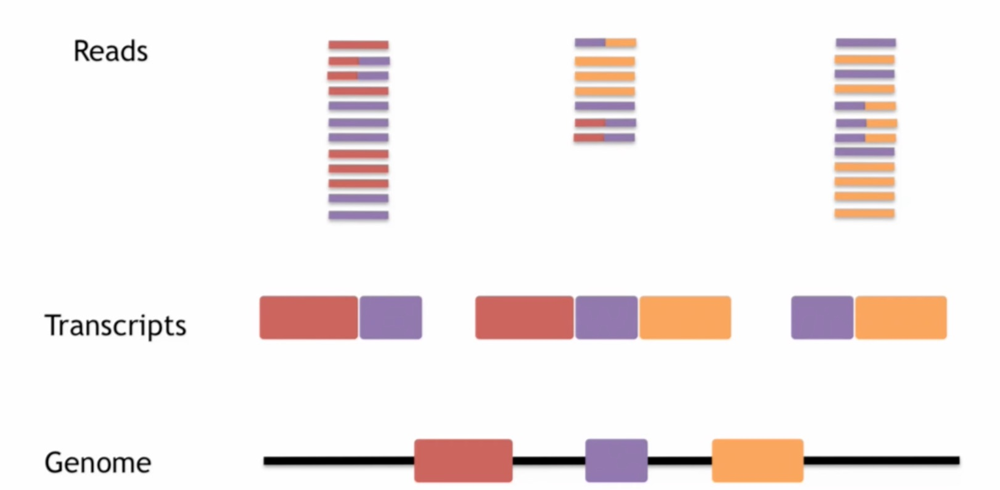
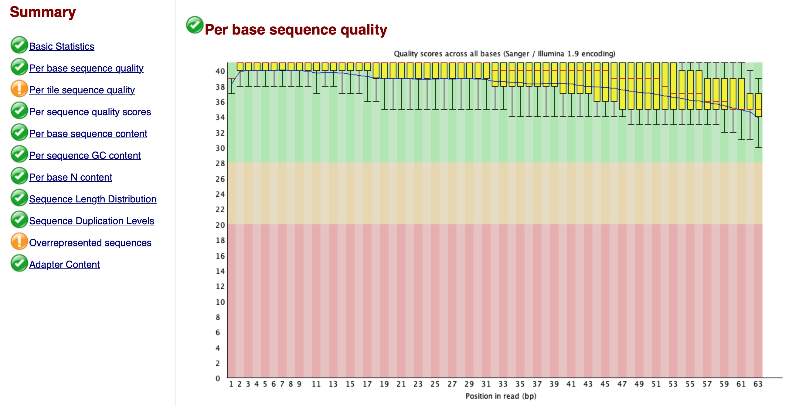
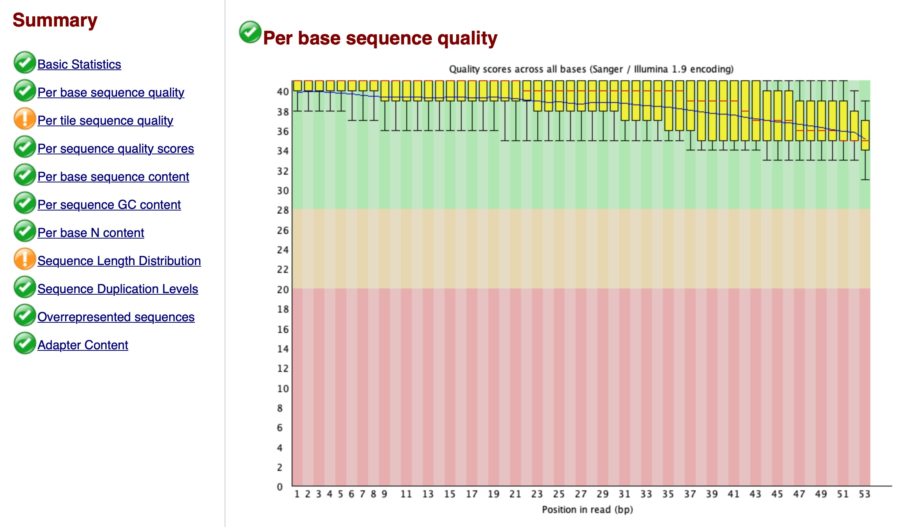

```{r setup, include=FALSE} 
knitr::opts_chunk$set(warning = FALSE, message = FALSE)
rm(list = ls())
```

# NGS sequencers output
NGS sequencers generate data in FASTQ and CSFASTA (FASTA) formats:

* FASTA files: the most common standard for storing reference or consensus sequence data. FASTA only stores sequences.
* FASTQ files: the most common format for storing raw sequence data. FASTQ stores both sequence and associated sequence quality values (QV).

## FASTQ file
Let's check a FASTQ file:
```{bash}
head -n 4 Data/SRR835775_1.first1000.fastq | less -S
```

## FASTA file
Now let's check the FASTA file of human genome chromosome 1:
```{bash}
# Assemble parts
gunzip -c Reference/Homo_sapiens.GRCh38.dna.chromosome.1.part1.fa.gz > \
Output/Homo_sapiens.GRCh38.dna.chromosome.1.part1.fa
gunzip -c Reference/Homo_sapiens.GRCh38.dna.chromosome.1.part2.fa.gz > \
Output/Homo_sapiens.GRCh38.dna.chromosome.1.part2.fa
gunzip -c Reference/Homo_sapiens.GRCh38.dna.chromosome.1.part3.fa.gz > \
Output/Homo_sapiens.GRCh38.dna.chromosome.1.part3.fa
gunzip -c Reference/Homo_sapiens.GRCh38.dna.chromosome.1.part4.fa.gz > \
Output/Homo_sapiens.GRCh38.dna.chromosome.1.part4.fa
gunzip -c Reference/Homo_sapiens.GRCh38.dna.chromosome.1.part5.fa.gz > \
Output/Homo_sapiens.GRCh38.dna.chromosome.1.part5.fa

cat Output/Homo_sapiens.GRCh38.dna.chromosome.1.part1.fa \
Output/Homo_sapiens.GRCh38.dna.chromosome.1.part2.fa \
Output/Homo_sapiens.GRCh38.dna.chromosome.1.part3.fa \
Output/Homo_sapiens.GRCh38.dna.chromosome.1.part4.fa \
Output/Homo_sapiens.GRCh38.dna.chromosome.1.part5.fa > \
Output/Homo_sapiens.GRCh38.dna.chromosome.1.fa

rm Output/Homo_sapiens.GRCh38.dna.chromosome.1.part1.fa \
Output/Homo_sapiens.GRCh38.dna.chromosome.1.part2.fa \
Output/Homo_sapiens.GRCh38.dna.chromosome.1.part3.fa \
Output/Homo_sapiens.GRCh38.dna.chromosome.1.part4.fa \
Output/Homo_sapiens.GRCh38.dna.chromosome.1.part5.fa

# Show
head -n 1000 Output/Homo_sapiens.GRCh38.dna.chromosome.1.fa | tail -5 | less -S
```

# RNA-seq
Initially, we should go from reads to transcripts. Note that a gene might also have different transcripts.



Approaches to transcript building:

* Assembly approaches
* Alignment approaches (to a reference genome): BWA, Bowtie2, STAR

Before continuing, let's check the position of a read (which should be on chr16) using a simple BLAST search:
```{r}
library(BSgenome.Hsapiens.UCSC.hg19)
matchPattern(
  "TCGATCCATCGATTGGAAGGCACTGATCTGGACTGTCAGGTTGGTGGTCTTATTTGCAAGTCC",
  Hsapiens$chr16
)
```

Now let's check another read:
```{r}
library(BSgenome.Hsapiens.UCSC.hg19)
matchPattern(
  "TCGCTCTCTCCGTTTCAGGGAAGCCAGCAAGTCCAGTCCGAGTAATGAAGGGCGGGGAGCAGG",
  Hsapiens$chr16
)
```

Nothing? Let's check if it is from the other strand:
```{r}
library(BSgenome.Hsapiens.UCSC.hg19)
matchPattern(reverseComplement(
  DNAString(
    "TCGCTCTCTCCGTTTCAGGGAAGCCAGCAAGTCCAGTCCGAGTAATGAAGGGCGGGGAGCAGG"
  )
),
Hsapiens$chr16)
```

## Alignment with STAR

1- Prepare the reference genome FASTA file (only chromosome 1 for this example). Take a peak:
```{bash}
head -n 1000 Output/Homo_sapiens.GRCh38.dna.chromosome.1.fa | tail -10 | less -S
```

2- Prepare the reference genome annotation (gtf) file (only chromosome 1 again). Take a peak:
```{bash}
# Assemble
gunzip -c Reference/Homo_sapiens.GRCh38.107.chrom1.gtf.gz > \
Output/Homo_sapiens.GRCh38.107.chrom1.gtf

# Show
head -n 1 Output/Homo_sapiens.GRCh38.107.chrom1.gtf | head -c 41 | less -S
```

3- Run the code below to generate the genome index:
```{bash}
STAR --runThreadN 12 \
--runMode genomeGenerate \
--genomeSAindexNbases 12 \
--genomeDir Output \
--genomeFastaFiles Output/Homo_sapiens.GRCh38.dna.chromosome.1.fa \
--sjdbGTFfile Output/Homo_sapiens.GRCh38.107.chrom1.gtf \
--sjdbOverhang 62
```

4- Run the code below to map the reads to the indexed genome:
```{bash}
STAR --runThreadN 12 \
--genomeDir Output \
--readFilesIn Data/SRR1039508.fastq

mv Aligned.out.sam Output/Aligned.out.sam
mv Log.final.out Output/Log.final.out
mv Log.progress.out Output/Log.progress.out
mv SJ.out.tab Output/SJ.out.tab
mv Log.out Output/Log.out
```

Check the log file:
```{bash}
cat Output/Log.final.out
```

Check some lines of the output:
```{bash}
head -n 40 Output/Aligned.out.sam | tail -1 | less -S
```

Finally, it's better to convert SAM files to BAM:
```{bash}
samtools view -S -b Output/Aligned.out.sam > Output/Aligned.out.bam
```

Let's import it now and check its data:
```{r}
library(Rsamtools)
bam <- scanBam("Output/Aligned.out.bam")
```

| Field     | Type    | Brief description                    |
| --------- | ------- | ------------------------------------ |
| QNAME     | String  | Query template name                  |
| FLAG      | Int     | bitwise flag                         |
| RNAME     | String  | Reference sequence name              |
| POS       | Int     | 1-based leftmost mapping position    |
| MAPQ      | Int     | Mapping quality                      |
| CIGAR     | String  | CIGAR string                         |
| RNEXT     | String  | Reference name of the mate/next read |
| PNEXT     | Int     | Position of the mate/next read       |
| TLEN      | Int     | Observed template length             |
| SEQ       | String  | Segment sequence                     |
| QUAL      | String  | ASCII of Phred-scaled base quality   |

**QNAME:** Reads/segments having identical QNAME are regarded to come from the same template. A QNAME ‘*’ indicates the information is unavailable.
**FLAG:**



**RNAME:** Reference sequence name of the alignment.
**POS:** 1-based leftmost mapping POSition of the first CIGAR operation that “consumes” a reference base. The first base in a reference sequence has coordinate 1. POS is set as 0 for an unmapped read without coordinate.
**MAPQ:** Mapping quality. A value 255 indicates that the mapping quality is not available.
**CIGAR:**



**RNEXT:** Reference sequence name of the primary alignment of the next read in the template. For the last read, the next read is the first read in the template.
**PNEXT:** 1-based Position of the primary alignment of the next read in the template. Set as 0 when the information is unavailable. This field equals POS at the primary line of the next read.
**TLEN:** For primary reads where the primary alignments of all reads in the template are mapped to the same reference sequence, the absolute value of TLEN equals the distance between the mapped end of the template and the mapped start of the template
**SEQ:** If not a ‘*’, the length of the sequence must equal the sum of lengths of M/I/S/=/X operations in CIGAR. An ‘=’ denotes the base is identical to the reference base.
**QUAL:** Base quality.

Let's check the data for our example:
```{r}
bam[[1]]$qname[1:4]
bam[[1]]$flag[1:4]
bam[[1]]$strand[1:4]
bam[[1]]$rname[1:4]
bam[[1]]$pos[1:4]
bam[[1]]$cigar[1:4]
bam[[1]]$seq[1:4]
bam[[1]]$qual[1:4]
```

At last, let's delete the output files:
```{bash}
rm Output/Aligned.out.bam Output/Aligned.out.sam Output/chrLength.txt \
Output/chrName.txt Output/chrNameLength.txt Output/chrStart.txt \
Output/exonGeTrInfo.tab Output/exonInfo.tab Output/geneInfo.tab \
Output/Genome Output/genomeParameters.txt Output/Log.final.out \
Output/Log.out Output/Log.progress.out Output/SA Output/SAindex \
Output/SJ.out.tab Output/sjdbInfo.txt Output/sjdbList.fromGTF.out.tab \
Output/sjdbList.out.tab Output/transcriptInfo.tab \
Output/Homo_sapiens.GRCh38.107.chrom1.gtf \
Output/Homo_sapiens.GRCh38.dna.chromosome.1.fa
```
