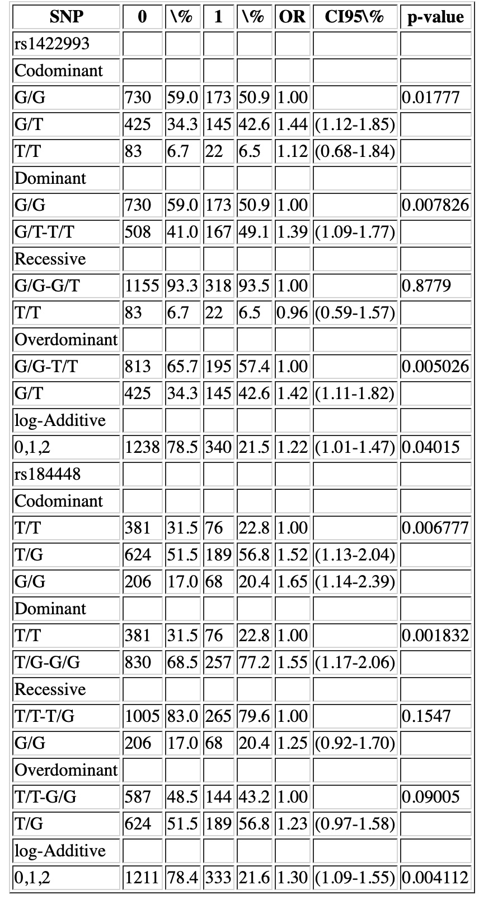

```{r setup, include=FALSE} 
knitr::opts_chunk$set(warning = FALSE, message = FALSE)
```

# A simple marker association test
## Scenario
Here’s our scenario: from previous mapping experiments a certain genomic region was identified as a potential QTL region, associated with weight in cattle. Even though its exact location is not well defined. Five microsatellite markers that we expect to be in full linkage with each of these genes were selected for the project. The researchers then set up a half sib experimental design with 10 heterozygote sires and each sire had 40 offspring with randomly selected females from a population with a similar genetic background. The sires and the offspring were genotyped for all five markers and phenotypic measures were recorded (the females were neither genotyped nor measured). We received this dataset and our task is to test for association between these markers and the phenotypes.

## Data Cleaning

```{r}
# Load sires data
sires = read.table("Data/siredata.txt",
                   header = T,
                   sep = "\t",
                   skip = 3)

# Load offsprings data
prog = read.table("Data/progdata.txt",
                  header = T,
                  sep = "\t",
                  skip = 3)

# Change marker columns to factors
for (i in c(1, 3:12)) {
  sires[, i] <- as.factor(sires[, i])
}

for (i in c(2, 3, 5:14)) {
  prog[, i] <- as.factor(prog[, i])
}

# Remove the one offspring with the missing weight data
prog = prog[-which(prog$weight == "-"),]

# Drop the first record (it's a genotype error)
prog = prog[-1, ]

# Change weight variable to numeric
prog$weight = as.numeric(as.character(prog$weight))
```

```{r}
# Check for the outliers in the offsprings data
plot(
  prog$weight,
  main = "Weight by Offspring",
  xlab = "",
  ylab = "Weight",
  col = "blue",
  xaxt = "n"
)
arrows(150, 480, 50, 480, code = 2)

# Remove the outlier
prog = prog[-which(prog$weight > 400), ]
```

```{r}
# Check data
head(sires, 5)
head(prog, 5)
```

**Note:** The first number refers to the marker and the second to the allele (i.e., m11 is marker one, allele one).

Now let's search for missing markers in the offsprings:
```{r}
# select marker columns
index = grep("m", names(prog))

# Create an empty variable for the loop to use
missing = numeric()

# Loop
for (i in 1:length(index)) {
  missing = c(missing, which(prog[, index[i]] == "-"))
}

missingU = unique(missing)

# Return the index of the rows with any missing marker
print(missingU)

# Return that row
print(prog[missingU, ])
```

```{r}
# Remove the sample with missing markers
prog = prog[-missingU, ]

# Check marker levels
summary(prog$m11)

# Drop unnecessary level "-"
for (i in 5:14) {
  prog[, i] <- droplevels(prog[, i], "-")
}

# Check marker levels again
summary(prog$m11)
```

Now, let's check offsprings' weights by sex and the density plot of their weights.

```{r}
par(mfrow = c(1, 2))
# Plot sires weight vs. offsprings weight
boxplot(prog$weight ~ prog$sire,
        col = 1:length(levels(prog$sire)),
        main = "Offsprings' weight by Sire",
        ylab = "Weight",
        xlab = "",
        las = 2,
        cex.names=0.4,)

# Check the density plot for offsprings' weights
plot(density(prog$weight),
     col = "blue",
     xlab = "Weight",
     main = "Density plot of offspring's weights")
```

Now, plot offsprings' weight against their sex.

```{r}
par(mfrow = c(1, 2))
# Plot offsprings weight vs. offsprings sex
boxplot(prog$weight ~ prog$sex,
        col = 1:length(levels(prog$sex)),
        main = "Offsprings' weight by Sex",
        ylab = "Weight",
        xlab = "Sex")

# Plot the offsprings' weights vs their sex
plot(
  prog$weight,
  col = prog$sex,
  pch = as.numeric (prog$sex),
  main = "Weight by Offspring",
  xlab = "",
  xaxt = "n",
  ylab = "Weight"
)
legend("topleft",
       levels(prog$sex),
       col = 1:2,
       pch = 1:2)
```

Now, let's check the first marker:

```{r}
# Extract data for the first marker
marker_1 = data.frame(m11 = as.character(prog$m11), m12 = as.character(prog$m12))

# Sort the data
marker_1_sorted = character()
for (i in 1:length(marker_1[, 1])) {
  marker_1_sorted = rbind(marker_1_sorted, sort(as.character(marker_1[i, ])))
}

# Check allelic frequencies for the first marker
alleles = summary(factor(marker_1_sorted))
print(alleles)

# Check genotype frequencies for the first marker
genotypes = paste(marker_1_sorted[, 1], marker_1_sorted[, 2], sep = "*")
genotypes = summary(factor(genotypes))
print(genotypes)
```

```{r}
# Plot the allelic and genotype frequencies for the first marker
par(mfrow = c(1, 2))
barplot(alleles,
        col = 1:11,
        las = 2,
        main = "Allelic frequencies")
barplot(
  genotypes,
  col = 1:11,
  las = 2,
  cex.names = 0.5,
  main = "Genotypic frequencies"
)
```

Now let’s make a new data.frame with the same information but with a single column for the genotypes for each marker instead of two columns with alleles.
```{r}
allgeno = NULL
indexms = grep("m", names(sires))
indexms = matrix(indexms, length(indexms) / 2, 2, byrow = T)
indexm = grep("m", names(prog))
indexm = matrix(indexm, length(indexm) / 2, 2, byrow = T)

for (i in 1:length(indexm[, 1])) {
  hold = data.frame(prog[indexm[i, ]])
  hold[, 1] = as.character(hold[, 1])
  hold[, 2] = as.character(hold[, 2])
  sorted = character()
  for (i in 1:length(hold[, 1])) {
    sorted = rbind(sorted, sort(as.character(hold[i, ])))
  }
  genotypes = paste(as.character(sorted[, 1]), as.character(sorted[, 2]), sep =
                      "_")
  allgeno = cbind(allgeno, genotypes)
}
colnames(allgeno) = c(
  "m1_both_allels",
  "m2_both_allels",
  "m3_both_allels",
  "m4_both_allels",
  "m5_both_allels"
)
markers = data.frame(prog[, 1:4], allgeno)
markers = markers[-1]
head(markers)
```

```{r}
# Remember the first form of data?
head(prog)
```

## Analysis

First, let's check for the homogeneity of variances and normality of the weights.
```{r}
# Fligner test for homogeneity of variances
fligner.test(weight ~ m1_both_allels, data = markers)
```

```{r}
# Shapiro test for normality
shapiro.test(markers$weight)
```

We want to test the markers with a continuous trait (weight) for association. A good way to go about it is with a linear model for analysis of variance (ANOVA).
```{r}
# Fit the model for marker 1
model3 = lm(weight ~ m1_both_allels, data = markers)
summary(model3)
```

```{r}
# Check quality control plots for the model
par(mfrow = c(2, 2), pin = c(2.5, 1.5))
plot(model3)
```

```{r}
# ANOVA test
anova(model3)
```

The marker is not significant (does not explain much of the variability in weight). We also know that sex seems to have a pretty big effect on our data, so let’s include sex in the model.
```{r}
model2 = lm(weight ~ sex + m1_both_allels, data = markers)
summary(model2)
anova(model2)
```

Now let's consider the effect of sire in our model.
```{r}
model1 = lm(weight ~ sex + sire + m1_both_allels, data = markers)
summary(model1)
anova(model1)
```

To formally test the difference in models (essentially proportion of variation explained by a term) do an anova on them.
```{r}
model1 = lm(weight ~ sex + sire + m1_both_allels, data = markers)
model2 = lm(weight ~ sex + m1_both_allels, data = markers)
model3 = lm(weight ~ m1_both_allels, data = markers)
null_model = lm(weight ~ 1, data = markers)
```
<br>

* **ANOVA of model 1 (sex + sire + M1) vs model 2 (sex + M1)**

```{r}
anova(model1, model2)
b = "==============================================="
```
<br>

* **ANOVA of model 2 (sex + M1) vs model 3 (M1)**

```{r}
anova(model2, model3)
b = "==============================================="
```
<br>

* **ANOVA of model 3 (M1) vs null model**

```{r}
anova(model3, null_model)
b = "==============================================="
```

This confirms it: our marker is not providing any information at all.

<br>

* **ANOVA of model 2 (sex + M1) vs null model**

In contrast look at sex:
```{r}
anova(model2, null_model)
b = "==============================================="
```

# Single SNP analysis
## Scenario
A dataset containing epidemiological information and 51 SNPs from a case-control study on asthma. We are interested in finding those SNPs associated with the asthma status.

## Load data

```{r}
# Import packages
library(SNPassoc)

# Load data
asthma <- read.table("Data/asthma.txt", header = TRUE)

# Check data's first 20 headers (the rest are SNPs as well)
colnames(asthma)[1:20]

# Check some samples
t(asthma[1:3, 1:7])

# Check some SNPs
asthma[1:5, 7:9]

# Indicate which columns of the dataset contain the SNP data
asthma.s <- setupSNP(data = asthma,
                     colSNPs = 7:ncol(asthma),
                     sep = "")

# Check SNP data now
asthma.s[1:5, 7:9]

# Check the genotype and allele frequencies for a SNP
summary(asthma.s$rs1422993)

# Plot missing genotypes across all SNPs
plotMissing(asthma.s, print.labels.SNPs = TRUE)
```

## H-W equilibrium
Genotype calling error can be detected by a H-W equilibrium test. Note that H-W must be checked only in controls. One is interested in keeping those SNPs that do not reject the null hypothesis (p > 0.05).
```{r}
# H-W test
hwe <- tableHWE(asthma.s, casecontrol)

# Check some results
hwe[1:4,]

# Keeping SNPs that pass the H-W test
snps.ok <- rownames(hwe)[hwe[, 2] >= 0.05]
pos <- which(colnames(asthma) %in% snps.ok, useNames = FALSE)
asthma.s <- setupSNP(data = asthma,
                     colSNPs = pos,
                     sep = "")
```

## SNP association analysis
Now, let's check the association between disease status (**casecontrol**) and a single SNP.

*Note: * AIC (Akaike information criteria): it can be used to decide which is the best model of inheritance (the lower the better the model is).

```{r}
# Test for group ~ SNP
association(formula = casecontrol ~ rs1422993, data = asthma.s)

# Incorporate covariates in the model
association(formula = casecontrol ~ rs1422993 + country + smoke, data = asthma.s)

# Stratify for gender
association(formula = casecontrol ~ rs1422993 + survival::strata(gender),
            data = asthma.s)

# Train the model only on a subset of individuals
association(
  formula = casecontrol ~ rs1422993,
  data = asthma.s,
  subset = country == "Spain"
)
```

Check the association between disease status (**casecontrol**) and all SNPs.
```{r fig1, fig.height = 7, fig.width = 7}
# Massive univariate testing (MUT)
ans <- WGassociation(formula = casecontrol, data = asthma.s)
ans[1:3, ]

# Plot p-values from the MUT
plot(ans)
```

We can also fit max-statistics model.
```{r}

# Calculate p-value for a certain SNP under the max-statistics model
maxstat(asthma.s$casecontrol, asthma.s$rs1422993)

# Max-statistics for all SNPs
ans.max <- maxstat(asthma.s, casecontrol)

# Check output
ans.max[1:5, 1:2]
```

Finally, let's create a table output for the results.
```{r}
# Create a table output for two specific SNPs
library(xtable)
invisible(capture.output(out <-
                           getNiceTable(ans[c("rs1422993", "rs184448")])))
nlines <- attr(out, "nlines")
hlines <- c(-1,-1, 0, cumsum(nlines + 1), nrow(out), nrow(out))
print(
  xtable(out, caption = "", label = 'tab-2SNPs'),
  tabular.enviroment = "longtable",
  type = "html",
  file = "Output/tableSNPs.html",
  floating = FALSE,
  include.rownames = FALSE,
  hline.after = hlines,
  sanitize.text.function = identity
)
```

The output table looks like this:



## Gene x environment and gene x gene interactions

```{r}
# G x E by smoking as the factor
association(formula = casecontrol ~ dominant(rs1422993) * factor(smoke),
            data = asthma.s)

# G x G by rs184448 as the factor
association(
  formula = casecontrol ~ rs1422993 * factor(rs184448),
  data = asthma.s,
  model.interaction = "dominant"
)
```

```{bash echo=FALSE}
rm Output/tableSNPs.html
```

