```{r setup, include=FALSE}
knitr::opts_chunk$set(warning = FALSE, message = FALSE)
rm(list = ls())
```

\newpage

# Overview
For RNA-seq data, **FastQC** is a popular non-R program for QC.
```{bash}
# S1
fastqc --noextract Data/RNAseq.fastq.gz --quiet --outdir Output/
```

The output looks like this:

```{r, echo=FALSE, fig.align='center', fig.pos='H', fig.show='hold', out.width = '100%', fig.cap='The summary panel of a bad example.'}
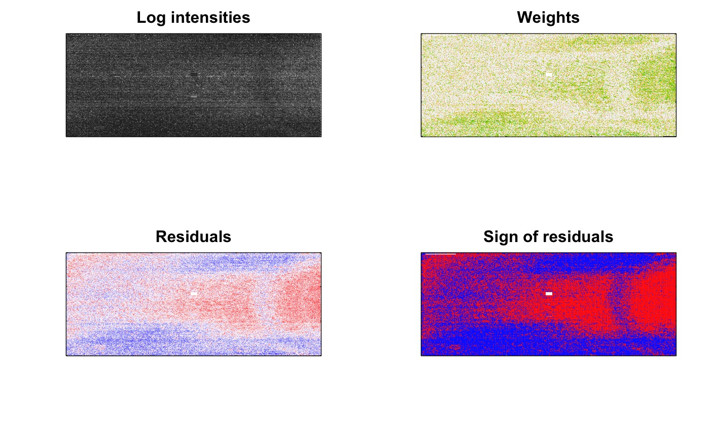
```

Sometimes we see warnings (orange triangles) and failures(red crosses) for good data and passes (green ticks) for questionable data. So, all modules should be carefully evaluated.

# Basic Statistics
The basic statistics module contains the overview information and statistics of the reads in the input FASTQ file.

```{r, echo=FALSE, fig.align='center', fig.pos='H', fig.show='hold', out.width = '100%', fig.cap='A good basic statistics report example.'}
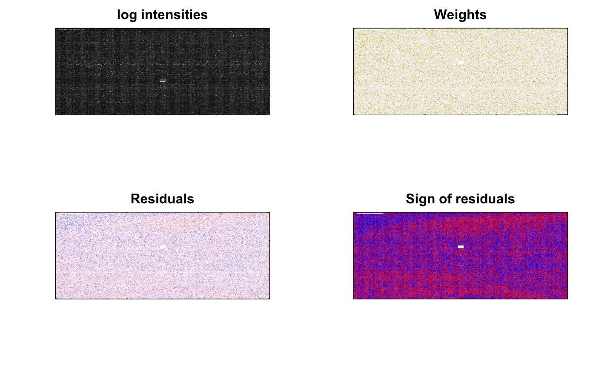
```

Good single-cell data usually have:

- a very little number of poor quality sequences;
- most often have uniform sequence length;
- the GC content should match the overall GC content of the genome or transcriptome of the sequenced species.

# Per Base Sequence Quality
The per base sequence quality view contains a Box Whisker type plot for each position in the read, which shows the range of quality scores across all bases at each position along all reads in the file.

```{r, echo=FALSE, fig.align='center', fig.pos='H', fig.show='hold', out.width = '100%', fig.cap='A good (left) and a bad (right) per-read sequence quality graph.'}
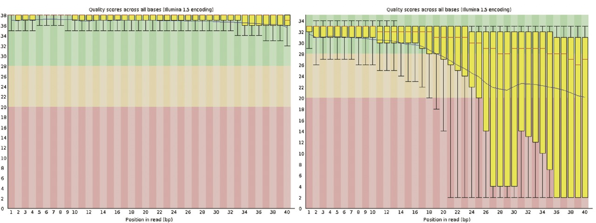
```

For single-cell data of good quality:

- all yellow boxes in the view, which represent IQR, should fall into the green (calls of good quality) area;
- so do all the whiskers, which represent the 10% and 90% of the distribution.

**Focus:** If poor quality calls are observed, one may consider performing quality trimming of their reads.

# Per Tile Sequence Quality
The per tile sequence quality plot shows the deviation from the average quality for the reads in each flowcell tile that was sequenced. The "hotter" the color, the larger the deviation. For high-quality data, we should see blue over the entire plot.

```{r, echo=FALSE, fig.align='center', fig.pos='H', fig.show='hold', out.width = '100%', fig.cap='A good (left) and a bad (right) per tile sequence quality view.'}
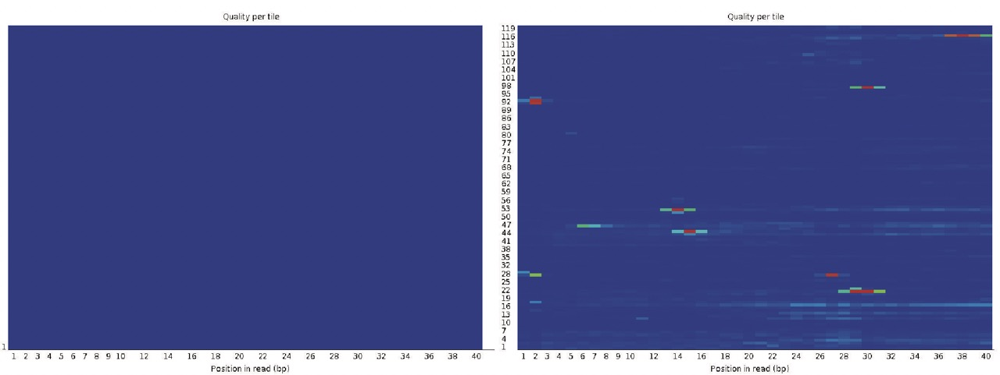
```

If only part of a flowcell has poor quality, some hot colors will appear in the plot. In that case, the sequencing step might have encountered transient problems, such as bubbles going through the flowcell or smudges and debris inside the flowcell lane.

# Per Sequence Quality Scores
The per sequence quality score plot shows the distribution of the average quality score of each read in the file. The x-axis shows the average quality scores, and the y-axis represents the frequency of each quality score.

```{r, echo=FALSE, fig.align='center', fig.pos='H', fig.show='hold', out.width = '100%', fig.cap='A good (left) and a bad (right) per sequence quality score plot.'}
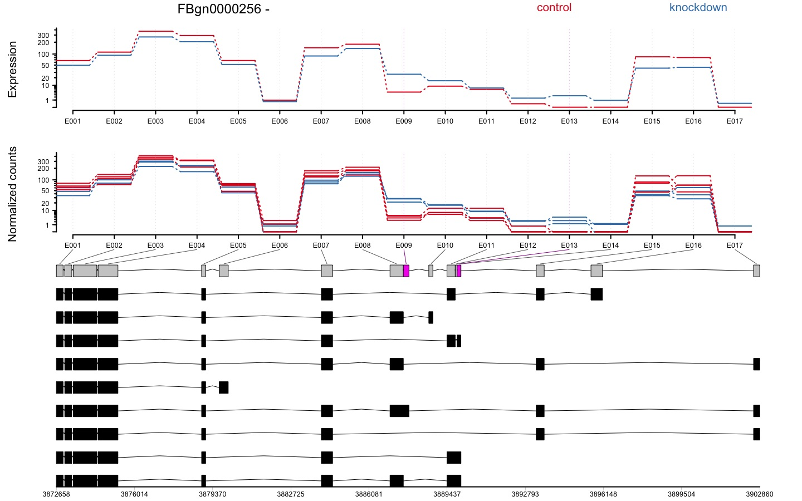
```

For good data, this plot should have only one peak at the tail.

# Per Base Sequence Content
The per base sequence content plot reports the percent of each base position of all reads in the file for which each of the four nucleotides has been called.

```{r, echo=FALSE, fig.align='center', fig.pos='H', fig.show='hold', out.width = '100%', fig.cap='A good (left) and bad (right) per base sequence content plot.'}
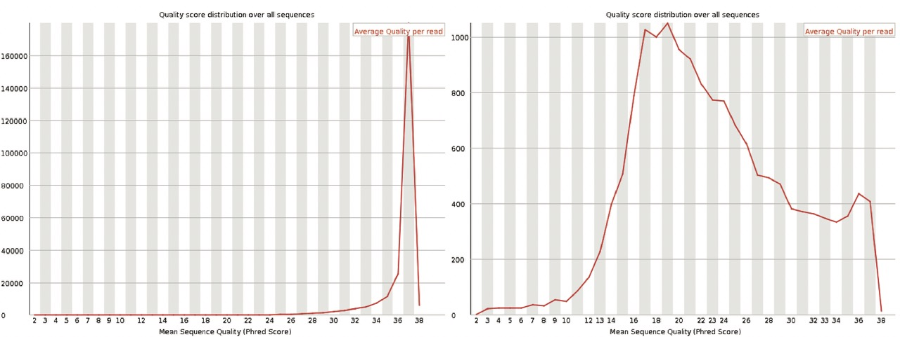
```

For single-cell data, it is not uncommon to see fluctuations at the start of the lines because the first bases of reads represent the sequence of the priming sites, which may not be perfectly random. This happens frequently in RNA-seq libraries, even though FastQC will call a warning or failure.

# Per Sequence GC Content
The per sequence GC content plot shows the distribution of GC content over all of the reads in red and a theoretical (expected) distribution in blue. The central peak of the observed distribution should correspond to the overall GC content of the underlying transcriptome.

```{r, echo=FALSE, fig.align='center', fig.pos='H', fig.show='hold', out.width = '100%', fig.cap='A good (left) and a bad (right) per sequence GC content plot.'}
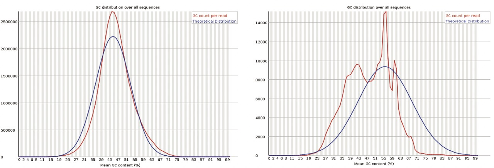
```

A complex distribution usually indicates a contaminated library.

# Per Base N Content
The per base N content plot shows the percent of bases at each position for which an N was called, which will occur when the sequencer has insufficient confidence to make a base call.

```{r, echo=FALSE, fig.align='center', fig.pos='H', fig.show='hold', out.width = '100%', fig.cap='A good (left) and a bad (right) per base N content plot.'}
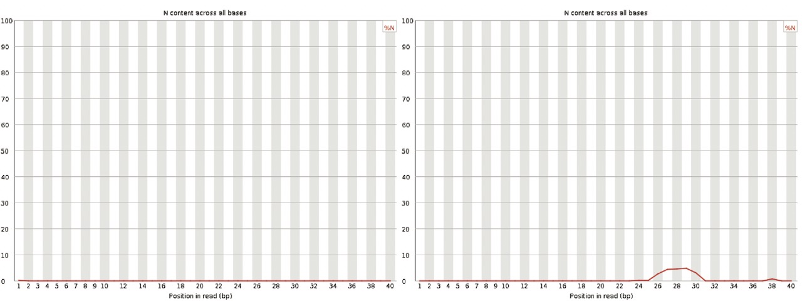
```

In a high-quality library, we should not expect any noticeable non-zero N content throughout the line.

# Sequence Length Distribution
The Sequence length distribution graph shows the distribution of the read lengths.

```{r, echo=FALSE, fig.align='center', fig.pos='H', fig.show='hold', out.width = '100%', fig.cap='A good (left) and a bad (right) sequence length distribution plot.'}
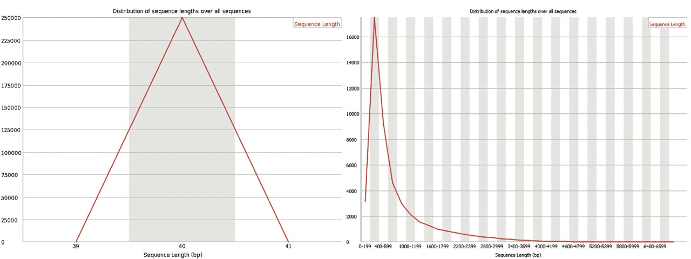
```

In most single-cell chemistries, all reads will be of the same length. If trimming was performed before quality assessment, there may be some small variation in read lengths.

# Sequence Duplication Levels
The sequence duplication level plot shows the distribution of the degree of duplication for read sequences (the blue line) and those after deduplication.

```{r, echo=FALSE, fig.align='center', fig.pos='H', fig.show='hold', out.width = '100%', fig.cap='A good (left) and a bad (right) per sequence duplication levels plot.'}
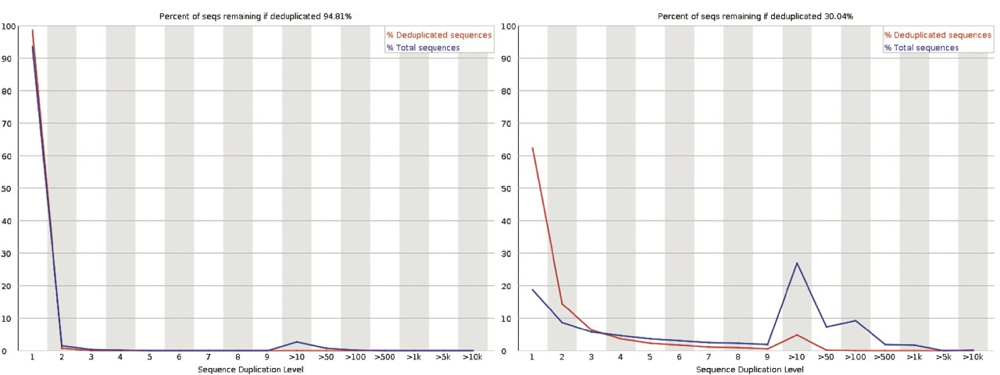
```

As most single-cell platform requires multiple rounds of PCR, highly expressed genes usually express a large number of transcripts, and FastQC itself is not UMI aware, it is common that a small subset of sequences may have a large number of duplications. Still, the majority of sequences should have a low duplication level.

# Overrepresented Sequences
The overrepresented sequences module lists all read sequences that make up more than 0.1% of the total number of sequences.

```{r, echo=FALSE, fig.align='center', fig.pos='H', fig.show='hold', out.width = '100%', fig.cap='An overrepresented sequence table.'}
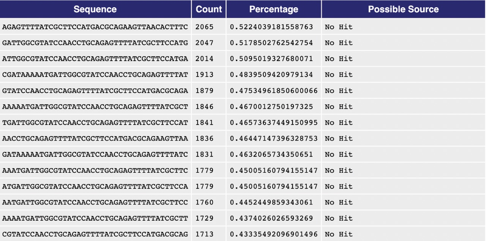
```

We might see some overrepresented sequences from the highly expressed genes after PCR amplification, but most sequences should not be overrepresented. Note that if the possible source of the overrepresented sequences is not “No Hit”, it might indicate that the library is contaminated by the corresponding type of source.

# Adapter Content
The adapter content module shows the cumulative percentage of the fraction of reads in which each of the adapter sequences has been observed at each base position.

```{r, echo=FALSE, fig.align='center', fig.pos='H', fig.show='hold', out.width = '100%', fig.cap='A good (left) and a bad (right) per sequence quality score plot.'}
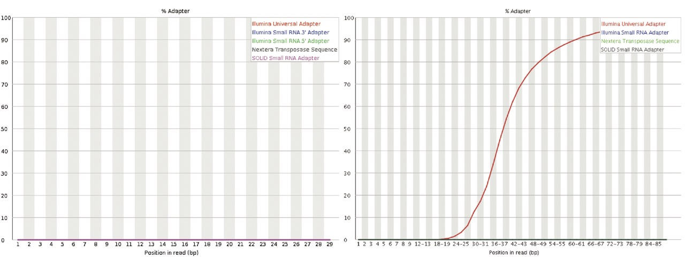
```

Ideally, we should not see any abundant adapter sequences in the data.

```{bash echo=FALSE}
rm -rf Output/QCreport
```
