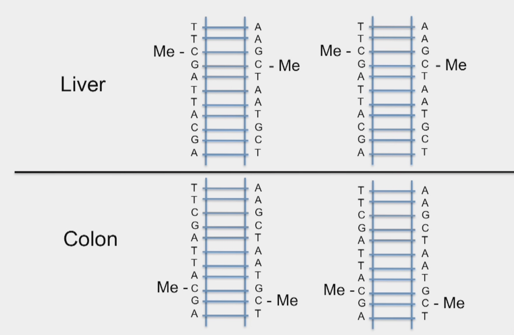

```{r setup, include=FALSE} 
knitr::opts_chunk$set(warning = FALSE, message = FALSE)
rm(list = ls())
```

# Introduction
**Epigenetics: ** Epigenetics is the study of stable phenotypic changes that do not involve alterations in the DNA sequence.  Epigenetics most often involves changes that affect gene activity and expression.

Techniques used to study epigenetics:

* ChIP-Seq: A method used to analyze protein interactions with DNA. ChIP-seq combines chromatin immunoprecipitation (ChIP) with massively parallel DNA sequencing to identify the binding sites of DNA-associated proteins.
* MeDIP-Seq: Methylated DNA immunoprecipitation (MeDIP) enables researchers to examine genome-wide changes in DNA methylation patterns.
* ATAC-Seq: The assay for transposase-accessible chromatin with sequencing (ATAC-Seq) is a popular method for determining chromatin accessibility across the genome. By sequencing regions of open chromatin, ATAC-Seq can help you uncover how chromatin packaging and other factors affect gene expression.

**Methylation: ** CpG segments (from 5' to 3' end) are the hotspots for methyl groups to attach to, causing methylated DNA. When the DNA replicates, this methylation characteristic preserves. This methylation is different across different cells and is an epigenetic.



Let's count the CpG segments in a part of human genome:
```{r}
library(BSgenome.Hsapiens.UCSC.hg19)
chr22 <- Hsapiens[["chr22"]]
s <- subseq(chr22, start = 23456789, width = 1000)
s

# Count CpG segments
countPattern("CG", s)
```

**CpG Islands: ** Sometimes in the genome, we see segments which are big clusters of CpGs. These segments are called CpG islands. These islands tend to be close to the promoter of genes. The formal definition is:

* > 200 base pairs
* GC-content > 50%
* obs / exp > 0.6

# Access the CpG Islands in human genome
```{r}
# Load the data in AnnotationHub package
library(AnnotationHub)
ah <- AnnotationHub()

# Subset to just the databases related to the hg19 genome
ah <- subset(ah,ah$genome=="hg19")

# Retrieve the annotations for CpG Islands
cgi <- ah[["AH5086"]]

# Extract the sequence of each CpG Island
library(BSgenome.Hsapiens.UCSC.hg19)
cgiseq <- getSeq(Hsapiens, cgi)

# Compute the proportion of Cs and Gs for each island
Cs <- letterFrequency(cgiseq, "C", as.prob=TRUE)
Gs <- letterFrequency(cgiseq, "G", as.prob=TRUE)

# Compute the proportion of CpGs we expect to see by chance
Exp <- array(Cs * Gs * width(cgiseq))

# Compute the proportion of CpGs we observe
Obs <- array(vcountPattern("CG", cgiseq))

# Compute the median of the observed to expected ratio
median(Obs / Exp)
```

Note that the CpG observed to expected ratio is below 1 and that few islands actually surpass a ratio of 1 or more. However, for the rest of the genome, the observed to expected ratio is substantially smaller.