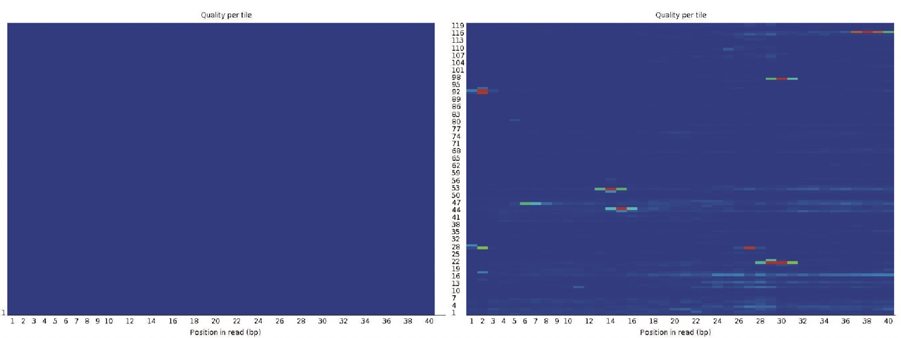

```{r setup, include=FALSE} 
knitr::opts_chunk$set(warning = FALSE, message = FALSE)
rm(list = ls())
```

# Introduction
**Epigenetics: ** Epigenetics is the study of stable phenotypic changes that do not involve alterations in the DNA sequence.  Epigenetics most often involves changes that affect gene activity and expression.

Techniques used to study epigenetics:

* ChIP-Seq: A method used to analyze protein interactions with DNA. ChIP-seq combines chromatin immunoprecipitation (ChIP) with massively parallel DNA sequencing to identify the binding sites of DNA-associated proteins.
* MeDIP-Seq: Methylated DNA immunoprecipitation (MeDIP) enables researchers to examine genome-wide changes in DNA methylation patterns.
* ATAC-Seq: The assay for transposase-accessible chromatin with sequencing (ATAC-Seq) is a popular method for determining chromatin accessibility across the genome. By sequencing regions of open chromatin, ATAC-Seq can help you uncover how chromatin packaging and other factors affect gene expression.

**Methylation: ** CpG segments (from 5' to 3' end) are the hotspots for methyl groups to attach to, causing methylated DNA. When the DNA replicates, this methylation characteristic preserves. This methylation is different across different cells and is an epigenetic.


Let's count the CpG segments in a part of human genome:
```{r}
library(BSgenome.Hsapiens.UCSC.hg19)
chr22 <- Hsapiens[["chr22"]]
s <- subseq(chr22, start = 23456789, width = 1000)
s

# Count CpG segments
countPattern("CG", s)
```

**Focus: ** We use Bisulfite treatment to assess if a CpG is methylated or not. Bisulfite turns un-methylated CpGs to TG.

**CpG Islands: ** Sometimes in the genome, we see segments which are big clusters of CpGs. These segments are called CpG islands. These islands tend to be close to the promoter of genes. The formal definition is:

* > 200 base pairs
* GC-content > 50%
* obs / exp > 0.6

# Access the CpG Islands in human genome
```{r}
# Load the data in AnnotationHub package
library(AnnotationHub)
ah <- AnnotationHub()

# Subset to just the databases related to the hg19 genome
ah <- subset(ah,ah$genome=="hg19")

# Retrieve the annotations for CpG Islands
cgi <- ah[["AH5086"]]

# Extract the sequence of each CpG Island
library(BSgenome.Hsapiens.UCSC.hg19)
cgiseq <- getSeq(Hsapiens, cgi)

# Compute the proportion of Cs and Gs for each island
Cs <- letterFrequency(cgiseq, "C", as.prob=TRUE)
Gs <- letterFrequency(cgiseq, "G", as.prob=TRUE)

# Compute the proportion of CpGs we expect to see by chance
Exp <- array(Cs * Gs * width(cgiseq))

# Compute the proportion of CpGs we observe
Obs <- array(vcountPattern("CG", cgiseq))

# Compute the median of the observed to expected ratio
median(Obs / Exp)
```

Note that the CpG observed to expected ratio is below 1 and that few islands actually surpass a ratio of 1 or more. However, for the rest of the genome, the observed to expected ratio is substantially smaller.

# Differentially methylated regions (DMRs)
Now we will show an example of analyzing methylation data. We will use colon cancer data from TCGA. The data was created with the Illumina 450K array and has already been processed to create matrix with methylation measurements.
```{r}
library(S4Vectors)
library(coloncancermeth)
data(coloncancermeth)
```

We know have three tables one containing the methylation data, one with information about the samples or columns of the data matrix, and Granges object with the genomic location of the CpGs represetned in the rows of the data matrix.
```{r}
# Methylation data
meth[1:4, 1:4]

# Sample information
pd[1:4, 20:22]

# Granges object
gr[1:4, ]
```

Check the number of cancer vs. non-cancer patients:
```{r}
table(pd$Status)
normalIndex <- which(pd$Status == "normal")
cancerlIndex <- which(pd$Status == "cancer")
```

Let's start by creating an MDS plot that graphically shows approximate distances between the samples:
```{r}
d <- dist(t(meth))
mds <- cmdscale(d)
plot(
  mds[, 1],
  mds[, 2],
  bg = as.numeric(pd$Status),
  pch = 21,
  xlab = "First dimension",
  ylab = "Second dimension"
)
legend("bottomleft",
       levels(pd$Status),
       col = seq(along = levels(pd$Status)),
       pch = 15
)
```

The MDS plot shows separation between cancer and normal samples, but only in the first dimension. The second dimension seems to be associated with a large variability within the cancers.

Now let's take a quick look at the distribution of methylation measurements for the samples:
```{r}
i = normalIndex[1]
plot(
  density(meth[, i], from = 0, to = 1),
  main = "",
  ylim = c(0, 3),
  type = "n"
)

# Add the normal samples
for (i in normalIndex) {
  lines(density(meth[, i], from = 0, to = 1), col = 1)
}

# Add the cancer samples
for (i in cancerlIndex) {
  lines(density(meth[, i], from = 0, to = 1), col = 2)
}
legend(
  x = "topright",
  legend = c("Normal", "Cancer"),
  col = c(1, 2),
  lty = 1,
  cex = 0.8
)
```

We are interested in finding regions of the genome that are different between cancer and normal samples. Furthermore, we want regions that are consistently different therefore we can treat this as an inference problem. We can compute a t-statistic for each CpG:
```{r}
library(limma)
X <- model.matrix( ~ pd$Status)
fit <- lmFit(meth, X)
eb <- eBayes(fit)
```

A volcano plot reveals many differences:
```{r}
library(rafalib)
splot(fit$coef[, 2],
      -log10(eb$p.value[, 2]),
      xlab = "Effect size",
      ylab = "-log10 p-value",
      col = "blue",
      pch = 3)
```

We can now compute a q-value for each test. If a feature resulted in a p-value of p, the q-value is the estimated pFDR for a list of all the features with a p-value at least as small as p. Let's check the q-values:
```{r}
pvals <- eb$p.value[, 2]
library(qvalue)
res <- qvalue(pvals)
qvals <- res$qvalues
plot(pvals, qvals)
```

What proportion of CpG sites have q-values smaller than 0.05?
```{r}
table(qvals < 0.05)[2] / length(qvals)
```

What proportion of the CpGs showing statistically significant differences (defined with q-values in the previous question) are, on average, higher in cancer compared to normal samples?
```{r}
index = which(qvals <= 0.05)
diffs = fit$coef[index, 2]
table(diffs > 0)[2] / length(diffs)
```

Now let's determine which of the differentially methylated CpGs are in CpG islands.
```{r}
# Redefine CpG islands as cgi
library(AnnotationHub)
ah <- AnnotationHub(localHub = TRUE)
cgi <- ah[["AH5086"]]
index = which(qvals <= 0.05)
table(gr[index] %over% cgi)[2] / length(gr[index])
```

If we have reason to believe for DNA methylation to have an effect on gene expression a region of the genome needs to be affected, not just a single CpG. Here is plot of the region surrounding the top hit:
```{r}
library(GenomicRanges)
i <- which.min(eb$p.value[, 2])
middle <- gr[i, ]
Index <- gr %over% (middle + 10000)
cols = ifelse(pd$Status == "normal", 1, 2)
chr = as.factor(seqnames(gr))
pos = start(gr)
plot(pos[Index],
     fit$coef[Index, 2],
     type = "b",
     xlab = "Genomic Location",
     ylab = "Difference",
     col = "blue"
)

matplot(pos[Index],
        meth[Index,],
        col = cols,
        xlab = "Genomic Location",
        ylab = "Methylation",
        pch = 1)
legend(
  x = "topright",
  legend = c("Normal", "Cancer"),
  col = c(1, 2),
  pch = 1,
  cex = 0.8
)
```

If we are going to perform regional analysis we first have to define a region. But one issue is that not only do we have to separate the analysis by chromosome but that within each chromosome we usually have big gaps creating subgroups of regions to be analyzed. We can create groups in the following way:
```{r}
library(bumphunter)
cl = clusterMaker(chr, pos, maxGap = 500)
# Shows the number of points of difference with 1,2,3, etc.
# The number under each point is the number of clusters with that number
# of points of difference
table(table(cl))[1:4]
```

Now let's consider two example regions:
```{r}
# Select the region with the smallest value
Index <- which(cl == cl[which.min(fit$coef[, 2])])
matplot(
  pos[Index],
  meth[Index, ],
  col = cols,
  pch = 1,
  xlab = "Genomic Location",
  ylab = "Methylation"
)
legend(
  x = "topright",
  legend = c("Normal", "Cancer"),
  col = c(1, 2),
  pch = 1,
  cex = 0.8
)

x1 = pos[Index]
y1 = fit$coef[Index, 2]
plot(x1,
     y1,
     xlab = "Genomic Location",
     ylab = "Methylation Difference",
     ylim = c(-1, 1),
     col = "blue",
     type = "b"
)
abline(h = 0, lty = 2)
```

This region shows only a single CpG as different. In contrast, notice this region:
```{r}
Index = which(cl == 72201)
matplot(
  pos[Index],
  meth[Index, ],
  col = cols,
  pch = 1,
  xlab = "Genomic Location",
  ylab = "Methylation"
)
legend(
  x = "topright",
  legend = c("Normal", "Cancer"),
  col = c(1, 2),
  pch = 1,
  cex = 0.8
)

x2 = pos[Index]
y2 = fit$coef[Index, 2]
plot(x2,
     y2,
     xlab = "Genomic Location",
     ylab = "Methylation Difference",
     ylim = c(-1, 1),
     col = "blue",
     type = "b"
)
abline(h = 0, lty = 2)
```

If we are interested in prioritizing regions over single points, we need an alternative approach. If we assume that the real signal is smooth, we could use statistical smoothing techniques such as *loess*. Here is an example two regions above:
```{r}
# Example 1
lfit <- loess(y1 ~ x1,
              degree = 1,
              family = "symmetric",
              span = 1 / 2)
plot(x1,
     y1,
     xlab = "Genomic Location",
     ylab = "Methylation Difference",
     ylim = c(-1, 1),
     col = "blue"
)
abline(h = 0, lty = 2)
lines(x1, lfit$fitted, col = 2)

# Example 2
lfit <- loess(y2 ~ x2,
              degree = 1,
              family = "symmetric",
              span = 1 / 2)
plot(x2,
     y2,
     xlab = "Genomic Location",
     ylab = "Methylation Difference",
     ylim = c(-1, 1),
     col = "blue",
     type = "b"
)
abline(h = 0, lty = 2)
lines(x2, lfit$fitted, col = 2)
```

The *bumphunter* automates this procedure of finding DMRs:
```{r}
chr = as.factor(seqnames(gr))
pos = start(gr)
res <- bumphunter(
  meth,
  X,
  chr = chr,
  pos = pos,
  cluster = cl,
  cutoff = 0.1,
  B = 0
)
tab <- res$table
tab[1:4, 1:4]
```

We now have a list of regions instead of single points. Here we look at the region with the highest rank if we order by area:
```{r}
Index = (tab[1, 7] - 3):(tab[1, 8] + 3)
matplot(
  pos[Index],
  meth[Index, , drop = TRUE],
  col = cols,
  pch = 1,
  xlab = "Genomic Location",
  ylab = "Methylation",
  ylim = c(0, 1)
)
legend(
  x = "topright",
  legend = c("Normal", "Cancer"),
  col = c(1, 2),
  pch = 1,
  cex = 0.8
)

plot(
  pos[Index],
  res$fitted[Index, 1],
  xlab = "Genomic Location",
  ylab = "Methylation Difference",
  ylim = c(-1, 1),
  col = "blue",
  type = "b"
)
abline(h = 0, lty = 2)
```

Let's filter some DMRs by region size:
```{r}
dmrs <- tab[tab$L >= 3, ]

# Convert to GenomicRanges object
dmrs <- makeGRangesFromDataFrame(dmrs)
```

Now let's find the distance to the closest island in *dmrs*:
```{r}
d_island <- distanceToNearest(dmrs, cgi)
```

What proportion of DMRs overlap a CpG island (distance = 0)?
```{r}
d_island <- as.data.frame(d_island)
table(d_island$distance == 0)[2] / length(d_island$distance)
```

# Methylation arrays data
The *minfi* package provides tools for analyzing Illumina’s Methylation arrays, specifically the 450k and EPIC (also known as the 850k) arrays. In here, we will read idat files from the illumina 450K DNA methylation array:
```{r}
library(minfi)
path <- "Data/idats"
```

Let's start by reading in the csv file, which contains clinical information. This has one row for each sample and one of the columns includes the "basenames" for the files:
```{r}
targets <- read.csv("Data/idats/targets.csv", as.is = TRUE)
names(targets)[102:106]
targets$Basename
```

To make this script work in any working directory  we can edit that column to contain the absolute paths. Then we are ready to read in the raw data:
```{r}
targets$Basename <- file.path(path, targets$Basename)
rgset <- read.metharray(targets$Basename, verbose = TRUE)
pData(rgset) <- as(targets, "DataFrame")
```

How many cancer samples are included in this dataset?
```{r}
table(rgset$Status)
```

We now have the raw data, red and green intensities which we have access to:
```{r}
getRed(rgset)[1:3, 1:3]
getGreen(rgset)[1:3, 1:3]
```

Let's use the built in preprocessing algorithm to get an object that gives us access to methylation estimates:
```{r}
mset <- preprocessIllumina(rgset)
```

However, for this to be useful, we want to have the locations of each CpG, and to do that we need map the CpGs to genome. *minfi* keeps this information modular so that when the genome annotation gets updated, one can easily change the mapping:
```{r}
mset <- mapToGenome(mset)
```

Now we are ready to obtain the methylation values and CpG locations:
```{r}
# Methylation values
getBeta(mset,type="Illumina")[1:3, 1:3]

# CpG locations
cpgloc <- granges(mset)
cpgloc[1:3]
```

What is the estimated level of methylation for the CpG at location 153807318 on chr4 for sample "5775041068_R04C01"?
```{r}
i <-
  which(seqnames(granges(mset)) == "chr4" &
          start(granges(mset)) == 153807318)
j <- which(rgset$Basename == file.path(path,"5775041068_R04C01"))
getBeta(mset, type = "Illumina")[i, j]
```

Add other data as well:
```{r}
mypar(1, 2)
# Sex data
colData(mset) <- getSex(mset)
plotSex(mset)

# QC data
plot(as.matrix(getQC(mset)))
```

Now let's convert *mset* to a *GenomicRatioSet* so we can read it into *bumphunter*:
```{r}
grset <- ratioConvert(mset, what = "beta", type = "Illumina")
```

Find DMRs between cancer and normal samples:
```{r}
X = model.matrix( ~ pData(rgset)$Status)
dmrs <- bumphunter(grset, X, cutoff = 0.1)
```

Now we will learn how to run *bumphunter* with smoothing. However to make the code run faster we will only run it on chr22:
```{r}
# Subset
index <- which(seqnames(grset) == "chr22")
grset2 <- grset[index, ]

# Run bumphunter without smoothing
X <- model.matrix( ~ pData(rgset)$Status)
res <- bumphunter(grset2, X, cutoff = 0.25)

# Run bumphunter with smoothing
res2 <- bumphunter(grset2, X, cutoff = 0.25, smooth = TRUE)
```

Notice that *res* has more DMRs and *res2* has longer DMRs:
```{r}
# Number of regions in res
nrow(res$table)
# Number of regions in res2
nrow(res2$table)
# Mean length of regions in res
mean(res$table$L)
# Mean length of regions in res2
mean(res2$table$L)
```

# Inference for DNA methylation
First, read in and preprocess the TCGA (The Cancer Genome Atlas program) data:
```{r}
library(minfi)
library(IlluminaHumanMethylation450kmanifest)
library(doParallel)
library(pkgmaker)
library(rafalib)

path = "Data/tcgaMethylationSubset"
targets = read.delim(file.path (path, "targets.txt"), as.is = TRUE)

# Case-control groups
table(targets$Tissue, targets$Status)

# Subset the normal colon and lung
index = which(targets$Status == "normal" &
                targets$Tissue %in% c("colon", "lung"))
targets = targets[index, ]

# Read and preprocess methylation data
dat = read.metharray.exp(base = path,
                         targets = targets,
                         verbose = TRUE)
dat = preprocessIllumina(dat)
dat = mapToGenome(dat)
dat = ratioConvert(dat, type = "Illumina")

# Check CpG data
granges(dat)[1:4, ]

# Get tissue data
tissue = pData(dat)$Tissue

# Parallelize the processing
library(doParallel)
detectCores()
registerDoParallel(cores = 4)
```

Now, let's build a model for finding DMRs based on tissue type:
```{r}
X = model.matrix( ~ tissue)

# For illustrative purposes let's restrict it to one chromosome only
index = which(seqnames(dat) == "chr22")
dat = dat[index, ]
res = bumphunter(dat, X, cutoff = 0.1, B = 1000)

# Check results
## value = the average height of the region (bump)
## L = the number of CpGs in the region
res$tab[1:4, c(1, 2, 3, 4, 13)]

# How many regions (bumps) were identified?
dim(res$tab)[1]
```

Now, let's evaluate the relationship between these DMRs and CpG islands:
```{r}
library(rafalib)
library(AnnotationHub)

# Load CpG islands
cgi = AnnotationHub(localHub = TRUE)[["AH5086"]]

# Restrict results to those with a FWER < 0.05
tab = res$tab[res$tab$fwer <= 0.05, ]

# Convert to GRanges object
tab = makeGRangesFromDataFrame(tab, keep.extra.columns = TRUE)

# Compute the distance between the nearest CpG island to each DMR
map = distanceToNearest(tab, cgi)
d = mcols(map)$distance

# Check the proportion of distances in categories of 0-1, 1-2000, etc.
prop.table(table(cut(
  as.numeric(d),
  c(0, 1, 2000, 5000, Inf),
  include.lowest = TRUE,
  right = FALSE
)))
```

As you can see, most of these DMRs are not within the islands, but are 2000 base pairs far from the islands. We call these regions "CpG island shores". CpGs that are nowhere near an island are called "open sea CpGs".

Those results were for DMRs with a FWER < 0.05. Let's see the distances for all CpGs:
```{r}
nulltab =  granges(dat)
nullmap = distanceToNearest(nulltab, cgi)
nulld = mcols(nullmap)$distance
prop.table(table(cut(
  nulld,
  c(0, 1, 2000, 5000, Inf),
  include.lowest = TRUE,
  right = FALSE
)))
```

As expected, most CpGs are in the islands. So, the DMRs seem to be more common in the shores than the islands, in contrast to what we see for CpGs. We can also check these information using another function:
```{r}
# How many CpGs are within islands, shores, etc.?
prop.table(table(getIslandStatus(dat)))
```

Now, let's plot one of those DMRs:
```{r}
# Sort DMRs by area
tab = tab[order(-mcols(tab)$area)]

# Add 3000 base pairs to each side
tab = tab + 3000

# Choose a specific DMR
i = 17

# Find all CpGs that are in the region
dataIndex = which(granges(dat) %over% tab[i])
cgiIndex = which(cgi %over% tab[i])
thecgi = cgi[cgiIndex]

# Get the positions of those CpGs
pos = start(dat)[dataIndex]

# Define the limit of the region to include in the plot
xlim = range(c(pos, start(thecgi), end(thecgi)))

# Get the beta values all CpGs
beta = getBeta(dat)

# Get the beta values for the CpGs in our specific region
y = beta[dataIndex, ]

# Color data points by tissue type
cols = as.factor(pData(dat)$Tissue)

# Plot
mypar(1, 1)
matplot(
  pos,
  y,
  col = as.numeric(cols),
  xlim = xlim,
  ylim = c(0, 1),
  xlab = "Genomic Location",
  ylab = "Methylation",
  pch = 1
)
legend(
  x = "topright",
  legend = c("Colon", "Lung"),
  col = c(1, 2),
  pch = 1,
  cex = 0.8
)

## Show CpG island
apply(cbind(start(thecgi), end(thecgi)), 1, function(x) {
  segments(x[1], 0, x[2], 0, lwd = 4, col = 3)
})

plot(
  pos,
  res$fitted[dataIndex],
  xlim = xlim,
  ylim = c(-0.4, 0.4),
  xlab = "Genomic Location",
  ylab = "Methylation Difference",
  col = "blue",
  type = "b"
)
abline(h = 0, lty = 2)

## Show CpG island
apply(cbind(start(thecgi), end(thecgi)), 1, function(x) {
  segments(x[1], 0, x[2], 0, lwd = 4, col = 3)
})
```

Let's perform another analysis on this data:
```{r}
library(minfi)
library(IlluminaHumanMethylation450kmanifest)
library(IlluminaHumanMethylation450kanno.ilmn12.hg19)

targets = read.delim(file.path (path, "targets.txt"), as.is = TRUE)

# Subset the normal colon and breast samples
index <-
  which(targets$Status == "normal" &
          targets$Tissue %in% c("colon", "breast"))
targets <- targets[index,]

# Read in methylation data
dat <- read.metharray.exp(base = path,
                          targets = targets,
                          verbose = TRUE)

# Preprocess the data
dat <- preprocessIllumina(dat)

# Assign locations to each CpG
dat <- mapToGenome(dat)

# Precompute methylation values from U and M values
dat <- ratioConvert(dat, type = "Illumina")
```

First look at the distribution of each sample:
```{r}
library(rafalib)

# Extract methylation values
y <- getBeta(dat)

# Plot
mypar(1, 1)
shist(y, xlab = "Methylation", main = "Shistogram of Methylation values")
```

Also, create an MDS plot to search for outlier samples. The first PC splits the data by tissue:
```{r}
mds <- cmdscale(dist(t(y)))
tissue <- as.factor(pData(dat)$Tissue)
plot(mds, col = tissue)
legend(
  x = "topright",
  legend = c("Breast", "Colon"),
  col = c(1, 2),
  pch = 1,
  cex = 0.8
)
```

As expected, no sample stands out as an outlier.

Now we are ready to use statistical inference to find DMRs. Let's start by using the limma package to perform a site-by-site analysis:
```{r}
library(limma)

# Create design matrix
tissue = as.factor(pData(dat)$Tissue)
X = model.matrix( ~ tissue)

# Extract methylation values
y = getBeta(dat)

# Obtain effect sizes and pvals with limma
fit = lmFit(y, X)
```

Which CpG has the largest effect size?
```{r}
index = which.max(abs( fit$coef[,2]))
print(index)
```

Which chromosome is this CpG on?
```{r}
granges(dat)[index]
```

Now we will use the *qvalue()* function to determine the q-value for the CpG found in the previous question:
```{r}
library(qvalue)

# Create design matrix
tissue <- as.factor(pData(dat)$Tissue)
X <- model.matrix( ~ tissue)

# Extract methylation values
y <- getBeta(dat)

# Obtain effect sizes and pvals with limma
fit <- lmFit(y, X)
eb <- eBayes(fit)

# Obtain q-values
qvals <- qvalue(eb$p.value[, 2])$qvalue

# What is the q-value for this CpG?
qvals[index]
```

Find all the CpGs within 5000 basepairs of the CpG identified in the previous question:
```{r}
tab = granges(dat)[index] + 5000
dataIndex = which(granges(dat) %over% tab)
```

Create plots showing the methylation values, methylation difference, estimated effect sizes, and q-values across all of the samples at these CpGs:
```{r}
mypar(2, 2)

# Plot of the methylation values
## Get the positions of those CpGs
pos = start(dat)[dataIndex]

## Define the limit of the region to include in the plot
xlim = range(min(pos), max(pos))

## Get the beta values of those CpGs
beta = getBeta(dat[dataIndex])

## Color data points by tissue type
cols = as.factor(pData(dat)$Tissue)

## Plot
matplot(
  pos,
  beta,
  col = as.numeric(cols),
  xlim = xlim,
  ylim = c(0, 1),
  xlab = "Genomic Location",
  ylab = "Methylation",
  pch = 1
)
legend(
  x = "topright",
  legend = c("Breast", "Colon"),
  col = c(1, 2),
  pch = 1,
  cex = 0.8
)

# Plot of the methylation difference
plot(
  pos,
  eb$coefficients[dataIndex],
  xlim = xlim,
  ylim = c(-0.4, 0.4),
  xlab = "Genomic Location",
  ylab = "Methylation Difference",
  col = "blue"
)
abline(h = 0, lty = 2)

## Create a buffer zone for significancy
abline(h = 0.1, lty = 3)
abline(h = -0.1, lty = 3)

# Plot of the estimated effect sizes
plot(pos,
     eb$coefficients[dataIndex, 2],
     xlim = xlim,
     xlab = "Genomic Location",
     ylab = "Effect Size",
     col = "blue")

# Plot of the q-values
plot(
  -log10(qvals[dataIndex]),
  col = "blue",
  type = "b",
  ylab = "-log10(q-value)",
  xlab = "",
  xaxt = 'n'
)
```

A region of about 1000 base pairs appears to be different.

Let's repeat the above code for the top 10 CpGs ranked by absolute value of the effect size:
```{r}
o <- order(abs(fit$coef[, 2]), decreasing = TRUE)[1:10]

mypar(2, 2)

# Plot of the methylation values
## Get the positions of those CpGs
pos = start(dat)[o]

## Define the limit of the region to include in the plot
xlim = range(min(pos), max(pos))

## Get the beta values of those CpGs
beta = getBeta(dat[o])

## Color data points by tissue type
cols = as.factor(pData(dat)$Tissue)

## Plot
matplot(
  pos,
  beta,
  col = as.numeric(cols),
  xlim = xlim,
  ylim = c(0, 1),
  xlab = "Genomic Location",
  ylab = "Methylation",
  pch = 1
)
legend(
  x = "topright",
  legend = c("Breast", "Colon"),
  col = c(1, 2),
  pch = 1,
  cex = 0.8
)

# Plot of the methylation difference
plot(
  pos,
  eb$coefficients[o],
  xlim = xlim,
  ylim = c(-0.4, 0.4),
  xlab = "Genomic Location",
  ylab = "Methylation Difference",
  col = "blue"
)
abline(h = 0, lty = 2)

## Create a buffer zone for significancy
abline(h = 0.1, lty = 3)
abline(h = -0.1, lty = 3)

# Plot of the estimated effect sizes
plot(pos,
     eb$coefficients[o, 2],
     xlim = xlim,
     xlab = "Genomic Location",
     ylab = "Effect Size",
     col = "blue")

# Plot of the q-values
plot(
  -log10(qvals[o]),
  type = "b",
  col = "blue",
  ylab = "-log10(q-value)",
  xlab = "",
  xaxt = 'n'
)
```

For most plots we see groups of CpGs that are differentially methylated.

Now we are going to explicitly search for DMRs. We will use permutation to assess statistical significance. Because the function is slow, we will restrict our analysis to chromosome 15:
```{r}
index <- which(seqnames(dat) == "chr15")
dat2 <- dat[index, ]

# Create design matrix
tissue <- as.factor(pData(dat)$Tissue)
X <- model.matrix(~ tissue)

# Extract methylation values
set.seed(1)
res <- bumphunter(dat2, X, cutoff = 0.1, B = 100)
res$tab[1:4, c(1, 2, 3, 4, 9, 13)]
```

How many regions achieve an FWER lower than 0.05?
```{r}
table(res$table$fwer < 0.05)[2]
```

Previously we performed a CpG by CpG analysis and obtained qvalues. Create an index for the CpGs that achieve qvalues smaller than 0.05 and a large effect size larger than 0.5 (in absolute value):
```{r}
index <-
  which(qvals < 0.05 &
          abs(fit$coef[, 2]) > 0.5 & seqnames(dat) == "chr15")
```

Now create a table of the DMRs returned by *bumphunter* that had 3 or more probes and convert the table into GRanges:
```{r}
tab <- res$tab[res$tab$L >= 3, ]
tab <- makeGRangesFromDataFrame(tab)
```

What proportion of the CpGs indexed by "index" are inside regions found in "tab"?
```{r}
overlaps <- findOverlaps(tab, granges(dat[index]))
length(overlaps) / length(index)
```

Now let's download the table of CpG islands using AnnotationHub:
```{r}
library(AnnotationHub)
cgi <- AnnotationHub(localHub = TRUE)[["AH5086"]]
```

Create a GRanges object from the list of DMRs we computed previously:
```{r}
tab <- res$tab[res$tab$fwer <= 0.05, ]
tab <- makeGRangesFromDataFrame(tab)
```

What proportion of the regions represented in "tab" do not overlap islands, but overall CpG islands shores (within 2000 basepairs) ?
```{r}
map = distanceToNearest(tab, cgi)
d = mcols(map)$distance
prop.table(table(cut(
  d,
  c(0, 1, 2000, 5000, Inf),
  include.lowest = TRUE,
  right = FALSE
)))[2]
```

# Accounting for cell composition
Most of the data we study comes from bulk of tissue which is usually a combination of cell types. Usually, different cell types have very different methylation profiles. In the figure below, you can see the methylation profiles for different cell types in the blood of 6 individuals.


As you can see, the difference between individuals for each cell type is negligible, but the difference between cell types is substantial. This problem could be attacked as an batch effect.

# Multi-resolution analysis
Until now, we were analyzing data based on regions (resolution) of 10 to 20 kilobases long. Now, we are going to analyze data for bigger resolutions:
```{r}
# Import and preprocess data
library(minfi)
path = "Data/tcgaMethylationSubset"
targets <- read.delim(file.path (path, "targets.txt"), as.is = TRUE)
index <- which(targets$Tissue == "colon")
targets <- targets[index, ]
dat <- read.metharray.exp(base = path,
                          targets = targets,
                          verbose = TRUE)
dat <- preprocessIllumina(dat)
dat <- mapToGenome(dat)

# Collapse CpG islands
cdat <- cpgCollapse(dat, verbose = FALSE)
```

How many regions are represented in the collapsed object?
```{r}
length(cdat[[1]])
```

We can see the type of regions that are represented in this collapsed object:
```{r}
head(granges(cdat$obj))
```

What proportion of the regions are OpenSea regions?
```{r}
table(granges(cdat$obj)$type == "OpenSea")[2] / length(granges(cdat$obj))
```

Now let's find DMRs between cancer and normal:
```{r}
status <- factor(pData(cdat$obj)$Status, level = c("normal", "cancer"))
X <- model.matrix( ~ status)
res <- blockFinder(cdat$obj, X, cutoff = 0.05)

# Take a peek at the blocks
res$table[1:4, c(1, 2, 3, 4, 9)]
```

What proportion of the blocks reported in "res$table" are hypomethyated in cancer (lower methylation in cancer versus normal)?
```{r}
table(res$table$value < 0)[2] / length(res$table$value)
```

Let's make figures now:
```{r}
tab = makeGRangesFromDataFrame(res$table)
index = granges(cdat$obj) %over% (tab[1] + 10000)
pos = start(cdat$obj)[index]
col = as.numeric(status)

# Plot for methylation values
matplot(pos,
        getBeta(cdat$obj)[index, ],
        col = col,
        pch = 1,
        cex = 0.5,
        xlab = "Genomic Location",
        ylab = "Methylation"
)
legend(
  x = "topright",
  legend = c("Normal", "Cancer"),
  col = c(1, 2),
  pch = 1,
  cex = 0.8
)

# Plot for methylation difference
plot(
  pos,
  res$fitted[index],
  xlab = "Genomic Location",
  ylab = "Methylation Difference",
  col = "blue",
  type = "b",
  ylim = c(-0.2, 0.2)
)
abline(h = 0, lty = 2)

## Create a buffer zone for significancy
abline(h = 0.1, lty = 3)
abline(h = -0.1, lty = 3)
```

# Whole genome bisulfite sequencing
Reduced Representation Bisulfite Sequencing (RRBS) is an experimental technique widely used to manipulate the regions of the genome we measure. An enzyme is used to cut DNA at CCGG and the general idea is to filter out small or large molecules once DNA is cut. We can use Bioconductor tools to predict the size of these regions.

Let's load the genome package and create an object with the sequence for chr22:
```{r}
library(BSgenome.Hsapiens.UCSC.hg19)
chr22 <- Hsapiens[["chr22"]]
```

How many CCGG do we find on chr22?
```{r}
CCGG <- matchPattern("CCGG", chr22)
length(CCGG)
```

Plot a histogram of the DNA fragment sizes after we cut at CCGG positions:
```{r}
size = diff(start(CCGG))
hist(log10(size), main = "", xlab = "log10 of DNA fragment sizes")
```

A typical size to filter are DNA regions between 40 and 220 basepairs. What proportion of the fragments created for chr22 are between 40 and 220 basepairs?
```{r}
table(size < 220 & size > 40)[2] / length(size)
```

If we try to sequence all of chromosome 22, we would need to sequence 51,304,566 bases. If instead we only sequence fragments of sizes between 40 and 220 basepairs, how many bases would we need to sequence?
```{r}
sum(size[size <= 220 & size >= 40])
```

Whole-genome bisulfite sequencing (WGBS) is another sequencing-based protocol for measuring DNA methylation in samples. Now, we will take a look at WGBS data from a set of paired tumor and normal colon samples:
```{r}
path <- "Data/colonCancerWGBS"
# Read in sample metadata table
targets <-
  read.table(file.path(path, "targets.txt"),
             header = TRUE,
             sep = "	")
```

The data consists of the following:

1. genomic positions (chromosome and location) for methylation sites
2. M (Methylation) values, the number of reads supporting methylation covering each site
3. Cov (Coverage) values, the total number of reads covering each site

Unzip and prepare data:
```{bash}
tar -zxvf Data/colonCancerWGBS/SRR949210.chr22.1.tar.gz
tar -zxvf Data/colonCancerWGBS/SRR949210.chr22.2.tar.gz
mv SRR949210.chr22.1/* Output/
mv SRR949210.chr22.2/* Output/
rm -rf SRR949210.chr22.1
rm -rf SRR949210.chr22.2
rm Output/.DS_Store
```

Read data:
```{r}
library(bsseq)
# Turn metadata into DataFrame w/ sample names as rownames
targets <- DataFrame(targets, row.names = as.character(targets$Run))

# Specify path to files in same order as targets table
path <- "Output/"
covfiles <- file.path(path, paste0(rownames(targets), ".chr22.cov"))

# Read coverage files
colonCancerWGBS <- read.bismark(files = covfiles,
                                rmZeroCov = TRUE,
                                colData = targets)

# Check pheno data
pData(colonCancerWGBS)[c(2, 10)]

# Check geno data
granges(colonCancerWGBS)[1:4]
```

Now, extract the coverage and the number of reads with evidence for methylation:
```{r}
cov <- getCoverage(colonCancerWGBS, type = "Cov")
m <- getCoverage(colonCancerWGBS, type = "M")

# Take a peak
m[1:4, ]
```

What proportion of the reported CpGs have some coverage in all sample?
```{r}
index = apply(cov > 0, 1, all)
mean(index)
```

Let's compute the methylation values (across all samples) for each CpG site and plot it against location:
```{r}
pos = start(granges(colonCancerWGBS))
col = as.numeric(as.factor(pData(colonCancerWGBS)$characteristics_ch1))
meth = m / cov

# Plot for methylation values
matplot(pos,
        meth,
        col = col,
        pch = 1,
        cex = 0.5,
        xlab = "Genomic Location",
        ylab = "Methylation"
)
legend(
  x = "topright",
  legend = c("Cancer", "Normal"),
  col = c(1, 2),
  pch = 1,
  cex = 0.8
)
```

```{bash, echo=FALSE}
rm Output/SRR949210.chr22.cov Output/SRR949211.chr22.cov \
Output/SRR949212.chr22.cov Output/SRR949213.chr22.cov \
Output/SRR949214.chr22.cov Output/SRR949215.chr22.cov
```


# Exercise - Epigenetic changes in peripheral blood in acute mania
## Paper
Let's check the paper details first:

**Title:** Association of DNA Methylation with Acute Mania and Inflammatory Markers

**Abstract:** In order to determine whether epigenetic changes specific to the manic mood state can be detected in peripheral blood samples we assayed DNA methylation levels genome-wide in serum samples obtained from 20 patients hospitalized for mania and 20 unaffected controls using the Illumina 450K methylation arrays. We identified a methylation locus in the CYP11A1 gene, which is regulated by corticotropin, that is hypo-methylated in individuals hospitalized for mania compared with unaffected controls. DNA methylation levels at this locus appear to be state-related as levels in follow-up samples collected from mania patients six months after hospitalization were similar to those observed in controls. In addition, we found that methylation levels at the CYP11A1 locus were significantly correlated with three inflammatory markers in serum in acute mania cases but not in unaffected controls. We conclude that mania is associated with alterations in levels of DNA methylation and inflammatory markers. Since epigenetic markers are potentially malleable, a better understanding of the role of epigenetics may lead to new methods for the prevention and treatment of mood disorders.

**Cohort Demographics:**


**DNA methylation between cases and controls:**



## Import data
Now let's import the data:
```{r}
# Import IDAT files into an RGChannelSet
library(minfi)
rg_68777 = read.metharray.exp("Data/GSE68777/idat")
```

Now let's get the phenotype data:
```{bash, echo=FALSE}
tar -zxvf Data/GSE68777/pData/GSE68777_series_matrix_1.txt.gz.tar
tar -zxvf Data/GSE68777/pData/GSE68777_series_matrix_2.txt.gz.tar
tar -zxvf Data/GSE68777/pData/GSE68777_series_matrix_3.txt.gz.tar
tar -zxvf Data/GSE68777/pData/GSE68777_series_matrix_4.txt.gz.tar
tar -zxvf Data/GSE68777/pData/GSE68777_series_matrix_5.txt.gz.tar
tar -zxvf Data/GSE68777/pData/GSE68777_series_matrix_6.txt.gz.tar
tar -zxvf Data/GSE68777/pData/GSE68777_series_matrix_7.txt.gz.tar
tar -zxvf Data/GSE68777/pData/GSE68777_series_matrix_8.txt.gz.tar
tar -zxvf Data/GSE68777/pData/GSE68777_series_matrix_9.txt.gz.tar
tar -zxvf Data/GSE68777/pData/GSE68777_series_matrix_10.txt.gz.tar

mv GSE68777_series_matrix_1.txt Output/
mv GSE68777_series_matrix_2.txt Output/
mv GSE68777_series_matrix_3.txt Output/
mv GSE68777_series_matrix_4.txt Output/
mv GSE68777_series_matrix_5.txt Output/
mv GSE68777_series_matrix_6.txt Output/
mv GSE68777_series_matrix_7.txt Output/
mv GSE68777_series_matrix_8.txt Output/
mv GSE68777_series_matrix_9.txt Output/
mv GSE68777_series_matrix_10.txt Output/

cat Output/GSE68777_series_matrix_1.txt Output/GSE68777_series_matrix_2.txt \
Output/GSE68777_series_matrix_3.txt Output/GSE68777_series_matrix_4.txt \
Output/GSE68777_series_matrix_5.txt Output/GSE68777_series_matrix_6.txt \
Output/GSE68777_series_matrix_7.txt Output/GSE68777_series_matrix_8.txt \
Output/GSE68777_series_matrix_9.txt Output/GSE68777_series_matrix_10.txt \
> Output/GSE68777_series_matrix.txt

rm Output/GSE68777_series_matrix_1.txt Output/GSE68777_series_matrix_2.txt \
Output/GSE68777_series_matrix_3.txt Output/GSE68777_series_matrix_4.txt \
Output/GSE68777_series_matrix_5.txt Output/GSE68777_series_matrix_6.txt \
Output/GSE68777_series_matrix_7.txt Output/GSE68777_series_matrix_8.txt \
Output/GSE68777_series_matrix_9.txt Output/GSE68777_series_matrix_10.txt

gzip Output/GSE68777_series_matrix.txt
```

```{r}
geo <- getGEO(filename = "Output/GSE68777_series_matrix.txt.gz")
pdat = pData(geo)

# Format rownames to match rg_68777 sample names
rownames(pdat) = paste(pdat$geo_accession, pdat$title, sep = "_")

# Extract group and sex metadata
pdat$group = as.factor(str_remove(pdat$characteristics_ch1.1, "^diagnosis: "))
pdat$sex = as.factor(str_remove(pdat$characteristics_ch1.2, "^Sex: "))
pdat = pdat[, c("group", "sex")]

# Make sure rows are in the same order as samples from the rgset
pdat = pdat[sampleNames(rg_68777), ]

# Add pData to rg_68777
pData(rg_68777) = as(pdat, "DataFrame")
```

```{bash, echo=FALSE}
rm Output/GSE68777_series_matrix.txt.gz
```

Let's check the data:
```{r}
# Check the matrix of counts
assay(rg_68777)[1:4, 1:3]

# Check pheno data
pData(rg_68777)[1:4, ]
```

