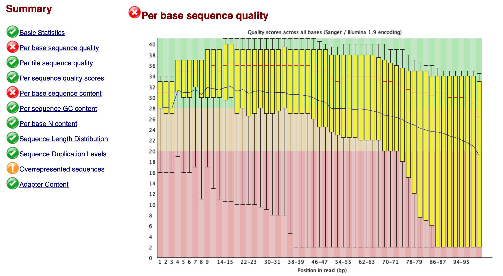
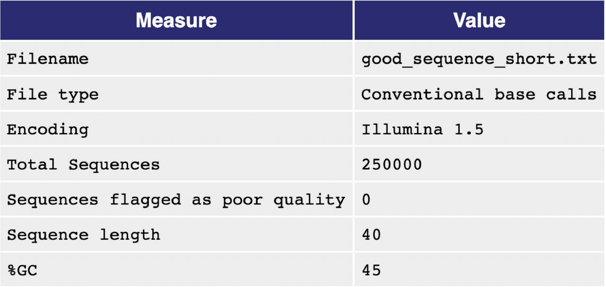
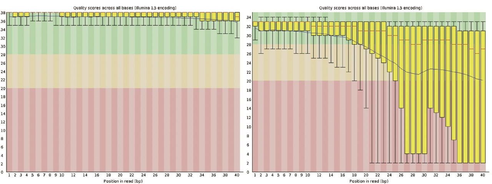

```{r setup, include=FALSE} 
knitr::opts_chunk$set(warning = FALSE, message = FALSE)
rm(list = ls())
```

**Note:** RNA-seq is the platform of choice for expression studies due to its next generation high-throughput sequencing capabilities.

# Experimental design

* Depth of sequencing: it refers to the number of reads that are sequenced. At a higher cost, a higher depth can be obtained which improves statistical power. Note that adding more depth after 10M reads does not greatly increase power.
* Biological replicates: have at least eight samples per treatment arm.
* Do not to confuse pseudo-replicates (different samples from the same individual) and technical replicates with true biological replicates.

# Import data
### Scenario 1
RNA-Seq (named as an abbreviation of RNA sequencing) is a sequencing technique which uses next-generation sequencing (NGS) to reveal the presence and quantity of RNA in a biological sample. It facilitates the ability to look at alternative gene spliced transcripts, post-transcriptional modifications, gene fusion, SNPs and changes in gene expression over time, or differences in gene expression in different groups or treatments.

```{r}
# Import data
library(ShortRead)
seq = readFastq("Data/RNAseq.fastq.gz")

# Check sequence reads
sread(seq)[1:2]

# Check quality scores
quality(seq)[1:2]
```

### Scenario 2
In this scenario, we will focus on comparing the expression levels of genes across 8 samples from the airway package, by counting the number of reads which overlap the exons of genes defined by a known annotation. This analysis sets aside the task of estimating the different kinds of RNA molecules, and the different isoforms for genes with multiple isoforms. The reads in this scenario have already been preprocessed.
```{r}
# Load data
library(airway)
dir <- system.file("extdata", package = "airway", mustWork = TRUE)
csv.file <- file.path(dir, "sample_table.csv")
sample.table <- read.csv(csv.file, row.names = 1)
bam.files <- file.path(dir, paste0(sample.table$Run, "_subset.bam"))
gtf.file <- file.path(dir, "Homo_sapiens.GRCh37.75_subset.gtf")

# Sample table
sample.table
```

### Scenario 3
This scenario contains RNA-seq fragments from a single sample on a single chromosome of the Drosophila genome.
```{r}
library(pasillaBamSubset)
bam.file <- untreated3_chr4()
```

# Quality control (QC)
## Scenario 1
For RNA-seq data, **fastQC** is a popular non-R program for QC.
```{bash}
fastqc --noextract Data/RNAseq.fastq.gz --outdir Output/
```

The output looks like this:



A similar job can be done in R with **ShortRead** package.
```{r}
# QC
seqQC = qa("Data/RNAseq.fastq.gz")

# Save report
report(seqQC, dest = "Output/QCreport")
```

The "quality score per cycle" graph looks like this:



```{bash echo=FALSE}
rm -rf Output/QCreport
```

Notice how quality starts to drop after around 80 bp. In this case we might want to trim the last 10–20. bases.

# Preprocessing
## Scenario 1
Steps required include:

* Filter the data by removing adapters.
* Trim low quality cycles.
* Remove low quality reads.

A good program for Illumina data is **trimmomatic**:
```{bash}
Java -jar /Users/amirvalizadeh/Trimmomatic/dist/jar/trimmomatic-0.40-rc1.jar \
SE -phred33 Data/RNAseq.fastq.gz Output/trimmedRNA.fastq \
ILLUMINACLIP:/Users/amirvalizadeh/Trimmomatic/adapters/TruSeq3-PE.fa:2:30:10 \
LEADING:3 TRAILING:3 SLIDINGWINDOW:4:15 MINLEN:50 HEADCROP:10 CROP:80
```

Notice that:

* **SE** means single end reads, for paired-end data use **PE**.
* **phred** is the quality scoring scheme.
* **ILLUMINACLIP** points to the file with the adapters.
* **LEADING** and **TRAILING** remove bases at the beginning and end of the reads below a score of 3.
* **SLIDINGWINDOW** slides across the sequence and removes those inside a window of length 4 that have an average quality below 15.
* **MINLEN** removes sequences that are shorter than 50 after filtering.
* **HEADCROP** removes the first 10 sequences at the start of the run.
* **CROP** deletes everything after the first 80 bases (recall the quality was not so good after 80 cycles).

Now, let's run QC again:

```{bash}
fastqc --noextract Output/trimmedRNA.fastq --outdir Output/
```

The output looks like this:



```{r}
# QC
seqQC = qa("Output/trimmedRNA.fastq")

# Save report
report(seqQC, dest = "Output/QCreport_2")
```

The "quality score per cycle" graph looks like this now:


Things look better now.

```{bash echo=FALSE}
rm -rf Output/QCreport_2
rm Output/trimmedRNA.fastq
rm Output/trimmedRNA_fastqc.zip
rm Output/trimmedRNA_fastqc.html
```

Now we have to align the data against a reference genome. **bowtie2** is a good software for this. For this purpose, first download the reference genome (index) from [bowtie2 website](http://bowtie-bio.sourceforge.net/bowtie2/index.shtml) or [Illumina website](http://support.illumina.com/sequencing/sequencing_software/igenome.html) and then run the following codes:
```{bash}
# bowtie2-align-s -p 80 -x "reference genome" Output/trimmedRNA.fastq -S alignedRNA
```

The aligned data is in SAM format. The last step is to convert the SAM file into BAM, sort and index it. For this we will use **samtools**:
```{bash}
# samtools import "reference genome" Output/alignedRNA.sam Output/alignedRNA.bam
# samtools sort Output/alignedRNA.bam Output/sortedAlignedRNA.bam
# samtools index Output/sortedAlignedRNA.bam
```

The output should be **sortedAlignedRNA.bam** and the index has the same name with extension **.bai**. Finally, to concatenate data from a sample that is spread across two or more SAM/BAM files, use the **merge** command from samtools.

Now, let's match sequence reads to functional annotations:
```{r}
library(GenomicFeatures)
library(GenomicAlignments)
library(biomaRt)
txdb = makeTxDbFromBiomart(biomart = "ENSEMBL_MART_ENSEMBL",
                           dataset = 'btaurus_gene_ensembl',
                           host = "https://asia.ensembl.org")
txGene = transcriptsBy(txdb, 'gene')

# Read in the preprocessed BAM file
reads = readGAlignments("Data/sortedAlignedRNA.bam")
reads[1]

# Add ranges
reads = GRanges(
  seqnames = seqnames(reads),
  ranges = IRanges(start = start(reads), end = end(reads)),
)
reads[1]
```

## Scenario 2
Let's match sequence reads to functional annotations:
```{r}
# Create an Rsamtools variable which wraps the BAM files.
library(Rsamtools)
bam.list <- BamFileList(bam.files)

# Create a transcript database from the GTF file.
library(GenomicFeatures)
txdb <- makeTxDbFromGFF(gtf.file, format = "gtf")

# Make a GRangesList which contains the exons for each gene.
exons.by.gene <- exonsBy(txdb, by = "gene")

# Take a peak
for (i in 1:3) {
  print(exons.by.gene[[i]][1:3])
}
```

## Scenario 3
Let's match sequence reads to functional annotations:
```{r}
library(Rsamtools)
bf <- BamFile(bam.file)
library(TxDb.Dmelanogaster.UCSC.dm3.ensGene)
txdb_2 <- TxDb.Dmelanogaster.UCSC.dm3.ensGene

# Make a GRangesList which contains the exons for each gene.
ebg <- exonsBy(txdb_2, by = "gene")

# Take a peak
for (i in 1:2) {
  print(ebg[[i]][1])
}
```

We can subset to only the genes on chromosome 4 using the following R command:
```{r}
chr4.idx <- all(seqnames(ebg) == "chr4")
ebg.sub <- ebg[chr4.idx]
```


# Analysis of differential expression (DE)
## Scenario 1
There are two main approaches for RNA-seq analysis:

- Gene or exon counts (edgeR, DESeq, DEXSeq)
- Assemble transcripts (Trinity, Oases, Cufflinks, Scripture)

Now to perform gene expression quantification:
```{r}
# Create a vector with the number of alignments that correspond to
# each of the identifiers (gene ids) in txGene
counts = countOverlaps(txGene, reads)
head(counts)
```

First, let's plot gene counts:
```{r}
plot(
  sort(counts),
  col = "blue",
  pch = 20,
  main = "Sorted RNA-seq counts",
  xlab = "Genes",
  ylab = "Counts",
  cex.main = 0.9
)
```

How many genes are known?
```{r}
length(counts)
```

How many genes are expressed at least once in this sample?
```{r}
length(which(counts > 0))
```

How many transcripts have more than 200 counts?
```{r}
length(which(counts >= 200))
```

How much of the data (in percents) they account for?
```{r}
sum(counts[which(counts >= 200)]) / sum(counts) * 100
```

In our RNA-seq data, we only had one sample. Instead, we will import another data with 20 samples (10 controls × 10treatments) using the same 4492 genes. We also import a second file that matches samples to treatment groups and is useful to build design matrices and contrasts.
```{r}
library(edgeR)
counts = read.table("Data/RNAdat.txt", header = T, sep = "\t")
contrast = read.table("Data/RNAcontrast.txt", header = T, sep = "\t")


# Create a container to assign group classes to the respective samples
DGE = DGEList(counts, group = contrast$contrast)

# Estimate the normalization and dispersion factors
DGE = calcNormFactors(DGE)
DGE = estimateCommonDisp(DGE)
DGE = estimateTagwiseDisp(DGE)
```

Now let's perform a simple contrast between the two groups:
```{r}
difexpEx = exactTest(DGE, pair = c("ctrl", "treat"))
resEx = topTags(difexpEx, n = nrow(DGE))
outEx = resEx$table
```

Let's plot the outcomes:
```{r}
par(mfrow = c(1, 2))
plotMeanVar(DGE, show.tagwise.vars = T, NBline = T)
plotBCV(DGE)
```

To see the significantly differentially expressed features (p < 0.05) after FDR correction:
```{r}
outEx[outEx$FDR<0.05,c(1,2,4)]
```

The data here is quite bad. Notice that the coefficient of variation is quite high at low counts. We can exclude these from the data and rerun the analysis.

A similar result can be obtained by fitting a GLM model instead of exactTest:
```{r}
# Create a design matrix
design = model.matrix( ~ contrast, contrast)

# Estimate design matrix dispersions
DGE2 = estimateGLMTrendedDisp(DGE, design)
DGE2 = estimateGLMTagwiseDisp(DGE2, design)

# Fit model
fit = glmFit(DGE2, design)

# Test contrast (coef) from design matrix
difexpGLM = glmLRT(fit, coef = 2)

# Extract outcomes
res = topTags(difexpGLM, n = nrow(DGE))
outGLM = res$table
outGLM[outGLM$FDR < 0.05, ]
```

## Scenario 2
The following code creates a *SummarizedExperiment* containing the counts for the reads in each BAM file (columns) for each gene in `exons.by.gene` (the rows). We add the `sample.table` as column data. Remember, we know the order is correct, because the `bam.list` was constructed from a column of `sample.table`.

```{r}
# Create a SummarizedExperiment containing the counts for the reads in each
# BAM file (columns) for each gene in `exons.by.gene` (the rows).
library(GenomicAlignments)
se <-
  summarizeOverlaps(
    exons.by.gene,
    bam.list,
    mode = "Union",
    singleEnd = FALSE,
    ignore.strand = TRUE,
    fragments = TRUE
)

# Add the sample.table as column data.
colData(se) <- DataFrame(sample.table)

# Take a peak
assay(se)
```

### Visualizing sample-sample distances
Let's create a plot of count genes on the un-transformed scale:
```{r}
# Load data
library(airway)
data(airway)
airway

# Take a peak
colData(airway)
for (i in c(1, 5, 10)) {
  print(rowRanges(airway)[[i]][1:3])
}
head(assay(airway))
```

```{r}
# Create a plot of count genes on the un-transformed scale
library(rafalib)
mypar()
plot(assay(airway)[, 1:2], cex = .1)
```

Note that, on the un-transformed scale, the high count genes have high variance. We will explore different scaling and transformations options below.

### Normalization for sequencing depth
First, we need to convert the *SummarizedExperiment* object to a *DESeqDataSet* object. We need to specify an experimental *design* here. The design starts with the tilde symbol `~`, which means, model the counts using the following variables: compare levels of `dex` while controlling for the `cell` differences.
```{r}
library(DESeq2)
dds <- DESeqDataSet(airway, design = ~ cell + dex)
```

Now, estimates size factors to account for differences in sequencing depth. Size factors are calculated by the median ratio of samples to a pseudo-sample (the geometric mean of all samples):
```{r}
dds <- estimateSizeFactors(dds)
```

Now, make a matrix of log normalized counts:
```{r}
log.norm <- normTransform(dds)
```

Compare the log normalized counts vs gene counts on the un-transformed scale:
```{r}
mypar(2, 1)
plot(assay(airway)[, 1:2], cex = .1)
plot(assay(log.norm)[, 1:2], cex = .1)
```

### Stabilizing count variance
Now we will use a more sophisticated transformation. It uses the variance model for count data to shrink together the log-transformed counts for genes with very low counts.
```{r}
rld <- rlog(dds)

# Compare with the previous counts
mypar(3, 1)
plot(assay(airway)[, 1:2], cex = .1)
plot(assay(log.norm)[, 1:2], cex = .1)
plot(assay(rld)[, 1:2], cex = .1)
```

## Scenario 3
```{r}
# Create a SummarizedExperiment containing the counts for the reads in each
# BAM file (columns) for each gene in `exons.by.gene` (the rows).
library(GenomicAlignments)
se_2 <-
  summarizeOverlaps(
    ebg.sub,
    bam.file,
    mode = "Union",
    singleEnd = FALSE,
    ignore.strand = TRUE,
    fragments = FALSE
)

# Take a peak
assay(se_2)[1:4, 1]
```

How many fragments overlap the first gene, *FBgn0002521*?
```{r}
assay(se_2)[1:2, 1]
```

Finally, let's delete extra files:
```{bash}
rm Output/RNAseq_fastqc.html Output/RNAseq_fastqc.zip
```
