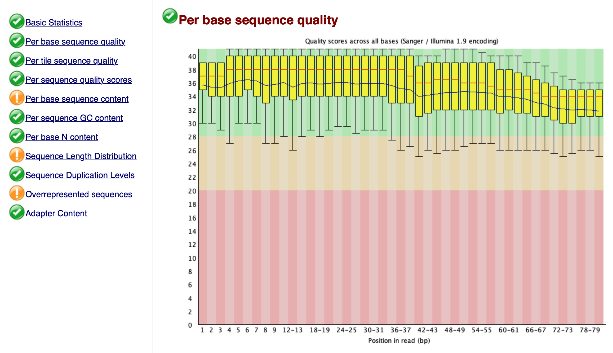
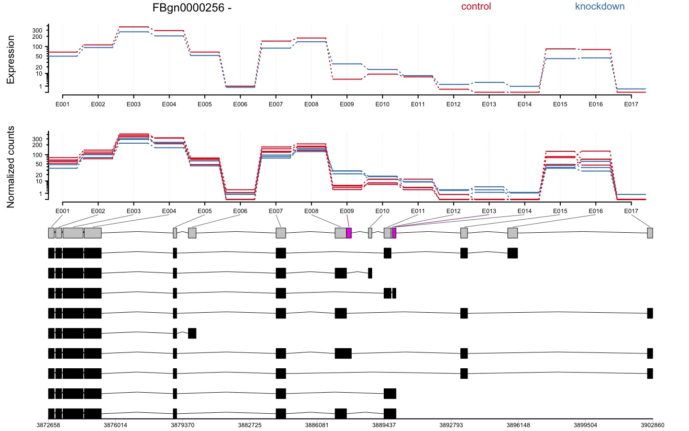

```{r setup, include=FALSE} 
knitr::opts_chunk$set(warning = FALSE, message = FALSE)
rm(list = ls())
```

\newpage

RNA-Seq (named as an abbreviation of RNA sequencing) is a sequencing technique which uses next-generation sequencing (NGS) to reveal the presence and quantity of RNA in a biological sample. It facilitates the ability to look at alternative gene spliced transcripts, post-transcriptional modifications, gene fusion, SNPs and changes in gene expression over time, or differences in gene expression in different groups or treatments.

# Experimental design

* Depth of sequencing: it refers to the number of reads that are sequenced. At a higher cost, a higher depth can be obtained which improves statistical power. Note that adding more depth after 10M reads does not greatly increase power.
* Biological replicates: have at least eight samples per treatment arm.
* Do not to confuse pseudo-replicates (different samples from the same individual) and technical replicates with true biological replicates.

# Scenarios

**S1:** It is just one sample.

**S2:** In this scenario, we will focus on comparing the expression levels of genes across 8 samples from the airway package, by counting the number of reads which overlap the exons of genes defined by a known annotation. This analysis sets aside the task of estimating the different kinds of RNA molecules, and the different isoforms for genes with multiple isoforms. The reads in this scenario have already been preprocessed.

**S3:** This scenario contains RNA-seq fragments from a single sample on a single chromosome of the Drosophila genome.

**S4:** This is an analysis of 22 RNA-seq samples of different human tissues.

**S5**: This data has 20 samples (10 controls × 10treatments) from 4492 genes. We also import a second file that matches samples to treatment groups and is useful to build design matrices and contrasts.

# Import data

```{r}
# S1
library(ShortRead)
seq = readFastq("Data/RNAseq.fastq.gz")

# Check sequence reads
sread(seq)[1:2]

# Check quality scores
quality(seq)[1:2]
```

```{r}
# S2
library(airway)
dir <- system.file("extdata", package = "airway", mustWork = TRUE)
csv.file <- file.path(dir, "sample_table.csv")
sample.table <- read.csv(csv.file, row.names = 1)
bam.files <- file.path(dir, paste0(sample.table$Run, "_subset.bam"))
gtf.file <- file.path(dir, "Homo_sapiens.GRCh37.75_subset.gtf")

# Sample table
sample.table[, c(2, 3, 6)]
```

```{r}
# S3
library(pasillaBamSubset)
bam.file <- untreated3_chr4()
```

```{r}
# S4
load("Data/wang_eset.RData")

# Take a peak
## sampleNames: SRX003935 SRX003921 ...
## featureNames: ENSG00000000003 ENSG00000000005 ...
exprs(wang.eset)[1:5, 1:3]
```

```{r}
# S5
library(edgeR)
counts = read.table("Data/RNAdat.txt", header = T, sep = "\t")
contrast = read.table("Data/RNAcontrast.txt", header = T, sep = "\t")


# Create a container to assign group classes to the respective samples
DGE = DGEList(counts, group = contrast$contrast)
```

# Quality control (QC)
Check **FastQC** tutorials.

# Preprocessing
## Filter reads
**S1**
<br>

Steps required include:

* Filter the data by removing adapters.
* Trim low quality cycles.
* Remove low quality reads.

A good program for Illumina data is **trimmomatic**:
```{bash}
Java -jar /Users/amirvalizadeh/Trimmomatic/dist/jar/trimmomatic-0.40-rc1.jar \
SE -phred33 Data/RNAseq.fastq.gz Output/trimmedRNA.fastq \
ILLUMINACLIP:/Users/amirvalizadeh/Trimmomatic/adapters/TruSeq3-PE.fa:2:30:10 \
LEADING:3 TRAILING:3 SLIDINGWINDOW:4:15 MINLEN:50 HEADCROP:10 CROP:80
```

Notice that:

* *SE* means single end reads, for paired-end data use *PE*.
* *phred* is the quality scoring scheme.
* *ILLUMINACLIP* points to the file with the adapters.
* *LEADING* and *TRAILING* remove bases at the beginning and end of the reads below a score of 3.
* *SLIDINGWINDOW* slides across the sequence and removes those inside a window of length 4 that have an average quality below 15.
* *MINLEN* removes sequences that are shorter than 50 after filtering.
* *HEADCROP* removes the first 10 sequences at the start of the run.
* *CROP* deletes everything after the first 80 bases (recall the quality was not so good after 80 cycles).

Now, let's run QC again:

```{bash}
fastqc --noextract Output/trimmedRNA.fastq --quiet --outdir Output/
```

The output looks like this:
```{r, echo=FALSE, fig.align='center', fig.pos='H', fig.show='hold', out.width = '100%'}

```

```{r}
# QC
seqQC = qa("Output/trimmedRNA.fastq")

# Save report
report(seqQC, dest = "Output/QCreport_2")
```

The "quality score per cycle" graph looks like this now:

```{r, echo=FALSE, fig.align='center', fig.pos='H', fig.show='hold', out.width = '60%'}

```

Things look better now.

```{bash echo=FALSE}
rm -rf Output/QCreport_2
rm Output/trimmedRNA.fastq
rm Output/trimmedRNA_fastqc.zip
rm Output/trimmedRNA_fastqc.html
```

## Align against reference genome
**S1**
<br>

Now we have to align the data against a reference genome. **bowtie2** is a good software for this. For this purpose, first download the reference genome (index) from [bowtie2 website](http://bowtie-bio.sourceforge.net/bowtie2/index.shtml) or [Illumina website](http://support.illumina.com/sequencing/sequencing_software/igenome.html) and then run the following codes:
```{bash, eval=FALSE}
bowtie2-align-s -p 80 -x "reference genome" Output/trimmedRNA.fastq -S alignedRNA
```

The aligned data is in SAM format. The last step is to convert the SAM file into BAM, sort and index it. For this we will use **samtools**:
```{bash, eval=FALSE}
samtools import "reference genome" Output/alignedRNA.sam Output/alignedRNA.bam
samtools sort Output/alignedRNA.bam Output/sortedAlignedRNA.bam
samtools index Output/sortedAlignedRNA.bam
```

The output should be **sortedAlignedRNA.bam** and the index has the same name with extension **.bai**. Finally, to concatenate data from a sample that is spread across two or more SAM/BAM files, use the **merge** command from *samtools*.

## Match sequence reads to functional annotations
**S1**
<br>

```{r}
library(GenomicFeatures)
library(GenomicAlignments)
library(biomaRt)
library(TxDb.Btaurus.UCSC.bosTau9.refGene)

txdb = TxDb.Btaurus.UCSC.bosTau9.refGene
txGene = transcriptsBy(txdb, 'gene')

# Read in the preprocessed BAM file
reads = readGAlignments("Data/sortedAlignedRNA.bam")
reads[1]

# Add ranges
reads = GRanges(
  seqnames = seqnames(reads),
  ranges = IRanges(start = start(reads), end = end(reads)),
)
reads[1]
```

<br>
**S2**
<br>

```{r}
# Create an Rsamtools variable which wraps the BAM files.
library(Rsamtools)
bam.list <- BamFileList(bam.files)

# Create a transcript database from the GTF file.
library(GenomicFeatures)
txdb <- makeTxDbFromGFF(gtf.file, format = "gtf")

# Make a GRangesList which contains the exons for each gene.
exons.by.gene <- exonsBy(txdb, by = "gene")

# Take a peak
for (i in 1:3) {
  print(exons.by.gene[[i]][1:3])
}
```

<br>
**S3**
<br>

```{r}
library(Rsamtools)
bf <- BamFile(bam.file)
library(TxDb.Dmelanogaster.UCSC.dm3.ensGene)
txdb_2 <- TxDb.Dmelanogaster.UCSC.dm3.ensGene

# Make a GRangesList which contains the exons for each gene.
ebg <- exonsBy(txdb_2, by = "gene")

# Take a peak
for (i in 1:2) {
  print(ebg[[i]][1])
}
```

We can subset to only the genes on chromosome 4 using the following R command:
```{r}
# S3
chr4.idx <- all(seqnames(ebg) == "chr4")
ebg.sub <- ebg[chr4.idx]
```

## Create count matrix
**S1**
<br>

```{r}
# Create a vector with the number of alignments that correspond to
# each of the gene ids in txGene
counts = countOverlaps(txGene, reads)

# Take a peak
counts[1:4]
```

How many genes are known?
```{r}
length(counts)
```

How many genes are expressed at least once in this sample?
```{r}
length(which(counts > 0))
```

How many transcripts have more than 200 counts?
```{r}
length(which(counts >= 200))
```

How much of the data (in percents) they account for?
```{r}
sum(counts[which(counts >= 200)]) / sum(counts) * 100
```

<br>
**S2**
<br>

The following code creates a *SummarizedExperiment* containing the counts for the reads in each BAM file (columns) for each gene in `exons.by.gene` (the rows). We add the `sample.table` as column data. Remember, we know the order is correct, because the `bam.list` was constructed from a column of `sample.table`.

```{r}
# Create a SummarizedExperiment containing the counts for the reads in each
# BAM file (columns) for each gene in `exons.by.gene` (the rows).
library(GenomicAlignments)
se <-
  summarizeOverlaps(
    exons.by.gene,
    bam.list,
    mode = "Union",
    singleEnd = FALSE,
    ignore.strand = TRUE,
    fragments = TRUE
)

# Add the sample.table as column data.
colData(se) <- DataFrame(sample.table)

# Take a peak
assay(se)[1:4, 1:3]
```

<br>
**S3**
<br>

```{r}
# Create a SummarizedExperiment containing the counts for the reads in each
# BAM file (columns) for each gene in `exons.by.gene` (the rows).
library(GenomicAlignments)
se_2 <-
  summarizeOverlaps(
    ebg.sub,
    bam.file,
    mode = "Union",
    singleEnd = FALSE,
    ignore.strand = TRUE,
    fragments = FALSE
)

# Take a peak
assay(se_2)[1:4, 1]
```

How many fragments overlap the first gene, *FBgn0002521*?
```{r}
assay(se_2)[1:2, 1]
```

<br>
**S4**
<br>

Let's take a subset of the count matrix and the column data:
```{r}
count.matrix_4 <- exprs(wang.eset)[, 10:21]
col.data_4 <- pData(wang.eset)[10:21, ]
```

## Visualizing sample-sample distances
**S2**
<br>

Let's create a plot of count genes on the un-transformed scale:
```{r}
# Load data
library(airway)
data(airway)
airway

# Take a peak
colData(airway)[, 1:3]
for (i in c(1, 5, 10)) {
  print(rowRanges(airway)[[i]][1:3])
}
assay(airway)[1:4, 1:3]
```

```{r}
# Create a plot of count genes on the un-transformed scale
library(rafalib)
mypar()
plot(assay(airway)[, 1:2], cex = .1)
```

Note that, on the un-transformed scale, the high count genes have high variance. We will explore different scaling and transformations options below.

## Normalization for sequencing depth
**S2**
<br>

*Remember: * Sequencing depth refers to the number of reads that are sequenced. At a higher cost, a higher depth can be obtained which improves statistical power. Note that adding more depth after 10M reads does not greatly increase power.

Let's check for sequencing depth variability:
```{r}
# Get the number of paired-end reads which align to the genes for each sample
SeqDep = colSums(assay(airway))

# Sort it and divide it by 1 million
sort(SeqDep) / 1e6
```

The wide range is indicative of sequencing depth variability. Now to account for this variability, first, we need to convert the *SummarizedExperiment* object to a *DESeqDataSet* object. We need to specify an experimental *design* here. The design starts with the tilde symbol `~`, which means, model the counts using the following variables: compare levels of `dex` while controlling for the `cell` differences.
```{r}
library(DESeq2)
dds <- DESeqDataSet(airway, design = ~ cell + dex)
```

Now, estimate size factors to account for differences in sequencing depth. Size factors are calculated by the median ratio of samples to a pseudo-sample (the geometric mean of all samples):
```{r}
dds <- estimateSizeFactors(dds)
plot(sizeFactors(dds), colSums(counts(dds)))
abline(lm(colSums(counts(dds)) ~ sizeFactors(dds) + 0))
```

Now, make a matrix of log normalized counts:
```{r}
log.norm.counts <- log2(counts(dds, normalized = TRUE) + 1)

# Another way to make this matrix
log.norm <- normTransform(dds)
```

Let's examine the difference between the log counts and the log normalized counts:
```{r}
rs <- rowSums(counts(dds))
mypar(1,2)

# Log counts
boxplot(log2(counts(dds)[rs > 0, ] + 1))

# Log normalized counts
boxplot(log.norm.counts[rs > 0, ])
```

Compare the log normalized counts vs gene counts on the un-transformed scale:
```{r, echo=FALSE, fig.align='center', fig.pos='H', fig.show='hold', out.width = '75%'}
mypar(2, 1)
plot(assay(airway)[, 1:2], cex = .1)
plot(assay(log.norm)[, 1:2], cex = .1)
```

<br>
**S4**
<br>

Now to account for sequence depth variability, first, we need to convert the *SummarizedExperiment* object to a *DESeqDataSet* object.
```{r}
dds_4 <- DESeqDataSetFromMatrix(count.matrix_4,
                                col.data_4,
                                design = ~ cell.type)
```

Now, estimate size factors to account for differences in sequencing depth:
```{r}
dds_4 <- estimateSizeFactors(dds_4)
```

What tissue has the highest size factor?
```{r}
dds_4$cell.type[which.max(sizeFactors(dds_4))]
```

<br>
**S5**
<br>

Estimate the normalization and dispersion factors:
```{r}
DGE = calcNormFactors(DGE)
DGE = estimateCommonDisp(DGE)
DGE = estimateTagwiseDisp(DGE)
```

## Stabilizing count variance
**S2**
<br>

Now we will use a more sophisticated transformation. It uses the variance model for count data to shrink together the log-transformed counts for genes with very low counts.
```{r, echo=FALSE, fig.align='center', fig.pos='H', fig.show='hold', out.width = '75%'}
rld <- rlog(dds)

# Compare with the previous counts
mypar(3, 1)
plot(assay(airway)[, 1:2], cex = .1)
plot(assay(log.norm)[, 1:2], cex = .1)
plot(assay(rld)[, 1:2], cex = .1)
```

Let's examine the difference between log normalized counts and rlog transformations:
```{r, echo=FALSE, fig.align='center', fig.pos='H', fig.show='hold', out.width = '60%'}
library(vsn)

# Log norm counts
meanSdPlot(log.norm.counts, ranks = FALSE, ylim = c(0, 3), main = "log norm")

# rlog
meanSdPlot(assay(rld), ranks = FALSE, ylim = c(0, 3), main = "rlog")
```

The principal components (PCA) plot is a useful diagnostic for examining relationships between samples:
```{r, echo=FALSE, fig.align='center', fig.pos='H', fig.show='hold', out.width = '70%'}
mypar()
rv <- apply(log.norm.counts, 1, var)
topgenes <- head(order(rv, decreasing = TRUE), 500)
pc <- prcomp(t(log.norm.counts[topgenes, ]))
plot(pc$x[, 1],
     pc$x[, 2],
     # Color the points by intervention group
     col = colData(dds)$dex,
     # Give a symbol to each point based on the cell type
     pch = as.integer(colData(dds)$cell))
```

<br>
**S4**
<br>

To stabilize count variance:
```{r, echo=FALSE, fig.align='center', fig.pos='H', fig.show='hold', out.width = '70%'}
rld_4 <- rlog(dds_4)

## OR

vsd <- varianceStabilizingTransformation(dds_4, blind = FALSE)
plot(assay(vsd)[, 1:2], cex = .1)
```

The principal components (PCA) plot:
```{r, echo=FALSE, fig.align='center', fig.pos='H', fig.show='hold', out.width = '70%'}
mypar()
plotPCA(vsd, intgroup = "cell.type")
```

Make a scatterplot matrix of some of the samples' transformed counts:
```{r}
# Row mean of rlog-transformed data
rmeans <- rowMeans(assay(vsd))

# Pick some samples for visualization
idx <- c(1, 2, 10, 7, 8, 9, 12)

# Pull out a small matrix of rlog-transformed counts
mat <- assay(vsd)[rmeans > 1, idx]

# Name the columns of matrix by cell type
colnames(mat) <- vsd$cell.type[idx]
```

Make a fast, subsetted scatter plot on top and add Pearson correlations below:
```{r}
panel.sub <-
  function(x, y, ...)
    points(cbind(x, y)[sample(length(x), 1000), ], ...)
panel.cor <-
  function(x,
           y,
           digits = 2,
           prefix = "",
           cex.cor,
           ...)  {
    usr <- par("usr")
    on.exit(par(usr))
    par(usr = c(0, 1, 0, 1))
    r <- abs(cor(x, y))
    txt <- format(c(r, 0.123456789), digits = digits)[1]
    txt <- paste0(prefix, txt)
    if (missing(cex.cor)) {
      cex.cor <- 0.8 / strwidth(txt)
    }
    text(0.5, 0.5, txt, cex = cex.cor * r)
  }
pairs(
  mat,
  asp = 1,
  col = rgb(0, 0, 0, .3),
  lower.panel = panel.cor,
  upper.panel = panel.sub
)
```

# Analysis of differential expression (DE)
There are some approaches for RNA-seq analysis:

- DE at gene level: edgeR and DESeq
- DE at exon level: DEXSeq
- DE at isoform level: Cufflinks

Now let's perform gene expression quantification.

## Scenario 2
We begin by modeling raw counts. Note that it is better to model raw counts rather than modeling normalized counts as we will know the distribution. We will use negative binomial distribution in here. Remeber our DESeqDataSet:
```{r}
# Design of DESeqDataSet
design(dds)

# Column data
colData(dds)[1:4, 1:4]
```

As we want to look at the fold change of treated vs. untreated, we should re-level the data:
```{r}
# Current levels
levels(dds$dex)

# Re-level
dds$dex <- relevel(dds$dex, "untrt")
```

Run DESeq model:
```{r}
dds <- DESeq(dds)

# Save results
res_2 <- results(dds)

# Show results
head(res_2)
```

How many genes were significant at p < 0.1 after correction for FDR?
```{r}
table(res_2$padj < 0.1)
```

Let's visualize results using MA plot:
```{r, echo=FALSE, fig.align='center', fig.pos='H', fig.show='hold', out.width = '75%'}
DESeq2::plotMA(res_2, ylim = c(-5, 5), colSig = "red")
```

The grey values are those with an adjusted p-value of > 0.1 and red values are those with an adjusted p-value of < 0.1.

```{r, echo=FALSE, fig.align='center', fig.pos='H', fig.show='hold', out.width = '75%'}
# Create the same MA plot for LFC of 1
res.thr <- results(dds, lfcThreshold = 1)
DESeq2::plotMA(res.thr, ylim = c(-5, 5), colSig = "red")
```

Let's perform surrogate variable analysis (SVA) to account for hidden batches or other structural differences in the data set:
```{r}
library(sva)
idx <- rowMeans(counts(dds, normalized = TRUE)) > 1
dat <- counts(dds, normalized = TRUE)[idx, ]
mod <- model.matrix( ~ dex, colData(dds))
mod0 <- model.matrix(~ 1, colData(dds))
svseq <- svaseq(dat, mod, mod0, n.sv = 2)
```

Plot surrogate variables:
```{r, echo=FALSE, fig.align='center', fig.pos='H', fig.show='hold', out.width = '75%'}
plot(svseq$sv[, 1], svseq$sv[, 2], col = dds$cell, pch = 16)
```

We colored the points based on cell type which we know is a real surrogate variable. As you can see, this difference was really captured by the SVA plot.

Now, to use these surrogate variables in a **DESeq** call:
```{r}
dds.sva <- dds
dds.sva$SV1 <- svseq$sv[, 1]
dds.sva$SV2 <- svseq$sv[, 2]
design(dds.sva) <- ~ SV1 + SV1 + dex
dds.sva <- DESeq(dds.sva)

```

How many genes were significant at p < 0.1 after correction for FDR?
```{r}
res.sva_2 <- results(dds.sva)
table(res.sva_2$padj < 0.1)
```

Let's visualize results using MA plot:
```{r}
mypar(2, 1)
DESeq2::plotMA(res_2, ylim = c(-5, 5), colSig = "red", main = "Before SVA")
DESeq2::plotMA(res.sva_2, ylim = c(-5, 5), colSig = "red", main = "After SVA")
```

## Scenario 4
In here, we will perform a gene-level DE analysis of brain tissue samples against all other samples. Now we make a new factor column in the colData of dds, which we set to "brain" for cerebellum and mixed brain samples, and "other" for all other samples. We will set "other" as the reference level (the denominator for the fold changes).
```{r}
dds_4$type <-
  factor(ifelse(
    dds_4$cell.type %in% c("cerebellum", "mixed.brain"),
    "brain",
    "other"
  ))
dds_4$type <- relevel(dds_4$type, "other")
```

Now reset the design of the DESeqDataSet:
```{r}
design(dds_4) <- ~ type
```

Run DESeq model:
```{r}
dds_4 <- DESeq(dds_4)

# Save results
res_4 <- results(dds_4)
```

Let's visualize results using MA plot:
```{r, echo=FALSE, fig.align='center', fig.pos='H', fig.show='hold', out.width = '75%'}
DESeq2::plotMA(res_4, ylim = c(-10, 10), colSig = "red")
```

Which gene has the lowest adjusted p-value?
```{r}
which(res_4$padj == min(res_4$padj, na.rm = T), )
```

Make a plot of the normalized counts for that gene:
```{r, echo=FALSE, fig.align='center', fig.pos='H', fig.show='hold', out.width = '75%'}
plotCounts(dds_4, which(res_4$padj == min(res_4$padj, na.rm = T),), intgroup = "type")
```

Make normalized counts plots for the top 9 genes:
```{r}
par(mfrow = c(3, 3))
for (i in 1:9) {
  plotCounts(dds_4, order(res_4$padj)[i], intgroup = "type")
}
```

Create the same MA plot for LFC of 2:
```{r, echo=FALSE, fig.align='center', fig.pos='H', fig.show='hold', out.width = '75%'}
res_4.thr <- results(dds_4, lfcThreshold = 2)
DESeq2::plotMA(res_4.thr, ylim = c(-10, 10), colSig = "red")
```

Now, how many genes with adjusted p-value less than 0.1 have a positive LFC?
```{r}
summary(res_4.thr)
```

Build a vector of the names of the top 20 genes by the test statistic (largest first).
```{r}
top <- rownames(res_4)[head(order(res_4$stat, decreasing = TRUE), 20)]
```

Use org.Hs.eg.db to determine the gene symbol of the top gene in this list:
```{r}
library(AnnotationDbi)
library(org.Hs.eg.db)

mapIds(org.Hs.eg.db,
       keys = "ENSG00000143858",
       column = "SYMBOL",
       keytype = "ENSEMBL")
```

What is the GENENAME of the top gene?
```{r}
mapIds(org.Hs.eg.db,
       keys = "ENSG00000143858",
       column = "GENENAME",
       keytype = "ENSEMBL")
```

Now, let's create a pheatmap:
```{r}
res_4Sort <- res_4[order(res_4$padj), ]
library(pheatmap)
topgenes_4 <- head(rownames(res_4Sort), 20)
mat_4 <- assay(rld_4)[topgenes_4, ]
mat_4 <- mat_4 - rowMeans(mat_4)
df <- as.data.frame(colData(dds_4)[, c("type", "cell.type")])
pheatmap(mat_4, annotation_col = df)
```

Let's perform SVA:
```{r}
library(sva)
idx_4 <- rowMeans(counts(dds_4, normalized = TRUE)) > 1
dat_4 <- counts(dds_4, normalized = TRUE)[idx_4, ]
mod_4 <- model.matrix( ~ type, colData(dds_4))
mod0_4 <- model.matrix(~ 1, colData(dds_4))
svseq_4 <- svaseq(dat_4, mod_4, mod0_4, n.sv = 2)
```

Plot surrogate variables:
```{r, echo=FALSE, fig.align='center', fig.pos='H', fig.show='hold', out.width = '75%'}
plot(svseq_4$sv[, 1], svseq_4$sv[, 2], col = dds_4$cell.type, pch = 16)
```

## Scenario 5
Now let's perform a simple contrast between the two groups:
```{r}
difexpEx = exactTest(DGE, pair = c("ctrl", "treat"))
resEx = topTags(difexpEx, n = nrow(DGE))
outEx = resEx$table
```

Let's plot the outcomes:
```{r}
par(mfrow = c(1, 2))
plotMeanVar(DGE, show.tagwise.vars = T, NBline = T)
plotBCV(DGE)
```

To see the significantly differentially expressed features (p < 0.05) after FDR correction:
```{r}
outEx[outEx$FDR < 0.05, c(1, 2, 4)][1:5, ]
```

The data here is quite bad. Notice that the coefficient of variation is quite high at low counts. We can exclude these from the data and rerun the analysis.

A similar result can be obtained by fitting a GLM model instead of exactTest:
```{r}
# Create a design matrix
design = model.matrix( ~ contrast, contrast)

# Estimate design matrix dispersions
DGE2 = estimateGLMTrendedDisp(DGE, design)
DGE2 = estimateGLMTagwiseDisp(DGE2, design)

# Fit model
fit = glmFit(DGE2, design)

# Test contrast (coef) from design matrix
difexpGLM = glmLRT(fit, coef = 2)

# Extract outcomes
res = topTags(difexpGLM, n = nrow(DGE))
outGLM = res$table
outGLM[outGLM$FDR < 0.05, ][1:5, ]
```

## Exon count (Differential exon usage; DEU)
The **DEXSeq** package offers differential testing of exon usage within each gene. Here we will explore the R code used in a *DEXSeq* analysis. We omit the python calls for preparing the annotation and count tables, but these can be found in the vignette.

```
python dexseq_prepare_annotation.py gtffile.gtf dexseq.gff
python dexseq_count.py dexseq.gff sample1.sam sample1.txt
```

Once we have repeated the `dexseq_count` script for each sample, we can read the data into R. As we are working with pre-prepared data, we first point to these files which live within the *pasilla* package.
```{r}
library("pasilla")
inDir = system.file("extdata", package = "pasilla", mustWork = TRUE)
countFiles = list.files(inDir, pattern = "fb.txt$", full.names = TRUE)
flattenedFile = list.files(inDir, pattern = "gff$", full.names = TRUE)
genesForSubset = read.table(file.path(inDir, "geneIDsinsubset.txt"),
                            stringsAsFactors = FALSE)[[1]]
```

As in *DESeq* we use a `sampleTable` to define the samples:
```{r}
sampleTable = data.frame(
  row.names = c(
    "treated1",
    "treated2",
    "treated3",
    "untreated1",
    "untreated2",
    "untreated3",
    "untreated4"
  ),
  condition = c(
    "knockdown",
    "knockdown",
    "knockdown",
    "control",
    "control",
    "control",
    "control"
  ),
  libType = c(
    "single-end",
    "paired-end",
    "paired-end",
    "single-end",
    "single-end",
    "paired-end",
    "paired-end"
  )
)
sampleTable
```

We now read the data into a `DEXSeqDataSet` object:
```{r}
library("DEXSeq")
dxd = DEXSeqDataSetFromHTSeq(
  countFiles,
  sampleData = sampleTable,
  design = ~ sample + exon + condition:exon,
  flattenedfile = flattenedFile
)
```

Subset the genes, for demonstration purposes:
```{r}
dxd = dxd[geneIDs(dxd) %in% genesForSubset, ]
```

Now we run the estimation and testing functions:
```{r}
dxd = estimateSizeFactors(dxd)
dxd = estimateDispersions(dxd)
dxd = testForDEU(dxd)
dxd = estimateExonFoldChanges(dxd, fitExpToVar = "condition")
```

The following code extracts a results table, makes an MA-plot, and draws the expression levels over the exons to highlight differential exon usage:
```{r, echo=FALSE, fig.align='center', fig.pos='H', fig.show='hold', out.width = '75%'}
dxr = DEXSeqResults(dxd)
plotMA(dxr, cex = 0.8)
plotDEXSeq(
  dxr,
  "FBgn0010909",
  legend = TRUE,
  cex.axis = 1.2,
  cex = 1.3,
  lwd = 2
)
```

Again, drawing the expression levels, now showing the annotated transcripts below:
```{r, echo=FALSE, fig.align='center', fig.pos='H', fig.show='hold', out.width = '75%'}
plotDEXSeq(
  dxr,
  "FBgn0010909",
  displayTranscripts = TRUE,
  legend = TRUE,
  cex.axis = 1.2,
  cex = 1.3,
  lwd = 2
)
```

Now we will subset to 1000 genes on chr2L which do not have low counts:
```{r}
library("DEXSeq")
dxd = DEXSeqDataSetFromHTSeq(
  countFiles,
  sampleData = sampleTable,
  design = ~ sample + exon + condition:exon,
  flattenedfile = flattenedFile
)
rmean <- rowMeans(counts(dxd))
dxd2L <- dxd[seqnames(rowRanges(dxd)) == "chr2L" & rmean > 10, ]
dxd2L <- dxd2L[1:1000, ]
```

Now we run the estimation and testing functions:
```{r}
dxd2L = estimateSizeFactors(dxd2L)
dxd2L = estimateDispersions(dxd2L)
dxd2L = testForDEU(dxd2L)
dxd2L = estimateExonFoldChanges(dxd2L, fitExpToVar = "condition")
dxr2L = DEXSeqResults(dxd2L)
```

What is the name of the gene containing the exon with the smallest adjusted p-value for DEU?
```{r}
dxr2L[which(dxr2L$padj == min(dxr2L$padj, na.rm = T), ), ]$groupID
```

Let's make a plot for this gene:
```{r}
#plotDEXSeq(
  #dxr2L,
  #"FBgn0000256",
  #legend = TRUE,
  #cex.axis = 1.2,
  #cex = 1.3,
  #lwd = 2,
  #norCounts = TRUE,
  #displayTranscripts = TRUE
#)
```


```{r, echo=FALSE, fig.align='center', fig.pos='H', fig.show='hold', out.width = '100%'}

```

How many transcripts does exonic part E009 appear in?
**Answer:** 1

How many transcripts contain exonic part E008 but not exonic part E009?
**Answer:** 3

## Differential isoform expression
In this example, we are not going to use Cufflinks, but instead, we will take a look at its output:
```{r}
library(cummeRbund)
myDir <- system.file("extdata", package = "cummeRbund")
gtfFile <-
  system.file("extdata/chr1_snippet.gtf", package = "cummeRbund")
```

Read in the prepared Cufflinks files from the directory:
```{r}
cuff <-
  readCufflinks(
    dir = myDir,
    gtfFile = gtfFile,
    genome = "hg19",
    rebuild = TRUE,
    verbose = FALSE
  )
```

Boxplots of expression (FPKM) at the gene and isoform level:
```{r, echo=FALSE, fig.align='center', fig.pos='H', fig.show='hold', out.width = '75%'}
csBoxplot(genes(cuff))
csBoxplot(genes(cuff), replicates = TRUE)
csBoxplot(isoforms(cuff), replicates = TRUE)
```

Scatterplot matrix of gene and isoform level expression:
```{r, echo=FALSE, fig.align='center', fig.pos='H', fig.show='hold', out.width = '80%'}
csScatterMatrix(genes(cuff))
csScatterMatrix(isoforms(cuff))
```

Sample dendrograms using Jensen-Shannon distances:
```{r, echo=FALSE, fig.align='center', fig.pos='H', fig.show='hold', out.width = '70%'}
csDendro(genes(cuff), replicates = TRUE)
csDendro(isoforms(cuff), replicates = TRUE)
```

MA-plot comparing two conditions:
```{r, echo=FALSE, fig.align='center', fig.pos='H', fig.show='hold', out.width = '70%'}
MAplot(genes(cuff), "hESC", "Fibroblasts")
MAplot(isoforms(cuff), "hESC", "Fibroblasts")
```

A "volcano plot" matrix. Each volcano plot is the -log10(p-value) over the log fold change:
```{r}
csVolcanoMatrix(genes(cuff))
csVolcanoMatrix(isoforms(cuff))
```

Extract the annotation information with the annotation() function. This gives exon-level information. We just want to know the gene which each isoform belongs to, so we can remove duplicate rows belonging to the same isoform:
```{r}
gene.features <- annotation(genes(cuff))
head(gene.features)
isoforms.per.gene <-
  gene.features[!duplicated(gene.features$isoform_id), c("gene_id", "isoform_id")]
isoforms.per.gene <-
  isoforms.per.gene[order(isoforms.per.gene$isoform_id), ]
head(isoforms.per.gene)
```

A single call to table() gives us a vector, one value for each gene, and the number of isoforms per gene:
```{r}
gene.tab <- table(isoforms.per.gene$gene_id)
table(gene.tab)
```

The fpkm() function returns a data.frame of the FPKM estimates for each isoform and sample:
```{r}
isoform.fpkm <- fpkm(isoforms(cuff))
head(isoform.fpkm)[1:4, 1:4]
table(isoform.fpkm$sample_name)
```

Extract out tables for the iPS and hESC samples:
```{r}
ips <- isoform.fpkm[isoform.fpkm$sample_name == "iPS", ]
hesc <- isoform.fpkm[isoform.fpkm$sample_name == "hESC", ]
```

Now check that the isoform_id from our FPKM tables and our isoforms-per-gene table are identical:
```{r}
stopifnot(all(ips$isoform_id == isoforms.per.gene$isoform_id))
stopifnot(all(hesc$isoform_id == isoforms.per.gene$isoform_id))
```

Identify, for each sample, the index of the isoform with the largest FPKM:
```{r}
ips.max <-
  sapply(split(ips$fpkm, isoforms.per.gene$gene_id), which.max)
head(ips.max)

hesc.max <-
  sapply(split(hesc$fpkm, isoforms.per.gene$gene_id), which.max)
head(hesc.max)
```

Across all genes in our tables, how often is the highest expressed isoform the same one in iPS and hESC cells?
```{r}
mean(ips.max == hesc.max)
```

Subsetting to only the genes that have more than one isoform, how often is the highest expressed isoform the same one in iPS and hESC cells?
```{r}
ips.max = sapply(split(ips$fpkm, isoforms.per.gene$gene_id), which.max)
hesc.max = sapply(split(hesc$fpkm, isoforms.per.gene$gene_id), which.max)
mean((ips.max == hesc.max)[gene.tab > 1]) 
```
